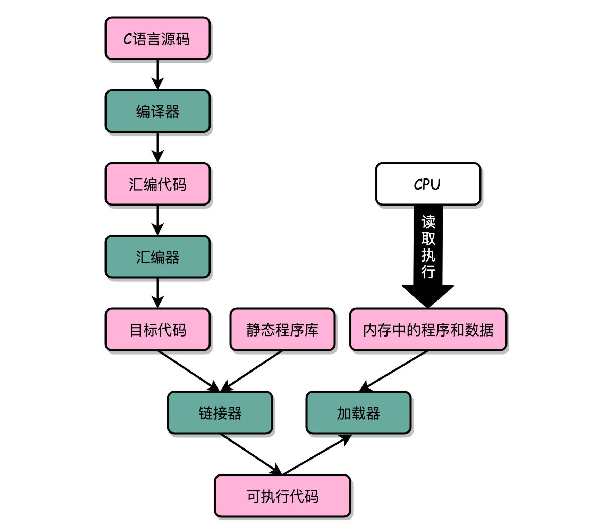

# 计算机组成原理

## 可执行程序


第一个部分由编译（Compile）、汇编（Assemble）以及链接（Link）三个阶段组成

写好的 C 语言代码，可以通过编译器编译成汇编代码，然后汇编代码再通过汇编器变成 CPU 可以理解的机器码，于是 CPU 就可以执行这些机器码了。

编译后生成的 .o 文件 add_lib.o 以及 link_example.o 并不是一个可执行文件（Executable Program），而是目标文件（Object File）。只有通过链接器（Linker）把多个目标文件以及调用的各种函数库链接起来，我们才能得到一个可执行文件。

```shell
gcc -g -c add_lib.c link_example.c
objdump -d -M intel -S add_lib.o
# add_lib.o:      file format mach-o 64-bit x86-64
objdump -d -M intel -S link_example.o
```

```shell
gcc -o link_example add_lib.o link_example.o
./link_example
# c = 15
```

在 Linux 下，可执行文件和目标文件所使用的都是一种叫 ELF（Execuatable and Linkable File Format）的文件格式，中文名字叫可执行与可链接文件格式，这里面不仅存放了编译成的汇编指令，还保留了很多别的数据。
