# 课前准备

## 安装虚拟机和 Docker 运行环境

1. 安装 [VirtualBox](https://www.virtualbox.org/wiki/Downloads)
1. 在 VirtualBox 里创建 1 个网络适配器 vboxnet0

   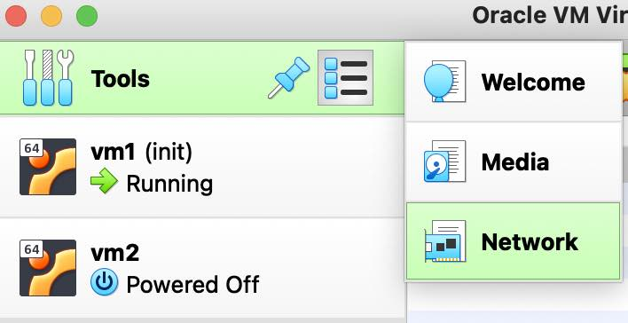
   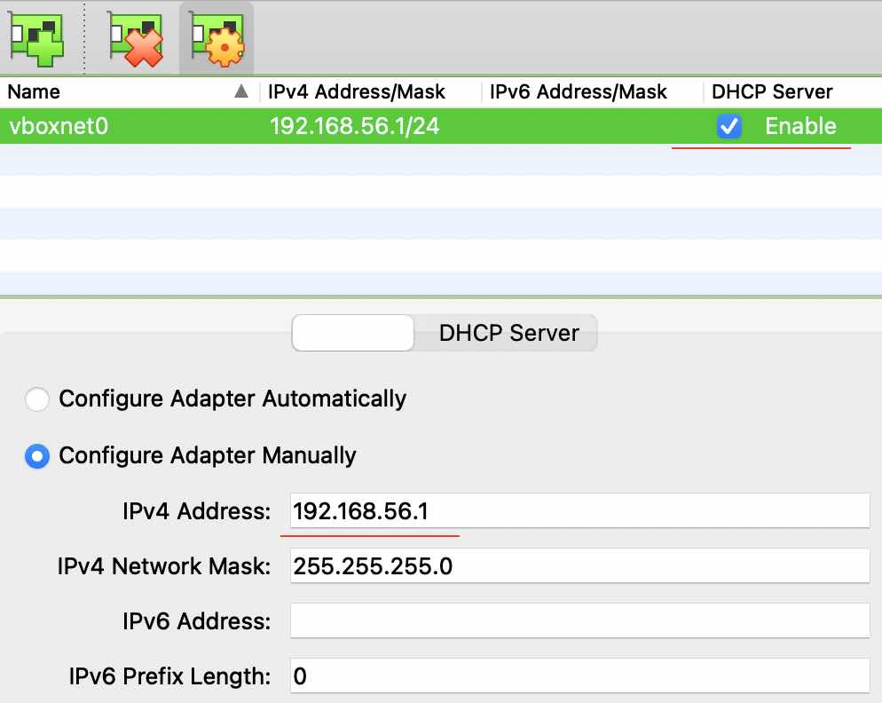

1. 安装 [Ubuntu Server](https://ubuntu.com/download/server) 虚拟机 vm1 作为 Docker 宿主机，基本配置如下
   > 下载 Ubuntu Server 时，选择 option 2 手动安装
   - CPU 2 核
   - 内存 > 2GB ，推荐 4GB
   - 硬盘 > 20GB ，推荐 40GB
   - 两网络适配器
      - 一个 Host 模式：作为虚拟机和宿主机的连通桥梁
      - 一个 NAT 模式：让虚拟机可以访问网络
   - 减少资源消耗可以关闭声卡、摄像头、软驱等外设
   - 选择 Ubuntu 最小安装
   - 安装时选择 需要开启 sshd 服务

   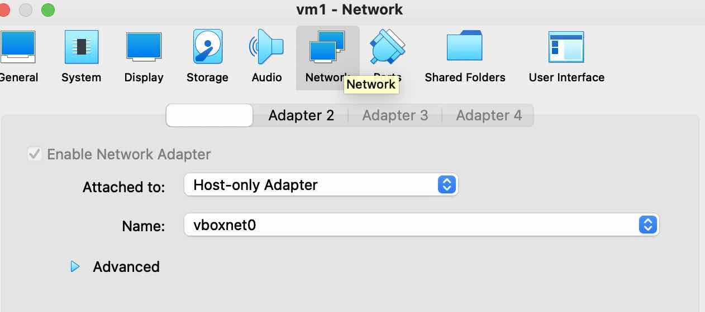
   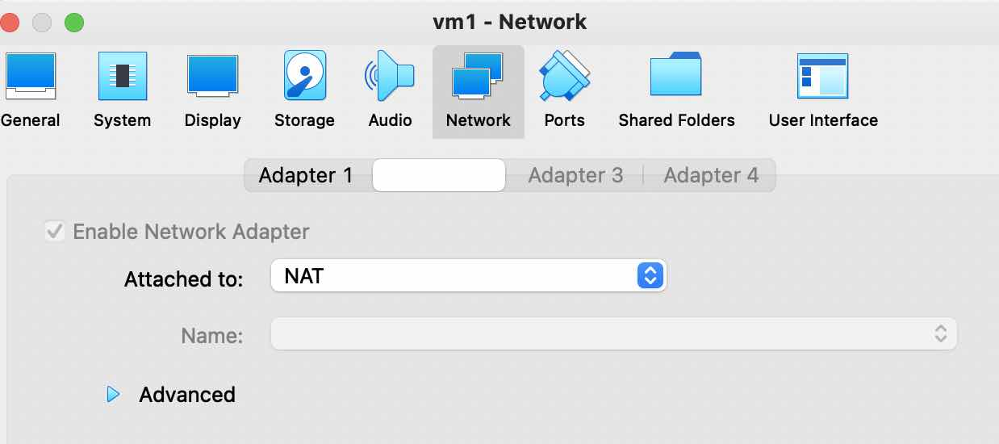

1. 在 Docker 宿主机 vm1 上安装 [Docker](https://docs.docker.com/engine/install/ubuntu/)

   - 从安装包安装，可以到 https://download.docker.com/linux/ubuntu/dists/ 下载对应系统的 docker 包

   ```shell
   apt install iptables

   wget https://download.docker.com/linux/ubuntu/dists/jammy/pool/stable/amd64/containerd.io_1.6.6-1_amd64.deb
   wget https://download.docker.com/linux/ubuntu/dists/jammy/pool/stable/amd64/docker-ce-cli_20.10.17~3-0~ubuntu-jammy_amd64.deb
   wget https://download.docker.com/linux/ubuntu/dists/jammy/pool/stable/amd64/docker-ce_20.10.17~3-0~ubuntu-jammy_amd64.deb
   wget https://download.docker.com/linux/ubuntu/dists/jammy/pool/stable/amd64/docker-compose-plugin_2.6.0~ubuntu-jammy_amd64.deb

   dpkg -i containerd.io_1.6.6-1_amd64.deb
   dpkg -i docker-ce-cli_20.10.17~3-0~ubuntu-jammy_amd64.deb
   dpkg -i docker-ce_20.10.17~3-0~ubuntu-jammy_amd64.deb
   dpkg -i docker-compose-plugin_2.6.0~ubuntu-jammy_amd64.deb

   service docker start
   usermod -aG docker ${USER}
   ```

   - 或者，使用 get-docker.sh 安装

   ```shell
   curl -fsSL https://get.docker.com -o get-docker.sh
    sudo sh get-docker.sh
   ```

1. vm1 全部完成后，给它做一个快照 snapshot ，然后[克隆](https://docs.oracle.com/en/virtualization/virtualbox/6.0/user/clone.html)一份 vm2

   注意：需要修改 vm2 的 hostname 和 IP ，区别于 vm1

   - hostname 修改： `/etc/hostname` 和 `/etc/hosts`

   - IP 地址的修改

   ```shell
   cd /etc/netplan/
   sudo vi 00-installer-config.yaml
   sudo netplan try
   sudo netplan apply
   sudo reboot
   ```

   文件 `/etc/netplan/00-installer-config.yaml`

   ```yaml
   # 注意 dhcp4 false 和 addresses 设置
   network:
     ethernets:
       enp0s3:
         dhcp4: false
         addresses: [192.168.56.103/24]
       enp0s8:
         dhcp4: true
     version: 2
   ```

## 扩展磁盘空间

后期，可能会因为各种原因，需要扩展磁盘空间。
我的悲剧案例就来自前期因为 SSD 容量的限制，在 VirtualBox 只设置了 10GB 。

1. 扩展 VirtualBox Media

   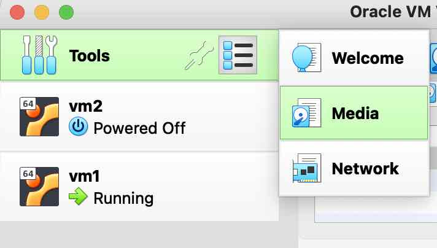
   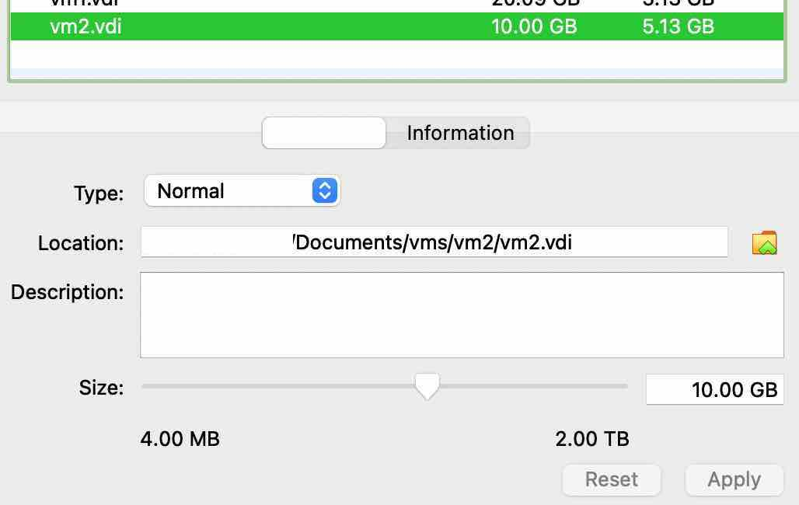

2. 扩展 ubuntu 磁盘

   >参考 [ubuntu lvm](https://wiki.ubuntu.com/Lvm)

   ```shell
   # 扩展物理卷
   sudo cfdisk
   ** resize disk /dev/sda3 **
   sudo pvresize /dev/sda3
   # 扩展逻辑卷
   sudo lvextend -L +10.1G /dev/ubuntu-vg/ubuntu-lv
   #sudo lvextend -l+100%FREE /dev/ubuntu-vg/ubuntu-lv
   sudo resize2fs /dev/ubuntu-vg/ubuntu-lv
   ```

   查看磁盘信息

   ```shell
   sudo pvdisplay
   sudo vgdisplay
   sudo lvdisplay
   sudo df -h
   sudo lsblk
   sudo pvs
   ```

   磁盘扩展**前**信息

   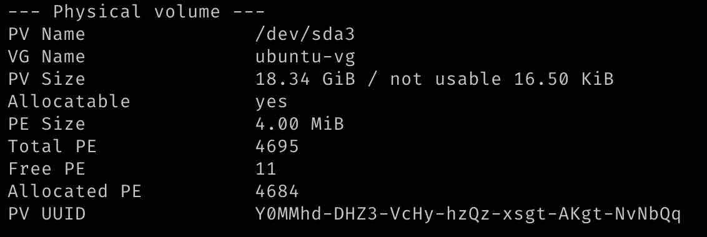
   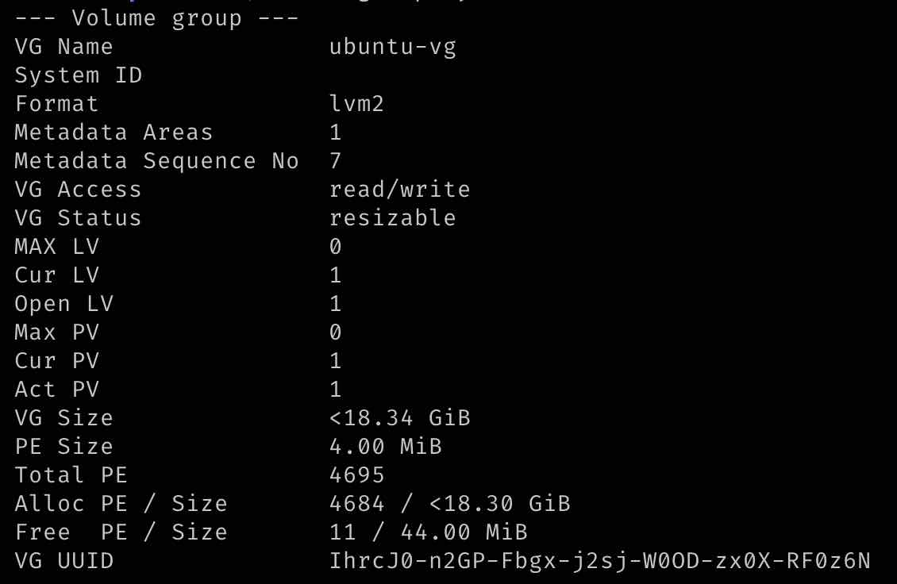
   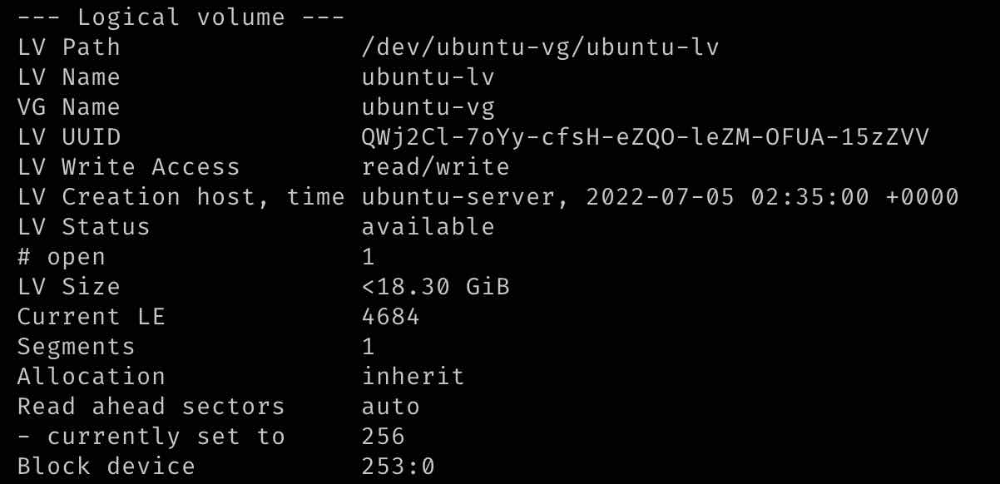

   磁盘扩展**后**信息

   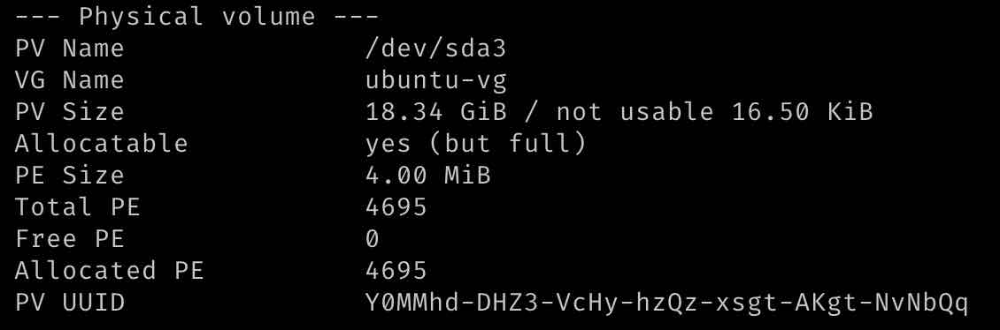
   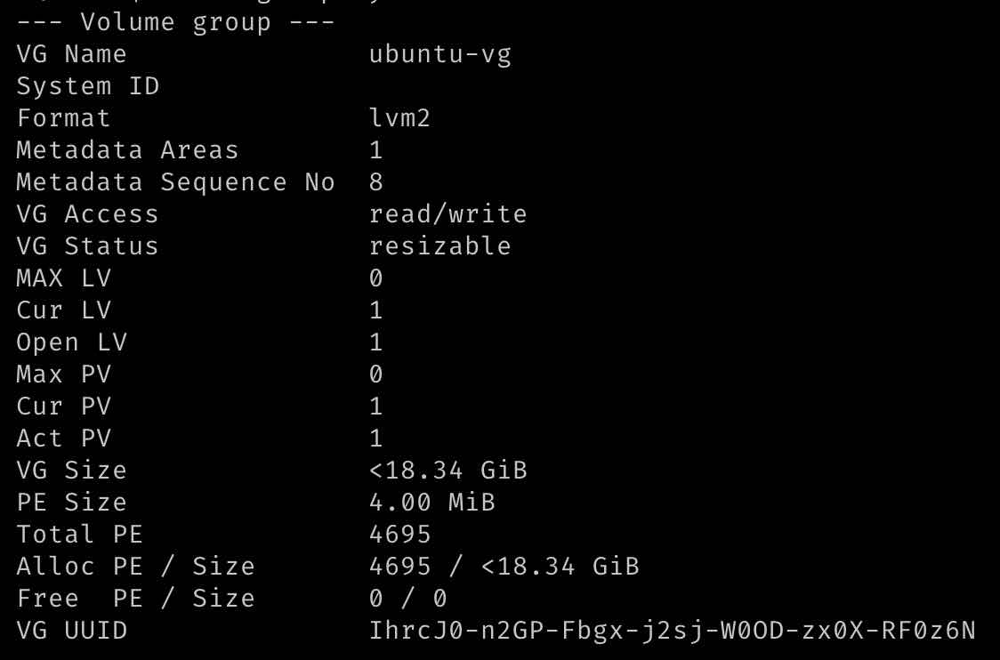
   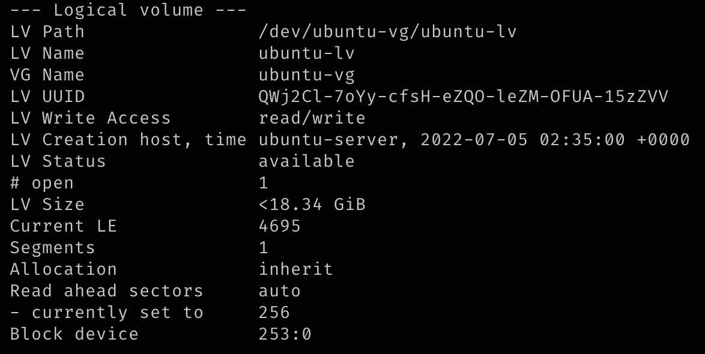
   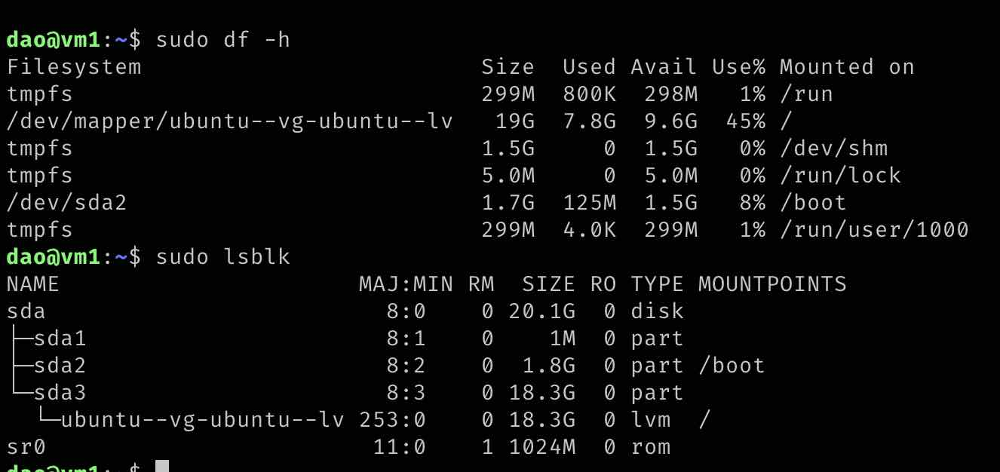
