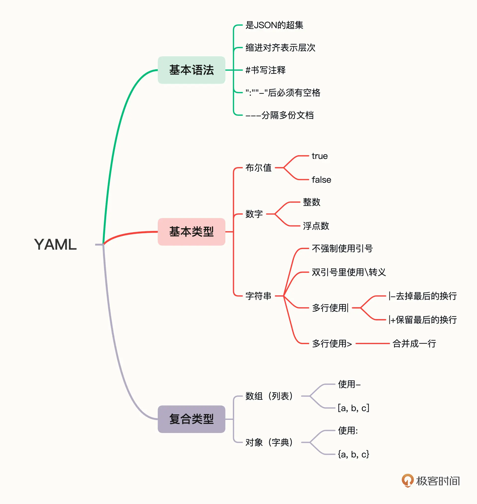

# 云原生

## 走近云原生

### 什么是容器编排

容器技术的创新只是解决了运维部署工作中一个很小的问题 (应用的打包、安装问题)。现实生产环境的复杂程度极高，除了最基本的安装，还会有各式各样的需求，比如服务发现、负载均衡、状态监控、健康检查、扩容缩容、应用迁移、高可用等等。

容器技术开启了云原生时代，但它只走出了一小步，再继续前进就无能为力了。这时已经不再是隔离一两个进程的问题，而是要隔离数不清的进程，以及它们之间互相通信、协作的问题，困难程度是指数级别地上升。在这些容器之上的管理、调度工作，就是“容器编排” (Container Orchestration)。

当前容器编排技术领域的事实标准就是 kubernetes 。

### 什么是 Kubernetes

2015 年 Google 把 C++ 开发的 Borg 系统用 Go 语言重写并开源，于是 Kubernetes 就这样诞生了。

**Kubernetes 一个生产级别的容器编排平台和集群管理系统**，不仅能够创建、调度容器，还能够监控、管理服务器，它凝聚了 Google 等大公司和开源社区的集体智慧，从而让中小型公司也可以具备轻松运维海量计算节点——也就是“云计算”的能力。

>2015 年，Google 又联合 Linux 基金会成立了云原生基金会 CNCF(Cloud Native Computing Foundation)，并把 Kubernetes 捐献出来作为种子项目。

### 搭建小巧完备的 Kubernetes 环境

>[线上实验环境 play-with-k8s](https://labs.play-with-k8s.com/)

#### 什么是 minikube

快速搭建 Kubernetes 环境的工具，[在官网](https://kubernetes.io/zh/docs/tasks/tools/)上推荐的有两个

- kind : Kubernetes in Docker。它功能少，用法简单，运行速度快，容易上手。但它缺少很多 Kubernetes 的标准功能，例如仪表盘、网络插件，也很难定制化，所以它比较适合有经验的 Kubernetes 用户做快速开发测试，不太适合学习研究。

- minikube : 最大特点就是“小而美”，可执行文件仅有不到 100MB ，运行镜像也不过 1GB ，却集成了 Kubernetes 的绝大多数功能特性，不仅有核心的容器编排功能，还有丰富的插件，如 Dashboard 、GPU 、 Ingress 、 Istio 、 Kong 、 Registry 等等。

minikube 只能够搭建 Kubernetes 环境，在 minikube 环境里，用到的两个客户端： 
- minikube ：管理 Kubernetes 集群环境
- kubectl ：操作实际的 Kubernetes 功能


#### 安装 minikube

>参考 [官方文档](https://minikube.sigs.k8s.io/docs/start/)

```shell
curl -LO https://storage.googleapis.com/minikube/releases/latest/minikube_latest_amd64.deb
sudo dpkg -i minikube_latest_amd64.deb
# verify installation
minikube version
```

#### 安装 kubectl

```shell
minikube kubectl
```

使用 kubectl

```shell
# alias to directly use kubectl, otherwise cannot run it directly in minikube kubectl
alias kubectl="minikube kubectl --"

# directly run
kubectl version

# or run by minikube command
minikube kubectl version -- --output=json
minikube kubectl version -- --output=yaml
```

##### 命令自动完成功能

参考 [bash completion - kubectl completion](https://kubernetes.io/docs/tasks/tools/included/optional-kubectl-configs-bash-linux/)

```shell
echo 'source <(kubectl completion bash)' >>~/.bashrc

echo 'alias k=kubectl' >>~/.bash_aliases
echo 'complete -o default -F __start_kubectl k' >>~/.bash_aliases

source ~/.bashrc
```

#### 启动集群

```shell
minikube start --memory=2200mb
minikube start --memory=2200mb --kubernetes-version=v1.24.1

# 集群的状态
minikube status
minikube node list

# log in node
minikube ssh
```

>切换到国内镜像  
>- 先执行 `minikube delete`
>- 再执行 `minikube start --image-mirror-country='cn' --kubernetes-version=v1.23.3`

minikube 是先虚拟出一个节点，节点安装了 docker engine ， minikube ssh 进去才是 Kubernetes 环境，用 docker ps 可以看到容器。

启动一个 nginx Pod

```shell
kubectl run ngx --image=nginx:alpine
```

## Kubernetes 的内部架构和工作机制

### 云计算时代的操作系统

容器是什么？容器是软件，是应用，是进程。服务器是什么？服务器是硬件，是 CPU、内存、硬盘、网卡。那么，既可以管理软件，也可以管理硬件，这样的东西应该是什么？这就是一个操作系统（Operating System）！

没错，从某种角度来看，Kubernetes 可以说是一个集群级别的操作系统，主要功能就是资源管理和作业调度。但 Kubernetes 不是运行在单机上管理单台计算资源和进程，而是运行在多台服务器上管理几百几千台的计算资源，以及在这些资源上运行的上万上百万的进程，规模要大得多。

Kubernetes 与 Linux 对比起来学习，这两个操作系统值得注意的区别之一
——Linux 的用户通常是两类人：Dev 和 Ops ，而在 Kubernetes 里则只有一类人：DevOps 。

### 基本架构


Kubernetes 采用了现今流行的“控制面 / 数据面” (Control Plane / Data Plane) 架构，集群里的计算机被称为“节点” (Node)，可以是物理机也可以是虚拟机，少量的节点用作控制面来执行集群的管理维护工作，其他的大部分节点都被划归数据面，用来跑业务应用。

控制面的节点在 Kubernetes 里叫做 Master Node，简称为 Master，它是整个集群里最重要的部分，可以说是 Kubernetes 的大脑和心脏。

数据面的节点叫做 Worker Node，简称为 Worker 或者 Node，相当于 Kubernetes 的手和脚，在 Master 的指挥下干活。

Node 的数量非常多，构成了一个资源池， Kubernetes 就在这个池里分配资源，调度应用。因为资源被“池化”了，所以管理也就变得比较简单，可以在集群中任意添加或者删除节点。

kubectl 是 Kubernetes 的客户端工具，用来操作 Kubernetes ，它位于集群之外，理论上不属于集群。

查看 Kubernetes 的节点状态：

```shell
kubectl get node
```

>Master 和 Worker 的划分不是绝对的，当集群的规模较小，工作负载较少的时候，Master 也可以承担 Worker 的工作，也就是一个节点可以既是 Master 又是 Worker 。

### 节点内部的结构


>参考[官方文档](https://kubernetes.io/zh-cn/docs/concepts/overview/components/)

Kubernetes 的节点是由很多的模块构成的，这些模块又可以分成组件（Components）和插件（Addons）两类。组件实现了 Kubernetes 的核心功能特性，它们就好像是无数个不知疲倦的运维工程师，把原先繁琐低效的人力工作搬进了高效的计算机里，能够随时发现集群里的变化和异常，再互相协作，维护集群的健康状态。

#### Master 里的 4 个组件

1. apiserver

   Master 节点——同时也是整个 Kubernetes 系统的唯一入口，它对外公开了一系列的 RESTful API，并且加上了验证、授权等功能，所有其他组件都只能和它直接通信，可以说是 Kubernetes 里的联络员。

1. etcd

   一个高可用的分布式 Key-Value 数据库，用来持久化存储系统里的各种资源对象和状态，相当于 Kubernetes 里的配置管理员。注意它只与 apiserver 有直接联系，也就是说任何其他组件想要读写 etcd 里的数据都必须经过 apiserver。

1. scheduler

   负责容器的编排工作，检查节点的资源状态，把 Pod 调度到最适合的节点上运行，相当于部署人员。因为节点状态和 Pod 信息都存储在 etcd 里，所以 scheduler 必须通过 apiserver 才能获得。

1. controller-manager

   负责维护容器和节点等资源的状态，实现故障检测、服务迁移、应用伸缩等功能，相当于监控运维人员。同样地，它也必须通过 apiserver 获得存储在 etcd 里的信息，才能够实现对资源的各种操作。

这 4 个组件也都被容器化了，运行在集群的 Pod 里，可以用 kubectl 来查看它们的状态：

```shell
# -n kube-system 参数，表示检查“kube-system”名字空间里的 Pod
kubectl get pod -n kube-system
```

#### Node 里的 3 个组件

1. kubelet

   Node 的代理，负责管理 Node 相关的绝大部分操作，Node 上只有它能够与 apiserver 通信，实现状态报告、命令下发、启停容器等功能，相当于是 Node 上的一个“小管家”。

1. kube-proxy

   它的作用有点特别，它是 Node 的网络代理，只负责管理容器的网络通信，简单来说就是为 Pod 转发 TCP/UDP 数据包，相当于是专职的“小邮差”。

1. container-runtime

   它是容器和镜像的实际使用者，在 kubelet 的指挥下创建容器，管理 Pod 的生命周期，是真正干活的“苦力”。

这 3 个组件中只有 kube-proxy 被容器化了，而 kubelet 因为必须要管理整个节点，容器化会限制它的能力，所以它必须在 container-runtime 之外运行。

查看 kube-proxy ：

```shell
# 登录到节点
minikube ssh
docker ps | grep kube-proxy
```

查看 kubelet ：

```shell
ps -ef | grep kubelet
# or
pgrep kubelet
```

#### 插件（Addons）

插件就像操作系统里的附加功能，在操作系统提供的基础功上使其达到“好用”的程度。

Kubernetes 里的大量的插件用来扩展、增强它对应用和集群的管理能力。

查看插件列表：

```shell
minikube addons list
```

这里有两个比较重要的插件：DNS 和 Dashboard 。一条简单的命令，就可以在浏览器里使用 Dashboard ：

```shell
minikube dashboard
```

#### 工作流程

Kubernetes 的大致工作流程：
- 每个 Node 上的 kubelet 会定期向 apiserver 上报节点状态，apiserver 再存到 etcd 里。
- 每个 Node 上的 kube-proxy 实现了 TCP/UDP 反向代理，让容器对外提供稳定的服务。
- scheduler 通过 apiserver 得到当前的节点状态，调度 Pod，然后 apiserver 下发命令给某个 Node 的 kubelet，kubelet 调用 container-runtime 启动容器。
- controller-manager 也通过 apiserver 得到实时的节点状态，监控可能的异常情况，再使用相应的手段去调节恢复。

### 知识图谱


## Kubernetes “弃用Docker” ?

### CRI

因为历史因素 Docker 的诞生和在生产上的应用先于 Kubernetes ， kubernetes 要慢慢摆脱对 Docker 的依赖（解耦）， 
Kubernetes 1.0 （2016年）引入了一个新的接口标准：CRI(Container Runtime Interface)。

CRI 采用了 ProtoBuffer 和 gPRC，规定 kubelet 该如何调用容器运行时去管理容器和镜像，但这是一套全新的接口，和之前的 Docker 调用完全不兼容。

但这个时候 Docker 已经非常成熟，而且市场的惯性也非常强大，各大云厂商不可能一下子就把 Docker 全部替换掉。于是 Kubernetes 选择一个“折中”方案，在 kubelet 和 Docker 中间加入一个“适配器”，把 Docker 的接口转换成符合 CRI 标准的接口，如下图：

<a href="https://kubernetes.io/blog/2016/12/container-runtime-interface-cri-in-kubernetes/" target="_blank"></a>

>因为这个“适配器”夹在 kubelet 和 Docker 之间，所以就被形象地称为是“shim”，也就是“垫片”的意思。

有了 CRI 和 shim， Kubernetes 也具备了和 Docker 解耦的条件，从此就拉开了“弃用 Docker”这场大戏的帷幕。

### containerd

面对 Kubernetes “咄咄逼人”的架势， Docker 也没有“坐以待毙”，而是采取了“断臂求生”的策略，推动自身的重构，把原本单体架构的 Docker Engine 拆分成了多个模块，其中的 Docker daemon 部分就捐献给了 CNCF ，形成了 containerd 。

由于 Docker 的“固执己见”，这时 Kubernetes 里就出现了两种调用链：
- 第一种是用 CRI 接口调用 dockershim，然后 dockershim 调用 Docker，Docker 再走 containerd 去操作容器。
- 第二种是用 CRI 接口直接调用 containerd 去操作容器。

<a href="https://kubernetes.io/blog/2018/05/24/kubernetes-containerd-integration-goes-ga/#containerd-1-1-cri-plugin-current" target="_blank"></a>

>由于都是用 containerd 来管理容器，所以这两种调用链的最终效果是完全一样的，但是第二种方式省去了 dockershim 和 Docker Engine 两个环节，更加简洁明了，损耗更少，性能也会提升一些。

### 正式“弃用 Docker”

到了 2020 年， Kubernetes 1.20 终于正式向 Docker“宣战”： kubelet 将弃用 Docker 支持，并会在未来的版本中彻底删除。

这个声明在不断传播的过程中很快就“变味”了，“ kubelet 将弃用 Docker 支持”被简化成了更吸引眼球的“ Kubernetes 将弃用 Docker ”。

实际上只是“弃用了 dockershim ”这个小组件，也就是说把 dockershim 移出了 kubelet ，并不是“弃用了 Docker ”这个软件产品。对 Kubernetes 和 Docker 来说都不会有什么太大的影响，因为它们都早已经把下层改成了开源的 containerd ，原来的 Docker 镜像和容器仍然会正常运行，唯一的变化就是 Kubernetes 绕过了 Docker ，直接调用 Docker 内部的 containerd 而已。

“宣战”之后， Kubernetes 原本打算用一年的时间完成“弃用 Docker”的工作，但它也确实低估了 Docker 的根基，一直到 2022 年 1.24 版才把 dockershim 的代码从 kubelet 里删掉了。

自此，Kubernetes 彻底和 Docker“分道扬镳”，今后就是“大路朝天，各走一边”。

<a href="https://kubernetes.io/blog/2018/05/24/kubernetes-containerd-integration-goes-ga/#what-about-docker-engine" target="_blank"></a>

>影响也不是完全没有
>
>- 如果 Kubernetes 直接使用 containerd 来操纵容器，那么它就是一个与 Docker 独立的工作环境，彼此都不能访问对方管理的容器和镜像。换句话说，使用命令 docker ps 就看不到在 Kubernetes 里运行的容器了。
>
>- 改用新的工具 crictl 替代 docker

## YAML —— Kubernetes 里的通用语

### 什么是 YAML

YAML 语言创建于 2001 年，比 XML 晚了三年。 在名字上模仿了 XML，但实质上与 XML 完全不同，更适合人类阅读，计算机解析起来也很容易。

YAML 是 JSON 的超集，支持整数、浮点数、布尔、字符串、数组和对象等数据类型。



### Kubernetes 的语义

YAML 语言只相当于“语法”，要与 Kubernetes 对话，还必须有足够的“词汇”来表示“语义”。

#### API 对象

Kubernetes 归纳总结了 Google 多年的经验，在理论层面抽象出了很多个概念，用来描述系统的管理运维工作，这些概念就叫做“API 对象”。

Kubernetes 把集群里的一切资源都定义为 API 对象，通过 RESTful 接口 (apiserver) 来管理，是系统的唯一入口。

查看当前 Kubernetes 版本支持的所有对象：

```shell
kubectl api-resources
```

输出结果的解析：
- 第一栏“NAME”，就是对象的名字
- 第二栏“SHORTNAMES”，则是这种资源的简写，使用 kubectl 命令的时候很有用

使用 kubectl 命令的时候，加上一个参数 `--v=9`，它会显示出详细的命令执行过程，清楚地看到发出的 HTTP 请求，比如：

```shell
kubectl get pod --v=9
```

>Kubernetes 是 Go 语言开发的，因此 API 对象都遵循 Go 的语法规范，命名使用 camel case 。

#### 描述 API 对象

“命令式”运行 nginx 

```shell
kubectl run ngx --image=nginx:alpine
```

改写成“声明式”的 YAML，

```yaml
apiVersion: v1
kind: Pod
metadata:
  name: ngx-pod
  labels:
    env: demo

spec:
  containers:
  - image: nginx:alpine
    name: ngx
    ports:
    - containerPort: 80
```

解释：
可以把 API 对象的描述分成 “`header`” 和 “`body`” 两部分。
- header 部分

  apiVersion 、 kind 、 metadata 是必须字段

  - apiVersion

    表示操作这种资源的 API 版本号，由于 Kubernetes 的迭代速度很快，不同的版本创建的对象会有差异，为了区分这些版本就需要使用 apiVersion 这个字段，比如 v1、v1alpha1、v1beta1 等等。

  - kind

    表示资源对象的类型，比如 Pod、Node、Job、Service 等等。

   - metadata

     顾名思义，表示的是资源的一些“元信息”，也就是用来标记对象，方便 Kubernetes 管理的一些信息。

- body 部分

  与对象相关，每种对象会有不同的规格定义，在 YAML 里表现为 spec 字段（即 specification），表示对对象的“期望状态”（desired status）。

使用 `kubectl apply`、`kubectl delete` 创建或者删除对象：

```shell
kubectl apply -f ngx-pod.yml
kubectl delete -f ngx-pod.yml
```

### 编写 YAML

>参考 [官方文档](https://kubernetes.io/docs/reference/kubernetes-api/)

有下面三个技巧：

1. kubectl api-resources 命令

2. kubectl explain 它相当于是 Kubernetes 自带的 API 文档，会给出对象字段的详细说明。比如，想要看 Pod 里的字段该怎么写：

   ```shell
   kubectl explain pod
   kubectl explain pod.metadata
   kubectl explain pod.spec
   kubectl explain pod.spec.containers
   ```

3. kubectl 的两个特殊参数 --dry-run=client 和 -o yaml 生成一份“文档样板”

   ```shell
   kubectl run ngx --image=nginx:alpine --dry-run=client -o yaml

   # ==> shortcuts
   export out="--dry-run=client -o yaml"
   kubectl run ngx --image=nginx:alpine $out
   ```

## Pod —— Kubernetes 最核心的概念

### 要有 Pod

Pod 原意是“豌豆荚”，后来又延伸出“舱室”、“太空舱”等含义，形象地来说 Pod 就是包含了很多组件、成员的一种结构。

在现实的生产环境中，很少有应用是完全独立运行的，经常需要多个进程密切协作才能完成任务。仅使用容器很难描述这种关系，

要解决多应用联合运行的问题，同时还要不破坏容器的隔离，就需要在容器外面再建立一个“收纳舱”，让多个容器既保持相对独立，又能够小范围共享网络、存储等资源，而且永远是“绑在一起”的状态。

由此，Pod 的概念也就呼之欲出了，容器正是“豆荚”里那些小小的“豌豆”。Pod “打包”一个或多个容器，保证里面的进程能够被整体调度。

### Pod 是核心对象

Kubernetes 让 Pod 去编排处理容器，然后把 Pod 作为应用调度部署的最小单位，Pod 也因此成为了 Kubernetes 世界里的“原子”，基于 Pod 就可以构建出更多更复杂的业务形态了。

>Pod 屏蔽了容器的一些底层细节，同时又具有足够的控制管理能力，比起容器的“细粒度”、虚拟机的“粗粒度”，Pod 可以说是“中粒度”，灵活又轻便，非常适合在云计算领域作为应用调度的基本单元，因而成为了 Kubernetes 世界里构建一切业务的“原子”。

<br/>
（以 Pod 为中心的 Kubernetes 资源对象关系图）

所有的 Kubernetes 资源都直接或者间接地依附在 Pod 之上，所有的 Kubernetes 功能都必须通过 Pod 来实现，Pod 当之无愧地成为了 Kubernetes 的核心对象。

### YAML 描述 Pod

Pod 也是 API 对象，它也必须有 apiVersion、kind、metadata、spec 这四个基本组成部分。

- metadata

  这里面的 name 只是一个基本的标识，信息有限，这时 labels 字段就派上了用处。它可以添加任意数量的 Key-Value，给 Pod“贴”上归类的标签，方便识别和管理。

  例如，可以根据运行环境，使用标签 env=dev/test/prod，或者根据所在的数据中心，使用标签 region=north/south，还可以根据应用在系统中的层次，使用 tier=front/middle/back 。

- spec
  - ports ：列出容器对外暴露的端口，对应 docker run -p 。
  - imagePullPolicy ：指定镜像的拉取策略，可以是 Always/Never/IfNotPresent ，默认是 IfNotPresent ，也就是说只有本地不存在才会远程拉取镜像，可以减少网络消耗。
  - env ：定义 Pod 的环境变量，和 Dockerfile 里的 ENV 指令有点类似，但它是**运行时指定的**，更加灵活可配置。
  - command ：定义容器启动时要执行的命令，相当于 Dockerfile 里的 ENTRYPOINT 指令。
  - args ：它是 command 运行时的参数，相当于 Dockerfile 里的 CMD 指令。

举例，

```yaml
# ...
spec:
  containers:
  - image: busybox:latest
    imagePullPolicy: IfNotPresent
    name: busy
    env:
      - name: os
        value: "ubuntu"
      - name: debug
        value: "on"
    command:
      - /bin/echo
    args:
      - "$(os), $(debug)"
```

解释：

这里为 Pod 指定使用镜像 busybox:latest，拉取策略是 IfNotPresent ，然后定义了 os 和 debug 两个环境变量，启动命令是 /bin/echo，参数里输出刚才定义的环境变量。

Pod 的 YAML 在 spec.containers 字段里用“声明式”把容器的运行状态描述得非常清晰准确，要比 docker run 那长长的命令行要整洁得多，对人、对机器都非常友好。

### kubectl 操作 Pod

操作 Pod 的命令很多与 Docker 类似，如 kubectl run、kubectl cp、kubectl exec 等，但有的命令有些小差异，使用的时候需要注意。

```shell
kubectl apply -f busy-pod.yml
kubectl delete -f busy-pod.yaml

# delete by pod name
kubectl delete pod busy-pod
```

查看 Pod 列表和运行状态：

```shell
kubectl get pod
kubectl get pod ngx-pod
```

检查 Pod 的详细状态：（在调试排错时很有用）

```shell
kubectl describe pod busy-pod
```

查看日志：

>和 Docker 不一样，Kubernetes 的 Pod 不会在前台运行，只能在后台（相当于默认使用了参数 -d），所以输出信息不能直接看到。需要使用命令 kubectl logs 展示 Pod 的标准输出流信息。

```shell
kubectl logs ngx-pod
```

kubectl 也提供与 docker 类似的 cp 和 exec 命令：

```shell
echo 'aaa' > a.txt
# 把本地文件拷贝进 Pod
kubectl cp a.txt ngx-pod:/tmp

# 进入 Pod 内部执行 Shell 命令
# kubectl exec 与 docker exec 有些许不同，需要使用 -- 把 kubectl 的命令与 Shell 命令分隔开
kubectl exec -it ngx-pod -- sh
```

## Job/CronJob

### 为什么不直接使用 Pod

面向对象的编程 OOP 中，把一切都视为高内聚的对象，强调对象之间互相通信来完成任务。OOP 有许多基本原则，其中有两条比较恰当地描述了 Kubernetes 对象设计思路：
- 单一职责：对象应只专注于做好一件事情，不要贪大求全，保持足够小的粒度才更方便复用和管理。
- 组合优于继承：应尽量让对象在运行时产生关系，保持松耦合，而不要用硬编码的方式固定对象的关系。

在 Kubernetes 的资源对象里， Pod 已经是一个相对完善的对象，专门负责管理容器，那么就不应该再盲目为它扩充功能，而是要保持它的独立性，容器之外的功能就需要定义其他的对象，把 Pod 作为它的一个成员“组合”进去。

### 要有 Job/CronJob

Kubernetes 里的两大类业务
- 在线业务：一旦运行起来基本上不会停，也就是永远在线（长时间运行的）。像 Nginx、Node.js、MySQL、Redis 等等。
- 离线业务：特点是必定会退出（短时间运行的）。它的调度策略需要考虑运行超时、状态检查、失败重试、获取计算结果等管理事项。它们一般不直接服务于外部用户，只对内部用户有意义，比如日志分析、数据建模、视频转码等等。
   - 临时任务：跑完就完事了，下次有需求了说一声再重新安排；——对应 Kubernetes 里的 API 对象 Job
   - 定时任务：可以按时按点周期运行，不需要过多干预。——对应 Kubernetes 里的 API 对象 CronJob

   使用这两个对象，就能够在 Kubernetes 里调度、管理任意的离线业务了。

### YAML 描述

使用模板生成一份 YAML 描述

```shell
kubectl create job echo-job --image=busybox $out
```

编辑这个 YAML

```yml
# Job 的 apiVersion: batch/v1 ，不属于核心组，是批处理组
apiVersion: batch/v1
kind: Job
metadata:
  name: echo-job
spec:
  template:
    spec:
      restartPolicy: OnFailure
      containers:
      - image: busybox
        name: echo-job
        imagePullPolicy: IfNotPresent
        command: ["/bin/echo"]
        args: ["hello", "world"]
```

解释：
在 Job 对象里应用了组合模式， template 字段定义了一个“应用模板”，里面嵌入了一个 Pod，这样 Job 就可以从这个模板来创建出 Pod 。由于这个 Pod 受 Job 的管理、控制，不直接和 apiserver 打交道，也就没必要重复 apiVersion 等“头字段”。只需要定义好关键的 spec ，描述清楚容器相关的信息。可以说是一个“无头”的 Pod 对象。


#### 感觉 Job 和 Pod 没有两异 ？

经过了 Job 、 Pod 对容器的两次封装，从概念上很清晰，但好像并没有带来什么实际的好处，似乎和直接跑容器也差不多。

加上以下几个控制离线作业的重要字段，就与 Pod 大不同了。
- activeDeadlineSeconds ：设置 Pod 运行的超时时间。
- backoffLimit ：设置 Pod 的失败重试次数。
- completions  ： Job 完成需要运行多少个 Pod，默认是 1 个。
- parallelism ：它与 completions 相关，表示允许并发运行的 Pod 数量，避免过多占用资源。

>要注意这 4 个字段并不在 template 字段下，而是在 spec 字段下，它们是属于 Job 级别的，用来控制模板里的 Pod 对象。

### 使用 Job

```shell
kubectl get job

kubectl get pod
# 此处可以看到 Pod 被自动关联了一个名字： Job 的名字 echo-job 再加上一个随机字符串 clg66

# 查看日志
kubectl logs echo-job-clg66
```

下面创建一个 Job 对象 sleep-job ，它随机睡眠一段时间再退出，模拟运行时间较长的作业。
Job 的参数设置 20 秒超时，最多重试 2 次，总共需要运行完 4 个 Pod ，但同一时刻最多并发 2 个 Pod 。

```yml
# ...
spec:
  activeDeadlineSeconds: 20
  backoffLimit: 2
  completions: 4
  parallelism: 2
  template:
    spec:
      restartPolicy: OnFailure
      containers:
      - image: busybox
        name: echo-job
        imagePullPolicy: IfNotPresent
        command:
        - sh
        - -c
        - sleep $(($RANDOM % 10 + 1)) && echo done
```

```shell
kubectl apply -f sleep-job.yml

# 追踪 Pod 动态
kubectl get pod -w

# 查看 Job 状态
kubectl get job
```

### YAML 描述 CronJob

老规矩 kubectl create 来创建 CronJob 的样板。

>因 CronJob 的名字有点长，所以 Kubernetes 提供了简写 cj ，这个简写也可以使用命令 kubectl api-resources 看到；CronJob 需要定时运行，所以我们在命令行里还需要指定参数 --schedule 。

```shell
kubectl create cronjob echo-cj --image=busybox --schedule="" $out
# short
kubectl create cj echo-cj --image=busybox --schedule="" $out
```

编辑这个 YAML 样板

```yml
# ...
spec:
  schedule: "*/1 * * * *"
  jobTemplate:
    spec:
      template:
        spec:
          restartPolicy: OnFailure
          containers:
          - image: busybox
            name: echo-job
            imagePullPolicy: IfNotPresent
            command: ["/bin/echo"]
            args: ["hello", "world"]
```

重点关注它的 spec 字段，居然连续有三个 spec 嵌套层次：
- 第一个 spec 是 CronJob 自己的对象规格声明
- 第二个 spec 从属于 `jobTemplate` ，它定义了一个 Job 对象。
- 第三个 spec 从属于 `template` ，它定义了 Job 里运行的 Pod。

一个新字段 `schedule` ，用来定义任务周期运行的规则。它使用的是标准的 Cron 语法，指定分钟、小时、天、月、周，和 Linux 上的 crontab 是一样的。

<br/>
(理解它的“套娃”结构)

### 使用 CronJob

```shell
kubectl apply -f echo-cronjob.yml
# 
kubectl get cj
kubectl get pod
```

### 小结

- 通过这种嵌套方式， Kubernetes 里的这些 API 对象就形成了一个“控制链”： CronJob 使用定时规则控制 Job ， Job 使用并发数量控制 Pod ， Pod 再定义参数控制容器，容器再隔离控制进程，进程最终实现业务功能，层层递进的形式有点像设计模式里的装饰模式 (Decorator)，链条里的每个环节都各司其职，在 Kubernetes 的统一指挥下完成任务。

- Job 在结束后不会立即删除，方便获取运算的结果，但是累积过多已完成的 Job 也会消耗系统资源，可以使用 `ttlSecondsAfterFinished` 设置一个保留时限。

- 出于节约资源的考虑， CronJob 默认只保留最近 3 个运算结果，可以使用 `successfulJobsHistoryLimit` 设置。

## ConfigMap/Secret —— 配置管理

Docker 时代有两种管理配置文件的方式：第一种是编写 `Dockerfile` ，用 COPY 指令把配置文件打包到镜像里；第二种是在运行时使用 `docker cp` 或者 `docker run -v` ，把本机的文件拷贝进容器。但这两种方式都存在缺陷。第一种方法相当于是在镜像里固定了配置文件，不好修改，不灵活，第二种方法则显得有点“笨拙”，不适合在集群中自动化运维管理。

应用程序有很多类别的配置信息，但从数据安全的角度来看可以分成两类：
- 一类是明文配置，也就是不保密，可以任意查询修改，比如服务端口、运行参数、文件路径等等。
- 另一类则是机密配置，由于涉及敏感信息需要保密，不能随便查看，比如密码、密钥、证书等等。

Kubernetes 里定义了两个 API 对象： ConfigMap 用来保存明文配置，Secret 用来保存秘密配置。

### ConfigMap

用命令 kubectl create 来创建一个它的 YAML 样板。

```shell
kubectl create configmap info $out
# short
kubectl create cm info $out
```

```yml
apiVersion: v1
kind: ConfigMap
metadata:
  creationTimestamp: null
  name: info
```

解释： 
ConfigMap 存储的是配置数据，是静态的字符串，并不是容器，所以它们就不需要用“spec”字段来说明运行时的“规格”。

要生成带有“data”字段的 YAML 样板，需要在 kubectl create 后面多加一个参数 `--from-literal` ，表示从字面值生成一些数据：

```shell
kubectl create cm info --from-literal k=v $out
```

输出

```yml
apiVersion: v1
kind: ConfigMap
metadata:
  name: info
data:
  k: v
```

编辑

```yml
apiVersion: v1
kind: ConfigMap
metadata:
  name: info

data:
  count: '10'
  debug: 'on'
  path: '/etc/systemd'
  greeting: |
    say hello to kubernetes.
```

使用 kubectl apply 创建 ConfigMap 对象，创建成功后，来查看 ConfigMap 的状态：

```shell
kubectl get cm
kubectl describe cm info
```

### Secret

和 ConfigMap 的结构和用法很类似，不过在 Kubernetes 里 Secret 对象又细分出很多类，比如：
- 访问私有镜像仓库的认证信息
- 身份识别的凭证信息
- HTTPS 通信的证书和私钥
- 一般的机密信息（格式由用户自行解释）

本节针对“一般的机密信息”解释。

创建 YAML 样板的命令是：

```shell
kubectl create secret generic user --from-literal=name=root $out
```

```yml
apiVersion: v1
kind: Secret
metadata:
  name: user

data:
  name: cm9vdA==
```

解释：

Secret 与 ConfigMap 基本一致，不同点是数据不再是保存明文了，但也只是使用 base64 对数据编码，然后写入 YAML 文件。
用 Linux 工具也可以转换

```shell
# 必须要加参数 -n 去掉字符串里隐含的换行符（注意 echo 行末会换行）
echo -n "root" | base64
```

创建和查看对象操作和 ConfigMap 是一样的

```shell
kubectl apply -f user-secret.yml
kubectl get secret
kubectl describe secret user
```

>因为它是保密的，使用 kubectl describe 不能直接看到内容，只能看到数据的大小

### 使用配置

创建了 ConfigMap 和 Secret 对象，该怎么在 Kubernetes 里应用它们呢？

因为 ConfigMap 和 Secret 只是一些存储在 etcd 里的字符串，所以如果想要在运行时产生效果，就必须要以某种方式“注入”到 Pod 里，让应用去读取。在这方面的处理上 Kubernetes 和 Docker 是一样的，也是两种途径：环境变量和加载文件。

#### 以环境变量的方式使用

Pod 的时候，说过描述容器的字段“containers”里有一个“env”，它定义了 Pod 里容器能够看到的环境变量。当时我们只使用了简单的“value”，把环境变量的值写“死”在了 YAML 里，实际上它还可以使用另一个“valueFrom”字段，从 ConfigMap 或者 Secret 对象里获取值，这样就实现了把配置信息以环境变量的形式注入进 Pod，也就是配置与应用的解耦。

```shell
kubectl explain pod.spec.containers.env.valueFrom
```

“valueFrom”字段指定了环境变量值的来源，可以是“configMapKeyRef”或者“secretKeyRef”，然后你要再进一步指定应用的 ConfigMap/Secret 的“name”和它里面的“key”，要当心的是这个“name”字段是 API 对象的名字，而不是 Key-Value 的名字。

举例，

```yml
# ...
spec:
  containers:
  # ...
  - env:
      - name: COUNT
        valueFrom:
          configMapKeyRef:
            name: info
            key: count
      - name: GREETING
        valueFrom:
          configMapKeyRef:
            name: info
            key: greeting
      - name: USERNAME
        valueFrom:
          secretKeyRef:
            name: user
            key: name
      - name: PASSWORD
        valueFrom:
          secretKeyRef:
            name: user
            key: pwd
```

用画图来表示它们的引用关系：

<br/>

图中可以清晰看出 Pod 与 ConfigMap、Secret 的“松耦合”关系，它们不是直接嵌套包含，而是使用“KeyRef”字段间接引用对象，这样，同一段配置信息就可以在不同的对象之间共享。

使用命令 kubectl exec 进入 Pod 观察环境变量。重点关注的是 env 字段里面定义的 4 个环境变量：

```shell
kubectl apply -f env-pod.yml
kubectl exec -it env-pod -- sh

echo $COUNT
echo $GREETING
echo $USERNAME $PASSWORD
```

#### 以 Volume 的方式使用

Kubernetes 为 Pod 定义了一个“Volume”的概念，可以翻译成是“存储卷”。如果把 Pod 理解成是一个虚拟机，那么 Volume 就相当于是虚拟机里的磁盘。

我们可以为 Pod“挂载（mount）”多个 Volume，里面存放供 Pod 访问的数据，这种方式有点类似 docker run -v

在 Pod 里挂载 Volume 很容易，只需要在“spec”里增加一个“volumes”字段，然后再定义卷的名字和引用的 ConfigMap/Secret 就可以了。要注意的是 Volume 属于 Pod，不属于容器，

```yml
# ...
spec:
  volumes:
  - name: cm-vol
    configMap:
      name: info
  - name: sec-vol
    secret:
      secretName: user
```

有了 Volume 的定义之后，就可以在容器里挂载了，这要用到“volumeMounts”字段，正如它的字面含义，可以把定义好的 Volume 挂载到容器里的某个路径下，所以需要在里面用“mountPath”“name”明确地指定挂载路径和 Volume 的名字。

```yml
# ...
containers:
  - volumeMounts:
    - mountPath: /tmp/cm-items
      name: cm-vol
    - mountPath: /tmp/sec-items
      name: sec-vol
```

用画图来表示它们的引用关系：

<br/>

挂载 Volume 的方式和环境变量又不太相同。环境变量是直接引用了 ConfigMap/Secret，而 Volume 又多加了一个环节，需要先用 Volume 引用 ConfigMap/Secret，然后在容器里挂载 Volume，有点“兜圈子”“弯弯绕”。
这种方式的好处在于：以 Volume 的概念统一抽象了所有的存储，不仅现在支持 ConfigMap/Secret，以后还能够支持临时卷、持久卷、动态卷、快照卷等许多形式的存储，扩展性非常好。

```shell
kubectl apply -f vol-pod.yml
kubectl get pod
kubectl exec -it vol-pod -- sh
```

可以看到 ConfigMap 和 Secret 都变成了目录的形式，而它们里面的 Key-Value 变成了一个个的文件，而文件名就是 Key。

环境变量用法简单，更适合存放简短的字符串，而 Volume 更适合存放大数据量的配置文件，在 Pod 里加载成文件后让应用直接读取使用。

### 小结

- 如果修改了 ConfigMap/Secret 的配置并更新了对象， Pod 里关联的信息是否会同步更新？

  答：以环境变量方式使用的配置不会更新；以 Volume 方式使用的配置更新了。

- 可以从文件创建 ConfigMap 或 Secret ，使用 `--from-file`
- 对 Secret 默认只启用了 base64 ，而这只是编码方式，可以启用加密功能，实现真正的安全
- Linux 环境变量不可以使用 `-` 、 `.` 等特殊字符，需要额外注意
- ConfigMap 和 Secret 对存储数据的大小是有限制的，限制为 1 MB

## 实践篇


>Kubernetes 集群在内部维护了一个自己的专用网络，这个网络和外界隔离，要用特殊的“端口转发”方式来传递数据。

### 1. 编排 MariaDB 对象

- 定义 MariaDB 使用的 ConfigMap

   参考 [YAML](./src/wp2/mariadb-cm.yml)

- 定义 MariaDB Pod

   此处使用了一个新的字段 `envFrom` ，这是因为 ConfigMap 里的信息比较多，如果用 env.valueFrom 一个个地写会非常麻烦，容易出错，而 envFrom 可以一次性地把 ConfigMap 里的字段全导入进 Pod，并且能够指定变量名的前缀（即这里的 `MARIADB_` ）。

   参考 [YAML](./src/wp2/mariadb-cm.yml)

### 2. 编排 WordPress 对象

参考 [ConfigMap YAML](./src/wp2/wp-cm.yml)，参考 [Pod YAML](./src/wp2/wp-pod.yml)。

### 3. 为 WordPress Pod 映射端口号

因为 Pod 都是运行在 Kubernetes 内部的私有网段里的，外界无法直接访问，想要对外暴露服务，需要使用一个专门的 `kubectl port-forward` 命令，把本机的端口映射到在目标对象的端口号。这有点类似 Docker 的参数 -p，经常用于 Kubernetes 的**临时调试和测试**。

把 <u>本地的 8080</u> 映射到 <u>WordPress Pod 的 80</u> ：

```shell
kubectl port-forward wp-pod 8080:80 &
```

>注意  
>端口映射后， kubectl 会把这个端口的所有数据都转发给集群内部的 Pod  
>在命令的末尾使用了一个 `&` 符号，让端口转发工作在后台进行。若需要终止时，使用 `fg` 把后台的任务带回到前台，然后 `Ctrl + C` 。

### 4. 创建反向代理的 Nginx

如果不创建这个反向代理只能本机访问 WP 站点。（本机指运行 kubenetes 集群的虚拟机）

proxy config

```conf
server {
  listen 80;
  default_type text/html;

  location / {
    proxy_http_version 1.1;
    proxy_set_header Host $host;
    proxy_pass http://127.0.0.1:8080;
  }
}
```

docker run nginx

```shell
# 这里指定 net 主机模式
docker run -d --rm \
  --net=host \
  -v /home/pi/kube/wordpress2/proxy.conf:/etc/nginx/conf.d/default.conf \
  nginx:alpine
```

>注意  
>是否本机开了防火墙，检验 `sudo ufw status`

## 扩展与参考

- [Kubernetes 中文](https://kubernetes.io/zh-cn/)
- [YAML 官网](https://yaml.org/)
- [minikube 官网](https://minikube.sigs.k8s.io/docs/start/)
