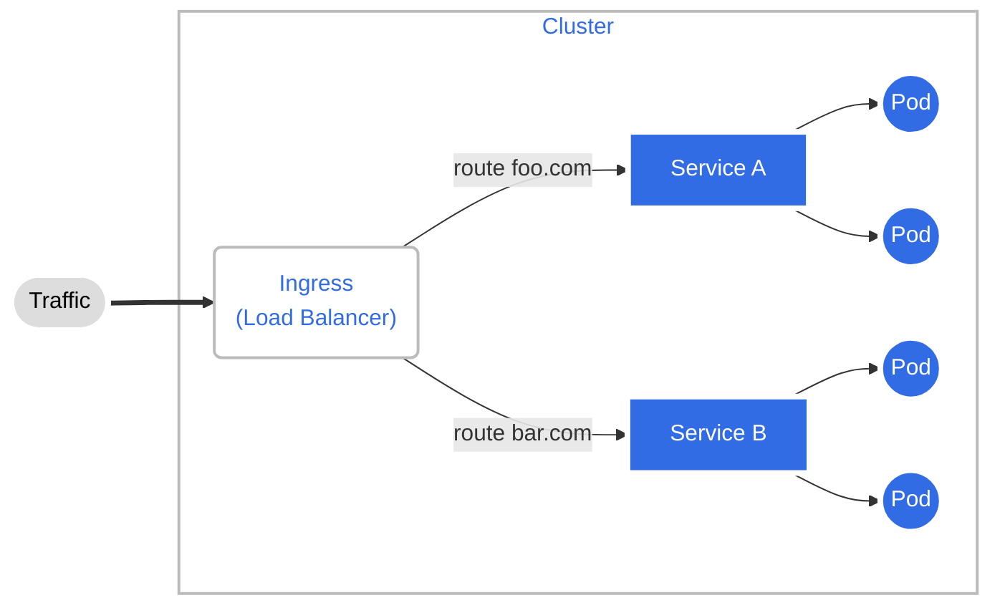
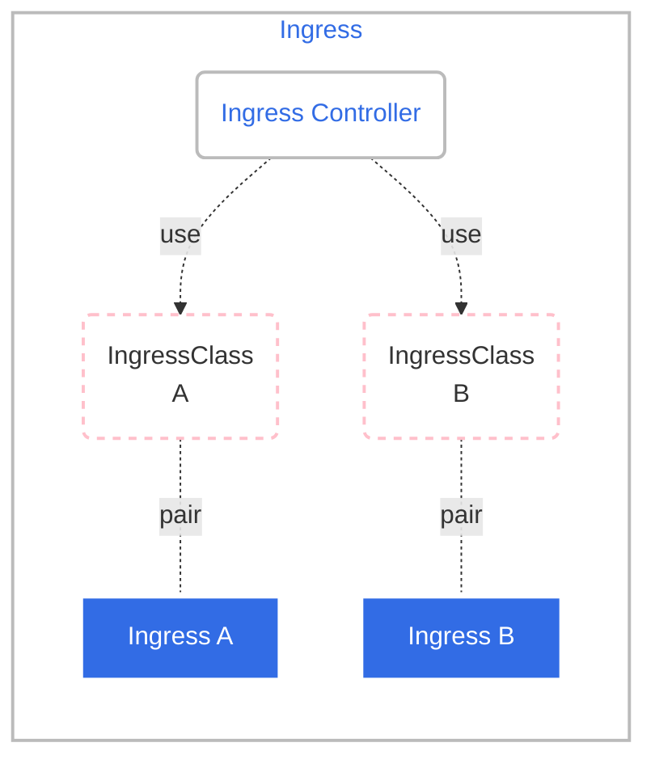

# 走进云原生

## 搭建多节点的 Kubernetes 集群

kubeadm 是一个方便易用的 Kubernetes 工具，能够部署生产级别的 Kubernetes 集群。

所谓的多节点集群，要求服务器应该有两台或者更多，为了简化我们只取最小值，所以这个 Kubernetes 集群就只有两台主机，一台是 Master 节点，另一台是 Worker 节点。


### 准备工作

1. 修改主机名

重命名主角，确保主机名唯一，并且提高名字的辨识度：

```shell
vi /etc/hostname
```

2. 配置容器运行时

>参考[Cgroup 驱动程序](https://kubernetes.io/zh-cn/docs/setup/production-environment/container-runtimes/#cgroup-drivers)

仍然使用 Docker 作为容器运行时，修改 cgroup 的驱动程序改成 systemd ，然后重启 Docker 的守护进程：

```shell
cat <<EOF | sudo tee /etc/docker/daemon.json
{
  "exec-opts": ["native.cgroupdriver=systemd"],
  "log-driver": "json-file",
  "log-opts": {
    "max-size": "100m"
  },
  "storage-driver": "overlay2"
}
EOF

sudo systemctl restart docker
```

3. 修改 iptables 配置

>参考[转发 IPv4 并让 iptables 看到桥接流量](https://kubernetes.io/zh-cn/docs/setup/production-environment/container-runtimes/#%E8%BD%AC%E5%8F%91-ipv4-%E5%B9%B6%E8%AE%A9-iptables-%E7%9C%8B%E5%88%B0%E6%A1%A5%E6%8E%A5%E6%B5%81%E9%87%8F)

为了让 Kubernetes 能够检查、转发网络流量，需要修改 iptables 的配置，启用“br_netfilter”模块：

```shell
cat <<EOF | sudo tee /etc/modules-load.d/k8s.conf
br_netfilter
EOF

cat <<EOF | sudo tee /etc/sysctl.d/k8s.conf
net.bridge.bridge-nf-call-ip6tables = 1
net.bridge.bridge-nf-call-iptables = 1
net.ipv4.ip_forward=1
EOF

sudo sysctl --system
```

4. 关闭 swap 分区

关闭 Linux 的 swap 分区，提升 Kubernetes 的性能：

```shell
sudo swapoff -a
# 注释 swap 设置
sudo sed -ri '/\sswap\s/s/^#?/#/' /etc/fstab
```

### 安装 kubeadm

查看[安装脚本](./src/kubeadm/install.sh)，详细参考官网[安装 kubeadm](https://kubernetes.io/zh-cn/docs/setup/production-environment/tools/kubeadm/install-kubeadm/)

安装完成之后，验证版本是否正确：

```shell
kubeadm version
kubectl version --short
```

使用 `apt-mark hold` 锁定这三个软件的版本，避免意外升级导致版本错误

```shell
sudo apt-mark hold kubeadm kubelet kubectl
```

使用命令 `kubeadm config images list` 可以查看安装 Kubernetes 所需的镜像列表，参数 --kubernetes-version 可以指定版本号：

>为了加快安装时的进度，我们提前下载 Kubernetes 组件镜像  
>国内镜像可以使用清华大学镜像，请参考[Kubernetes 镜像使用帮助](https://mirrors.tuna.tsinghua.edu.cn/help/kubernetes/)

```shell
kubeadm config images list --kubernetes-version v1.23.9

# pull images
docker pull k8s.gcr.io/kube-apiserver:v1.23.9
docker pull k8s.gcr.io/kube-controller-manager:v1.23.9
docker pull k8s.gcr.io/kube-scheduler:v1.23.9
docker pull k8s.gcr.io/kube-proxy:v1.23.9
docker pull k8s.gcr.io/pause:3.6
docker pull k8s.gcr.io/etcd:3.5.1-0
docker pull k8s.gcr.io/coredns/coredns:v1.8.6
```

### 安装 Master 节点

使用 `kubeadm init` 把组件在 Master 节点，注意下面的几个选项：

- `--pod-network-cidr`：设置集群里 Pod 的 IP 地址段。
- `--apiserver-advertise-address`：设置 apiserver 的 IP 地址，对于多网卡服务器来说很重要（比如 VirtualBox 虚拟机就用了两块网卡），可以指定 apiserver 在哪个网卡上对外提供服务。
- `--kubernetes-version`：指定 Kubernetes 的版本号。

```shell
sudo kubeadm init \
    --pod-network-cidr=10.10.0.0/16 \
    --apiserver-advertise-address=192.168.56.101 \
    --kubernetes-version=v1.23.9
```

很快便安装完成，提示出以下信息：

```shell
To start using your cluster, you need to run the following as a regular user:

  mkdir -p $HOME/.kube
  sudo cp -i /etc/kubernetes/admin.conf $HOME/.kube/config
  sudo chown $(id -u):$(id -g) $HOME/.kube/config

Alternatively, if you are the root user, you can run:

  export KUBECONFIG=/etc/kubernetes/admin.conf

You should now deploy a pod network to the cluster.
Run "kubectl apply -f [podnetwork].yaml" with one of the options listed at:
  https://kubernetes.io/docs/concepts/cluster-administration/addons/

Then you can join any number of worker nodes by running the following on each as root:

kubeadm join 192.168.56.101:6443 --token 5e3iz8.kdxd8k8foaoxht0g \
	--discovery-token-ca-cert-hash sha256:552da927e91563c7e7eb3c89c2d2af44b244a727c631e969958c42dcdee9aacb
```

检查安装结果

```shell
kubectl version
kubectl get node
```

发现提示 `NotReady` ，原因是：还缺少网络插件，集群的内部网络还没有正常运作。

```shell
kubectl get node
# 输出
NAME   STATUS     ROLES                  AGE     VERSION
vm1    NotReady   control-plane,master   5m54s   v1.23.9
```

>**如果使用多张网卡**，可能需要给节点指定下面的配置
>
>```shell
>vim /etc/default/kubelet
># master
>KUBELET_EXTRA_ARGS="--node-ip=192.168.56.101"
># worker
>KUBELET_EXTRA_ARGS="--node-ip=192.168.56.103"
>```
>设置完成后，重启 kubelet
>```shell
>sudo systemctl daemon-reload
>sudo systemctl restart kubelet
>```

#### 安装 Flannel 网络插件

Kubernetes 定义了 CNI 标准，有很多网络插件，这里以最常用的 Flannel 为例。

>[GitHub 仓库](https://github.com/flannel-io/flannel/) 及 [安装文档](https://github.com/flannel-io/flannel/blob/master/Documentation/kubernetes.md)

它安装很简单，先下载 `kube-flannel.yml`；然后修改 kube-flannel.yml 的 `net-conf.json`字段，把 Network 改成 kubeadm 的参数 `--pod-network-cidr` 设置的地址段；最后应用这个配置。

```shell
#下载
wget https://raw.githubusercontent.com/flannel-io/flannel/master/Documentation/kube-flannel.yml

# 编辑
vi kube-flannel.yml
82   net-conf.json: |
83     {
84       "Network": "10.10.0.0/16",
85       "Backend": {
86         "Type": "vxlan"
87       }
88     }

# 应用/安装
kubectl apply -f kube-flannel.yml
```

>**如果使用多网卡**，可能还需要为 Flannel 命令传入选项参数 `iface`
>```shell
>vi kube-flannel.yml
>154    command:
>155    - /opt/bin/flanneld
>156    args:
>157    - --ip-masq
>158    - --kube-subnet-mgr
>159    - --iface=enp0s3
>```
>需要重启 kube-flannel-ds 
>`kubectl -n kube-flannel rollout restart ds kube-flannel-ds`

稍等一小会（镜像拉取回来后），再来看节点状态：

```shell
kubectl get node
# 输出
NAME   STATUS   ROLES                  AGE   VERSION
vm1    Ready    control-plane,master   28m   v1.23.9
```

Master 节点的状态是“Ready”，表明节点网络也工作正常了。

### 安装 Worker 节点

>如果是从零开始安装 Worker 节点，那么需要做完准备工作并安装好 kubeadm 。

Worker 节点的安装，只需要执行 kubeadm join 命令就可以了（记得要用 sudo 来执行）：

```shell
sudo kubeadm join 192.168.56.101:6443 --token 5e3iz8.kdxd8k8foaoxht0g \
	--discovery-token-ca-cert-hash sha256:552da927e91563c7e7eb3c89c2d2af44b244a727c631e969958c42dcdee9aacb
  5b9e1c141de75f9e7c8b64b53f68a4edb0c96b108c3ef586ceb5dfa1c477a94b
```

>如果忘记在 Master 节点拷贝的 join 命令，或 token 过期了（24小时有效期）：
> - 可以执行 `kubeadm token create --print-join-command` 重新获取
> - 或者执行 `kubeadm token list` 获取 token，然后执行 
`openssl x509 -pubkey -in /etc/kubernetes/pki/ca.crt | openssl rsa -pubin -outform der 2>/dev/null | openssl dgst -sha256 -hex | sed 's/^.* //'` 获取 `--discovery-token-ca-cert-hash`

安装完毕后，查看节点状态：

```shell
kubectl get nodes

# 输出
NAME   STATUS   ROLES                  AGE    VERSION
vm1    Ready    control-plane,master   69m    v1.23.9
vm2    Ready    <none>                 100s   v1.23.9
```

使用 nginx 来检验一下集群安装：

```shell
kubectl run ngx --image=nginx:alpine
kubectl get pod -o wide

# 输出
NAME   READY   STATUS    RESTARTS   AGE   IP          NODE   NOMINATED NODE   READINESS GATES
ngx    1/1     Running   0          26s   10.10.1.2   vm2    <none>           <none>
```

会看到 Pod 运行在 Worker 节点上，IP 地址是“10.10.1.2”，表明 Kubernetes 集群部署成功。

>由于集群节点通常是按顺序初始化的，CoreDNS Pod 很可能都运行在第一个控制面节点上。 为了提供更高的可用性，请在加入至少一个新节点后 使用 `kubectl -n kube-system rollout restart deployment coredns` 命令，重新平衡这些 CoreDNS Pod。

### Console 节点的部署

它是可选的节点，只需要安装一个 kubectl ，然后复制“config”文件就行。比如可以直接在 Master 节点上用“scp”远程拷贝，例如：

```shell
# run at vm1
scp `which kubectl` console-vm:~/
scp ~/.kube/config console-vm:~/.kube
```

### 小结/补充

- 如果安装节点失败，可以使用 `kubeadm reset` 重置后重装。

  >参考 [删除节点](https://kubernetes.io/zh-cn/docs/setup/production-environment/tools/kubeadm/create-cluster-kubeadm/#remove-the-node)

- Worker 节点不需要 `api-server`、`controller-manager`、`scheduler` 和 `etcd`，可以删除相关镜像，减少磁盘空间占用。

   ```shell
   # kube-apiserver
   docker rmi 5bc0062e9555
   # kube-controller-manager
   docker rmi f6bc1b780606
   # kube-scheduler
   docker rmi 0198979b7707
   # etcd
   docker rmi 25f8c7f3da61
   ```

## Deployment

API Deployment ，顾名思义，它是专门用来部署应用程序的，能够**让应用永不宕机**，多用来发布无状态的应用，是 Kubernetes 里最常用也是最有用的一个对象。

### 要有 Deployment

除了“离线业务”，另一大类业务——也就是“在线业务”。

先看看用 Pod 是否就足够了？
它在 YAML 里使用`containers`就可以任意编排容器，而且还有一个`restartPolicy`字段，默认值就是 `Always`，可以监控 Pod 里容器的状态，一旦发生异常，就会自动重启容器。不过，`restartPolicy`只能保证容器正常工作。如果容器之外的 Pod 出错了该怎么办呢？比如说，有人不小心误删了 Pod ，或者 Pod 运行的节点发生了断电故障，那么 Pod 就会在集群里彻底消失，对容器的控制也就无从谈起了。

还有在线业务远不是单纯启动一个 Pod 这么简单，还有多实例、高可用、版本更新等许多复杂的操作。比如最简单的多实例需求，为了提高系统的服务能力，应对突发的流量和压力，我们需要创建多个应用的副本，还要即时监控它们的状态。如果还是只使用 Pod，那就会又走回手工管理的老路，没有利用好 Kubernetes 自动化运维的优势。

面对以上的问题，解决的办法也很简单，因为 Kubernetes 已经给我们提供了处理这种问题的思路，就是“单一职责”和“对象组合”。既然 Pod 管理不了自己，那么我们就再创建一个新的对象，由它来管理 Pod，采用和 Job/CronJob 一样的形式——“对象套对象”。这个用来管理 Pod，实现在线业务应用的新 API 对象，就是 Deployment 。

### YAML 描述

来看看 Deployment 的基本信息：

```shell
kubectl api-resources | grep deployment

NAME                  SHORTNAMES   APIVERSION             NAMESPACED   KIND
deployments           deploy       apps/v1                true         Deployment
```

依据这些信息就有了 YAML 文件头：

```yaml
apiVersion: apps/v1
kind: Deployment
metadata:
  name: xxx-dep
```

使用命令 kubectl create 来创建 Deployment 的 YAML 样板：

```shell
kubectl create deploy ngx-dep --image=nginx:alpine $out
```

#### 关键字段

- replicas 字段

  它的含义比较简单明了，就是“副本数量”的意思，指定要在 Kubernetes 集群里运行多少个 Pod 实例。有了这个字段，就相当于为 Kubernetes 明确了应用部署的“期望状态”， Deployment 对象就可以扮演运维监控人员的角色，自动地在集群里调整 Pod 的数量。

- selector 字段

  它的作用是“筛选”出要被 Deployment 管理的 Pod 对象，下属字段 `matchLabels` 定义了 Pod 对象应该携带的 label 。它必须和`template` 里 Pod 定义的 `labels` 完全相同，否则 Deployment 就会找不到要控制的 Pod 对象，apiserver 也会告诉你 YAML 格式校验错误无法创建。

  这个 selector 字段的用法初看起来好像是有点多余，为了保证 Deployment 成功创建，我们必须在 YAML 里把 label 重复写两次：一次是在`selector.matchLabels`，另一次是在`template.matadata`。

  为什么要这么麻烦？对比于 Job ，为什么不能像 Job ，在 template 里直接定义 Pod ？

  对于在线业务，因为 Pod 永远在线，除了要在 Deployment 里部署运行，还可能会被其他的 API 对象引用来管理，比如负责负载均衡的 Service 对象。 Deployment 和 Pod 实际上是一种松散的组合关系， Deployment 实际上并不“持有” Pod 对象，它只是帮助管理 Pod 对象能够有足够的副本数量运行而已。

  >Kubernetes 采用的是这种“贴标签”的方式，通过在 API 对象的“metadata”元信息里加各种标签（labels），然后就可以使用类似关系数据库里查询语句的方式，筛选出具有特定标识的那些对象。通过标签这种设计，Kubernetes 就解除了 Deployment 和模板里 Pod 的强绑定，把组合关系变成了“弱引用”。

下面一张图，用来理解 Deployment 与被它管理的 Pod 的组合关系。
用不同的颜色来区分 Deployment YAML 里的字段，并用虚线特别标记了 matchLabels 和 labels 之间的联系。


### kubectl 操作

创建 Deployment 对象：

```shell
kubectl apply -f deploy.yml
```

要查看 Deployment 的状态:

```shell
kubectl get deploy
# 输出
NAME      READY   UP-TO-DATE   AVAILABLE   AGE
ngx-dep   2/2     2            2           26s
```

它显示的信息都很重要：

- READY

  表示运行的 Pod 数量，前面的数字是当前数量，后面的数字是期望数量，所以“2/2”的意思就是要求有两个 Pod 运行，现在已经启动了两个 Pod。
- UP-TO-DATE

  指的是当前已经更新到最新状态的 Pod 数量。因为如果要部署的 Pod 数量很多或者 Pod 启动比较慢，Deployment 完全生效需要一个过程，UP-TO-DATE 就表示现在有多少个 Pod 已经完成了部署，达成了模板里的“期望状态”。
- AVAILABLE

  要比 READY 、 UP-TO-DATE 更进一步，不仅要求已经运行，还必须是健康状态，能够正常对外提供服务，它才是我们最关心的 Deployment 指标。
- AGE

  表示 Deployment 从创建到现在所经过的时间，也就是运行的时间。

Deployment 管理的也是 Pod，来看看 Pod 的状态：

```shell
kubectl get pod
#
NAME                      READY   STATUS    RESTARTS   AGE
ngx-dep-bfbb5f64b-6ng7b   1/1     Running   0          5s
ngx-dep-bfbb5f64b-cgcht   1/1     Running   0          5s
```

现在检查一下 Deployment 部署的应用真的可以做到“永不宕机”？删除一个 Pod ，然后再查看 Pod 的状态：

```shell
kubectl delete ngx-dep-bfbb5f64b-6ng7b
kubectl get pod
```

可以看到被删除的 Pod 确实是消失了，但 Kubernetes 在 Deployment 的管理之下，很快又创建出了一个新的 Pod，保证了应用实例的数量始终是 YAML 里定义的数量。

在 Deployment 部署成功之后，还可以随时调整 Pod 的数量，实现所谓的“应用伸缩”。这项工作在 Kubernetes 出现之前对于运维来说是一件很困难的事情，而现在由于有了 Deployment 就变得轻而易举了。

`kubectl scale --replicas` 专门用于实现“扩容”和“缩容”的命令，Kubernetes 就会自动增加或者删除 Pod，让最终的 Pod 数量达到“期望状态”。

```shell
# 注意：命令式操作，扩容和缩容只是临时的措施，建议最好使用 YAML 定义
kubectl scale --replicas=5 deploy ngx-dep
```

我们通过 labels 为对象“贴”了各种“标签”，在使用 kubectl get 命令的时候，加上参数 -l，使用 `==`、`!=`、`in`、`notin` 等表达式，就能够很容易地用“标签”筛选、过滤出所要查找的对象，效果等同于 Deployment 里的 selector 字段。

举例：

```shell
# 没有搜索结果
kubectl get pod -l app=nginx

# 搜索出 ngx-dep
kubectl get pod -l 'app in (ngx, nginx, ngx-dep)'
```
### 小结

- Pod 只能管理容器，不能管理自身，所以就出现了 Deployment ，由它来管理 Pod 。
- 作为 Kubernetes 里最常用的对象， Deployment 还支持滚动更新、版本回退，自动伸缩等高级功能。
- Deployment 实际上并不直接管理 Pod ，而是用了另一个对象 ReplicaSet 来控制多副本。

## Daemonset

另一类代表在线业务 API 对象： DaemonSet ，**它会在 Kubernetes 集群的每个节点上都运行一个 Pod** ，就好像是 Linux 系统里的“守护进程”（Daemon）。

### 要有 DaemonSet

Deployment 并不关心这些 Pod 会在集群的哪些节点上运行，在它看来，Pod 的运行环境与功能是无关的，只要 Pod 的数量足够，应用程序应该会正常工作。

这个假设对于大多数业务来说是没问题的，比如 Nginx、WordPress、MySQL，它们不需要知道集群、节点的细节信息，只要配置好环境变量和存储卷，在哪里“跑”都是一样的。但是有一些业务比较特殊，它们不是完全独立于系统运行的，而是与主机存在“绑定”关系，必须要依附于节点才能产生价值，比如说：

- 网络应用（如 kube-proxy），必须每个节点都运行一个 Pod，否则节点就无法加入 Kubernetes 网络。
- 监控应用（如 Prometheus），必须每个节点都有一个 Pod 用来监控节点的状态，实时上报信息。
- 日志应用（如 Fluentd），必须在每个节点上运行一个 Pod，才能够搜集容器运行时产生的日志数据。
- 安全应用，同样的，每个节点都要有一个 Pod 来执行安全审计、入侵检查、漏洞扫描等工作。

### YAML 描述

来看看 DaemonSet 的基本信息：

```shell
kubectl api-resources | grep DaemonSet

NAME                  SHORTNAMES   APIVERSION             NAMESPACED   KIND
daemonsets            ds           apps/v1                true         DaemonSet
```

依据这些信息就有了 YAML 文件头：

```yaml
apiVersion: apps/v1
kind: DaemonSet
metadata:
  name: xxx-ds
```

Kubernetes 没有提供自动创建 DaemonSet YAML 样板的功能，查看帮助，确实没有：

```shell
kubectl create -h

Available Commands:
  clusterrole         Create a cluster role
  clusterrolebinding  Create a cluster role binding for a particular cluster role
  configmap           Create a config map from a local file, directory or literal value
  cronjob             Create a cron job with the specified name
  deployment          Create a deployment with the specified name
  ingress             Create an ingress with the specified name
  job                 Create a job with the specified name
  namespace           Create a namespace with the specified name
  poddisruptionbudget Create a pod disruption budget with the specified name
  priorityclass       Create a priority class with the specified name
  quota               Create a quota with the specified name
  role                Create a role with single rule
  rolebinding         Create a role binding for a particular role or cluster role
  secret              Create a secret using specified subcommand
  service             Create a service using a specified subcommand
  serviceaccount      Create a service account with the specified name
```

我们可以去 [Kubernetes 的官网](https://kubernetes.io/zh-cn/docs/concepts/workloads/controllers/daemonset/)“抄”一份

```yaml
apiVersion: apps/v1
kind: DaemonSet
metadata:
  name: redis-ds
  labels:
    app: redis-ds

spec:
  selector:
    matchLabels:
      name: redis-ds
  template:
    metadata:
      labels:
        name: redis-ds
    spec:
      containers:
      - image: redis:5-alpine
        name: redis
        ports:
        - containerPort: 6379
```

把这份 YAML 和 Deployment 对象简单对比一下，会发现：
- 前面的 kind、metadata 是对象独有的信息，自然是不同的
- 后面的 spec 部分， DaemonSet 和 Deployment 对象几乎一模一样，除了 DaemonSet 在 spec 里没有 replicas 字段。

  这意味着它不会在集群里创建多个 Pod 副本，而是要在每个节点上只创建出一个 Pod 实例。换句话说，DaemonSet 仅仅是在 Pod 的部署调度策略上和 Deployment 不同，其他的都是相同的，某种程度上我们也可以把 DaemonSet 看做是 Deployment 的一个特例。

  <br/>
  (Deployment 和 DaemonSet 的 YAML 描述差异)

基于这个比较结果，我们可以使用变通的方法来创建 DaemonSet 的 YAML 样板了。

用 kubectl create 先创建出一个 Deployment 对象，然后把 kind 改成 DaemonSet，再删除 spec.replicas 就行了，比如：

```shell
kubectl create deploy redis-ds --image=redis:5-alpine $out
```

### 使用

```shell
kubectl apply -f redis-ds.yml

kubectl get ds
#
NAME       DESIRED   CURRENT   READY   UP-TO-DATE   AVAILABLE   NODE SELECTOR   AGE
redis-ds   1         1         0       1            0           <none>          42s

NAME       DESIRED   CURRENT   READY   UP-TO-DATE   AVAILABLE   NODE SELECTOR   AGE
redis-ds   1         1         1       1            1           <none>          1m1s

kubectl get pod -o wide
#
NAME             READY   STATUS    RESTARTS   AGE   IP          NODE   NOMINATED NODE   READINESS GATES
redis-ds-r59qw   1/1     Running   0          60s   10.10.1.6   vm2    <none>           <none>

```

按照 DaemonSet 的本意，应该在每个节点上都运行一个 Pod 实例才对，但 Master 节点却被排除在外了，这就不符合我们当初的设想。 DaemonSet 没有尽到“看门”的职责，它的设计与 Kubernetes 集群的工作机制发生了冲突（ Master 节点默认不跑应用），有没有办法解决呢？

Kubernetes 早就想到了这点，为了应对 Pod 在某些节点的“调度”和“驱逐”问题，它定义了两个新的概念：污点（taint）和容忍度（toleration）。

#### 污点 taint 和 容忍度 toleration

“污点”是 Kubernetes 节点的一个属性，它的作用也是给节点“贴标签”，但为了不和已有的 labels 字段混淆，就改成了 taint。

和“污点”相对的，就是 Pod 的“容忍度”，顾名思义，就是 Pod 能否“容忍”污点。

集群里的节点各式各样，有的节点“纯洁无瑕”，没有“污点”；而有的节点因为某种原因粘上了“泥巴”，也就有了“污点”。Pod 也脾气各异，有的“洁癖”很严重，不能容忍“污点”，只能挑选“干净”的节点；而有的 Pod 则比较“大大咧咧”，要求不那么高，可以适当地容忍一些小“污点”。

Kubernetes 在创建集群的时候会自动给节点 Node 加上一些“污点”，方便 Pod 的调度和部署。你可以用 kubectl describe node 来查看 Master 和 Worker 的状态：

```shell
kubectl describe node vm1
#
Name:               vm1
Roles:              control-plane,master
...
Taints:             node-role.kubernetes.io/master:NoSchedule
...

kubectl describe node vm2
#
Name:               vm2
Roles:              <none>
...
Taints:             <none>
...
```

可以看到， Master 节点默认有一个 taint，名字是 node-role.kubernetes.io/master，它的效果是 NoSchedule，也就是说这个污点会拒绝 Pod 调度到本节点上运行，而 Worker 节点的 taint 字段则是空的。这正是 Master 和 Worker 在 Pod 调度策略上的区别所在，通常来说 Pod 都不能容忍任何“污点”，所以加上了 taint 属性的 Master 节点也就会无缘 Pod 了。

明白以上，现在来解决如何让 DaemonSet 在 Master 节点（或者任意其他节点）上运行。

**第一种方法是去掉 Master 节点上的 taint ，让 Master 变得和 Worker 一样“纯洁无瑕”，DaemonSet 自然就不需要再区分 Master/Worker。**

```shell
# 去掉污点要额外加上一个 '-'
kubectl taint node vm1 node-role.kubernetes.io/master:NoSchedule-
```

很快便看到了变化，因为 DaemonSet 一直在监控集群节点的状态，命令执行后 Master 节点已经没有了“污点”，所以它立刻就会发现变化，然后就会在 Master 节点上创建一个“守护”Pod。

```shell
kubectl get ds
#
NAME       DESIRED   CURRENT   READY   UP-TO-DATE   AVAILABLE   NODE SELECTOR   AGE
redis-ds   2         2         2       2            2           <none>          23m

kubectl get pod -o wide
#
NAME             READY   STATUS    RESTARTS   AGE   IP          NODE   NOMINATED NODE   READINESS GATES
redis-ds-jx52x   1/1     Running   0          23s   10.10.0.6   vm1    <none>           <none>
redis-ds-r59qw   1/1     Running   0          19m   10.10.1.6   vm2    <none>           <none>
```

但是，这种方法修改的是 Node 的状态，影响面会比较大，可能会导致很多 Pod 都跑到这个节点上运行。

**第二种方法，为 Pod 添加字段 tolerations，让它能够“容忍”某些“污点”，就可以在任意的节点上运行了。**

tolerations 是一个数组，里面可以列出多个被“容忍”的“污点”，需要写清楚“污点”的名字、效果。比较特别是要用 operator 字段指定如何匹配“污点”，一般使用 Exists，也就是说存在这个名字和效果的“污点”。

修改 YAML 配置文件，添加 tolerations ：

```yaml
tolerations:
- key: node-role.kubernetes.io/master
  effect: NoSchedule
  operator: Exists
```

```shell
# 还原 master 节点的 taint
kubectl taint node vm1 node-role.kubernetes.io/master:NoSchedule

# 重新部署 redis ds
kubectl apply -f redis-ds.yml
```

### 静态 Pod

DaemonSet 是在 Kubernetes 里运行节点专属 Pod 最常用的方式，但它不是唯一的方式，Kubernetes 还支持另外一种叫“静态 Pod”的应用部署手段。

“静态 Pod”非常特殊，它不受 Kubernetes 系统的管控，不与 `apiserver`、`scheduler` 发生关系，所以是“静态”的。但既然它是 Pod，也必然会“跑”在容器运行时上，也会有 YAML 文件来描述它，而唯一能够管理它的 Kubernetes 组件也就只有在每个节点上运行的 `kubelet` 了。

“静态 Pod”的 YAML 文件默认都存放在节点的 /etc/kubernetes/manifests 目录下，它是 Kubernetes 的专用目录。

```shell
ll /etc/kubernetes/manifests/
#
total 24
drwxr-xr-x 2 root root 4096 Aug 10 00:01 ./
drwxr-xr-x 4 root root 4096 Aug 10 00:01 ../
-rw------- 1 root root 2263 Aug 10 00:01 etcd.yaml
-rw------- 1 root root 3864 Aug 10 00:01 kube-apiserver.yaml
-rw------- 1 root root 3364 Aug 10 00:01 kube-controller-manager.yaml
-rw------- 1 root root 1435 Aug 10 00:01 kube-scheduler.yaml
```

Kubernetes 的 4 个核心组件 `apiserver`、`etcd`、`scheduler`、`controller-manager` 原来都以静态 Pod 的形式存在的，这也是为什么它们能够先于 Kubernetes 集群启动的原因。

>如果有一些 DaemonSet 无法满足的特殊的需求，可以考虑使用静态 Pod，编写一个 YAML 文件放到这个目录里，节点的 kubelet 会定期检查目录里的文件，发现变化就会调用容器运行时创建或者删除静态 Pod。

### 小结/补充

- “容忍度”并不是 DaemonSet 独有的概念，而是从属于 Pod，所以理解了“污点”和“容忍度”之后，可以在 Job/CronJob、Deployment 里为它们管理的 Pod 也加上 tolerations，从而能够更灵活地调度应用。
参考 [Kubernetes 官网文档](https://kubernetes.io/zh/docs/concepts/scheduling-eviction/taint-and-toleration/)。

- Linux 里的头号守护进程 systemd ，也是系统里的 1 号进程，管理其它所有的进程。
- 网络插件 Flannel 也是一个 DaemonSet ，它在名字空间 `kube-flannel` 下

  ```shell
  kubectl get ds -n kube-flannel
  ```

- 与“污点”和“容忍度”相关的另一个概念是“亲和性”(nodeAffinity) ，是“偏好”选择哪个节点的意思。
- 从 Kubernetes v1.24 起， master 节点的 taint 改为 `node-role.kubernetes.io/control-panel`。

## Service：微服务架构的应对之道

在云原生时代，微服务无疑是应用的主流形态。为了更好地支持微服务以及服务网格这样的应用架构，Kubernetes 又专门定义了一个新的对象：Service，它是集群内部的负载均衡机制，用来解决服务发现的关键问题。

### 要有 Service

在应用程序快速版本迭代的同时，另一个问题也逐渐显现出来了，就是“服务发现”。

在 Kubernetes 集群里 Pod 的生命周期是比较“短暂”的，虽然 Deployment 和 DaemonSet 可以维持 Pod 总体数量的稳定，但在运行过程中，难免会有 Pod 销毁又重建，这就会导致 Pod 集合处于动态的变化之中。这种“动态稳定”对于现在流行的微服务架构来说是非常致命的。试想一下，后台 Pod 的 IP 地址老是变来变去，客户端该怎么访问呢？

这个问题也并不是什么难事，业内早就有解决方案来针对这样“不稳定”的后端服务，那就是“负载均衡”，典型的应用有 LVS、Nginx 等。它们在前端与后端之间加入了一个“中间层”，屏蔽后端的变化，为前端提供一个稳定的服务。在云原生时代， Kubernetes 按照这个思路，定义了新的 API 对象：Service。

<br/>
(Service 的工作原理)

这里 Service 使用了 iptables 技术，每个节点上的 kube-proxy 组件自动维护 iptables 规则，客户不再关心 Pod 的具体地址，只要访问 Service 的固定 IP 地址，Service 就会根据 iptables 规则转发请求给它管理的多个 Pod，是典型的负载均衡架构。

本质上， Service 就是一个由 kube-proxy 控制的四层负载均衡，在 TCP/IP 协议栈上转发流量。

>Service 对象的这个固定 IP 地址是一个“虚地址”，不存在实体，只能用来转发流量。  
>Service 也并不是只能使用 iptables 来实现负载均衡，它还有另外两种实现技术：  
>- 性能更差的 userspace
>- 性能更好的 ipvs

### YAML 描述

```shell
kubectl api-resources | grep service

#
NAME              SHORTNAMES   APIVERSION              NAMESPACED   KIND
services          svc          v1                      true         Service
```

写出 YAML 文件头

```yaml
apiVersion: v1
kind: Service
metadata:
  name: xxx-svc
```

自动创建 Service 的 YAML 样板
> Kubernetes 又表现出了行为上的不一致：它自动创建 YAML 样板的命令变成 kubectl expose ，也许是觉得“expose”能够更好地表达 Service“暴露”服务地址的意思吧。

```shell
# 参数:
# --port 指定映射端口
# --target-port 指定容器端口
kubectl expose deploy ngx-dep --port=8080 --target-port=80 $out
```

```yaml
apiVersion: v1
kind: Service
metadata:
  name: ngx-svc
  labels:
    app: ngx-svc

spec:
  selector:
    app: ngx-dep
  ports:
  - port: 8080
    protocol: TCP
    targetPort: 80
status:
  loadBalancer: {}
```

Service 的定义非常简单，在“spec”里只有两个关键字段，selector 和 ports。

- selector ：和 Deployment/DaemonSet 里的作用是一样的，用来过滤出要代理的那些 Pod。
- ports ：里面的三个字段分别表示外部端口、内部端口和使用的协议。

可以看到，Kubernetes 的这个标签机制虽然很简单，却非常强大有效，很轻松就关联上了 Deployment 的 Pod。

<br/>
(Service 与它引用的 Pod 的关系)

### 使用 Service

下面以实例来演示，

1. 先创建一个 ConfigMap ，定义一个 Nginx 的配置片段，它会输出服务器的地址、主机名、请求的 URI 等基本信息：

   ```yml
   apiVersion: v1
   kind: ConfigMap
   metadata:
     name: ngx-conf
   
   data:
     default.conf: |
       server {
         listen 80;
         location / {
           default_type text/plain;
           return 200
             'srv : $server_addr:$server_port\nhost: $hostname\nuri : $request_method $host $request_uri\ndate: $time_iso8601\n';
         }
       }
   ```

1. 然后我们在 Deployment 的`template.volumes`里定义存储卷，再用`volumeMounts`把配置文件加载进 Nginx 容器里：

   ```yml
   apiVersion: apps/v1
   kind: Deployment
   metadata:
     name: ngx-dep
   
   spec:
     replicas: 2
     selector:
       matchLabels:
         app: ngx-dep
   
     template:
       metadata:
         labels:
           app: ngx-dep
       spec:
         volumes:
         - name: ngx-conf-vol
           configMap:
             name: ngx-conf
   
         containers:
         - image: nginx:alpine
           name: nginx
           ports:
           - containerPort: 80
   
           volumeMounts:
           - mountPath: /etc/nginx/conf.d
             name: ngx-conf-vol
   ```

1. 创建 Service 对象

   ```shell
   kubectl apply -f ngx-conf.yml
   kubectl apply -f ngx-dep.yml
   kubectl apply -f ngx-svc.yml
   ```

1. 查看 Service

   ```shell
   kubectl get svc
   #
   NAME         TYPE        CLUSTER-IP      EXTERNAL-IP   PORT(S)    AGE
   ngx-svc      ClusterIP   10.97.78.160   <none>        8080/TCP   24s
   
   # 查看 Service 代理了哪些后端的 Pod：
   kubectl describe svc ngx-svc
   #
   Name:              ngx-svc
   ...
   Type:              ClusterIP
   IP Family Policy:  SingleStack
   IP Families:       IPv4
   IP:                10.100.50.229
   IPs:               10.100.50.229
   Port:              <unset>  8080/TCP
   TargetPort:        80/TCP
   Endpoints:         10.10.1.4:80,10.10.1.5:80
   ...
   ```
   可以看到，
   - Kubernetes 为 Service 对象自动分配了一个 IP 地址“10.100.50.229”，这个地址段独立于 Pod 地址段的。
   - Service 对象管理了两个 endpoint ，分别是“10.10.1.4:80”和“10.10.1.5:80”，这两个 IP 地址是 Nginx Pod 的实际地址。如下检验：

   ```shell
   kubectl get pod -o wide
   #
   NAME                       READY   STATUS    RESTARTS       AGE   IP          NODE   NOMINATED NODE   READINESS GATES
   ngx-dep-6796688696-dp222   1/1     Running   1 (9m1s ago)   9h    10.10.1.4   vm2    <none>           <none>
   ngx-dep-6796688696-wmgvb   1/1     Running   1 (9m1s ago)   9h    10.10.1.5   vm2    <none>           <none>
   ```

#### 测试 Service 的负载均衡

因为 Service 、 Pod 的 IP 地址都是 Kubernetes 集群的内部网段，我们需要用 kubectl exec 进入到 Pod 内部（或者 ssh 登录集群节点），再用 curl 等工具来访问 Service：

```shell
kubectl exec -it ngx-dep-6796688696-dp222 -- sh

/ # curl 10.100.50.229:8080
srv : 10.10.1.4:80                 <---负载均衡
host: ngx-dep-6796688696-dp222     <---服务发现
uri : GET 10.100.50.229 /
date: 2022-08-14T02:43:34+00:00

/ # curl 10.100.50.229:8080
srv : 10.10.1.5:80                 <---负载均衡
host: ngx-dep-6796688696-wmgvb     <---服务发现
uri : GET 10.100.50.229 /
date: 2022-08-14T02:43:36+00:00
```

试着删除一个 Pod ，接着测试 Service 是否会更新后端 Pod 的信息，实现自动化的服务发现及负载均衡：

```shell
kubectl delete pod ngx-dep-6796688696-wmgvb
pod "ngx-dep-6796688696-wmgvb" deleted

kubectl exec -it ngx-dep-6796688696-dp222 -- sh
/ # curl 10.100.50.229:8080
srv : 10.10.1.4:80
host: ngx-dep-6796688696-dp222
uri : GET 10.100.50.229 /
date: 2022-08-14T02:51:41+00:00

/ # curl 10.100.50.229:8080
srv : 10.10.1.6:80
host: ngx-dep-6796688696-x2whj
uri : GET 10.100.50.229 /
date: 2022-08-14T02:51:42+00:00
```

### 以域名的方式使用 Service

Service 对象的 IP 地址是静态的，保持稳定，不过数字形式的 IP 地址不方便使用。这个时候 Kubernetes 的 DNS 插件就派上了用处，它可以为 Service 创建易写易记的域名，让 Service 更容易使用。
使用 DNS 域名之前，我们要先了解一个新的概念：名字空间（namespace）。在 Kubernetes 里，名字空间用来在集群里实现对 API 对象的隔离和分组。

namespace 的简写是“ns”，查看当前集群里都有哪些名字空间：

```shell
kubectl get ns
```

Kubernetes 有一个默认的名字空间，叫“default”，如果不显式指定，API 对象都会在这个“default”名字空间里。

DNS 是一种层次结构，为了避免太多的域名导致冲突，Kubernetes 就把名字空间作为域名的一部分，减少了重名的可能性。

Service 对象的域名几种形式：
- `对象名`，使用了默认名字空间
- `对象名.名字空间`，这省略了后面的部分
- `对象名.名字空间.svc.cluster.local`，这是完全形式

进入 Pod 测试一下：

```shell
curl ngx-svc:8080

curl ngx-svc.default:8080

curl ngx-svc.default.svc.cluster.local:8080
```

>Kubernetes 也为每个 Pod 分配了域名，形式是 `IP 地址.名字空间.pod.cluster.local`，注意要把 IP 地址里的 `.` 改成 `-` 。

### 对外暴露服务

Service 对象有一个关键字段“type”，表示 Service 是哪种类型的负载均衡。前面我们看到的用法都是对集群内部 Pod 的负载均衡，所以这个字段的值就是默认的“ClusterIP”，Service 的静态 IP 地址只能在集群内访问。

除了“ClusterIP”，Service 还支持其他三种类型，分别是“ExternalName”“LoadBalancer”“NodePort”。不过前两种类型一般由云服务商提供，我们的实验环境用不到，所以接下来就重点看“NodePort”这个类型。


如果我们在使用命令 kubectl expose 的时候加上参数 --type=NodePort，或者在 YAML 里添加字段 type:NodePort，那么 Service 除了会对后端的 Pod 做负载均衡之外，还会在集群里的每个节点上创建一个独立的端口，用这个端口对外提供服务，这也正是“NodePort”这个名字的由来。

```shell
kubectl get svc
#
NAME         TYPE        CLUSTER-IP       EXTERNAL-IP   PORT(S)          AGE
ngx-svc      NodePort    10.105.166.221   <none>        8080:30430/TCP   8m34s

curl 192.168.56.103:30430
#
srv : 10.10.1.16:80
host: ngx-dep-6796688696-f2gvk
uri : GET 192.168.56.103 /
date: 2022-08-14T08:06:26+00:00

srv : 10.10.1.15:80
host: ngx-dep-6796688696-mvm75
uri : GET 192.168.56.103 /
date: 2022-08-14T08:06:27+00:00
```

<br/>
(NodePort 与 Service、Deployment 的对应关系)

#### NodePort 的缺点

- 第一个缺点是它的端口数量很有限。Kubernetes 为了避免端口冲突，默认只在“30000~32767”这个范围内随机分配，只有 2000 多个，而且都不是标准端口号，这对于具有大量业务应用的系统来说根本不够用。
- 第二个缺点是它会在每个节点上都开端口，然后使用 kube-proxy 路由到真正的后端 Service，这对于有很多计算节点的大集群来说就带来了一些网络通信成本，不是特别经济。
- 第三个缺点，它要求向外界暴露节点的 IP 地址，这在很多时候是不可行的，为了安全还需要在集群外再搭一个反向代理，增加了方案的复杂度。虽然有这些缺点，但 NodePort 仍然是 Kubernetes 对外提供服务的一种简单易行的方式，在其他更好的方式出现之前，我们也只能使用它。

### 小结及补充

- LVS Linux Virtual Server
- iptables 基于 Linux 内核的 netfilter 模块，用来处理网络数据包，实现修改、过滤、地址转换等
- Service 并不管理 Pod ，而是使用代表 IP 地址的 Endpoint 对象。
- NodePort 的默认端口号范围（30000～32767）

## Ingress：集群进出流量的总管

Service 很有用，但也只能说是“基础设施”，它对网络流量的管理方案还是太简单，离复杂的现代应用架构需求还有很大的差距，所以 Kubernetes 就在 Service 之上又提出了一个新的概念：Ingress。

比起 Service ， Ingress 更接近实际业务，对它的开发、应用和讨论也是社区里最火爆的。

### Ingress

Service 是工作在四层上的负载均衡， 功能很有限，只能够依据 IP 地址和端口号做一些简单的判断和组合，现在的绝大多数应用都是跑在七层的 HTTP/HTTPS 协议上的，有更多的高级路由条件，比如主机名、URI、请求头、证书等。

Service 比较适合代理集群内部的服务，而对于需要暴露给集群外部的服务，就只能使用 NodePort 或者 LoadBalancer 这两种方式，而它们都缺乏足够的灵活性，难以管控。

针对 上面 Service 的一些局限性， Kubernetes 提供的解决方案是 API 对象 Ingress ，意思就是集群内外边界上的入口。

Ingress 除了七层负载均衡，还承担更多的职责，作为流量的总入口，统管集群的进出口数据，“扇入”“扇出”流量，让外部用户能够安全、顺畅、便捷地访问内部服务。



### Ingress Controller


（Kubernetes 里 Ingress 主要组成部分）

Service 本身是没有服务能力的，它只是一些 iptables 规则，真正配置、应用这些规则的实际上是节点里的 kube-proxy 组件。如果没有 kube-proxy，Service 定义得再完善也没有用。

同样的，Ingress 也只是一些 HTTP 路由规则的集合，相当于一份静态的描述文件，真正要把这些规则在集群里实施运行，靠的是 Ingress Controller，它的作用就相当于 Service 的 kube-proxy，能够读取、应用 Ingress 规则，处理、调度流量。

按理来说，Kubernetes 应该把 Ingress Controller 内置实现，作为基础设施的一部分，就像 kube-proxy 一样。
不过可能由于 Ingress Controller 要做的事情太多，且与上层业务联系太密切， Kubernetes 把 Ingress Controller 的实现交给了社区，任何人都可以开发 Ingress Controller，只要遵守 Ingress 规则即可。

这些实现中最著名的，就是老牌的反向代理和负载均衡软件 Nginx 了。从 Ingress Controller 的描述上也可以看出，HTTP 层面的流量管理、安全控制等功能其实就是经典的反向代理，而 Nginx 则是其中稳定性最好、性能最高的产品，所以它也理所当然成为了 Kubernetes 里应用得最广泛的 Ingress Controller。

<br/>
(Ingress Controller 在 Kubernetes 集群里的地位)

### Ingress Class

Kubernetes 最初解决请求的路由和分发的设计是：一个集群里有一个 Ingress Controller，再给它配上许多不同的 Ingress 规则。
但随着 Ingress 在实践中的大量应用，这样的设计会带来一些问题，比如：

- 由于某些原因，项目组需要引入不同的 Ingress Controller，但 Kubernetes 不允许这样做；
- Ingress 规则太多，都交给一个 Ingress Controller 处理会让它不堪重负；
- 多个 Ingress 对象没有很好的逻辑分组方式，管理和维护成本很高；
- 集群里有不同的租户，他们对 Ingress 的需求差异很大甚至有冲突，无法部署在同一个 Ingress Controller 上。

Kubernetes 又提出了一个 Ingress Class 的概念，让它插在 Ingress 和 Ingress Controller 中间，作为流量规则和控制器的协调人，解除了 Ingress 和 Ingress Controller 的强绑定关系。现在，Kubernetes 用户可以转向管理 Ingress Class，用它来定义不同的业务逻辑分组，简化 Ingress 规则的复杂度。如下图：Class A 处理博客流量；Class B 处理短视频流量；Class C 处理购物流量。

<br/>

### YAML 描述

执行 `kubectl api-resources` 查看 Ingress 相关的基本信息：

```shell
kubectlapi-resources | grep ingress
#
NAME                  SHORTNAMES   APIVERSION                    NAMESPACED   KIND
ingressclasses                     networking.k8s.io/v1          false        IngressClass
ingresses             ing          networking.k8s.io/v1          true         Ingress
```

这里面没有 Ingress Controller ？ 是的，它和其它两个对象不太一样，它不只是描述文件，是一个要实际干活、处理流量的应用程序，在 Kubernetes 里有对象 Deployment 和 DaemonSet 来管理应用程序。
所以我们先关注 Ingress 和 Ingress Class 的用法。

#### Ingress

Ingress 也是可以使用 kubectl create 来创建样板文件的，它需要用两个附加参数：
- `--class`：指定 Ingress 从属的 Ingress Class 对象。
- `--rule`：指定路由规则，基本形式是`URI=Service`。访问 HTTP 路径就转发到对应的 Service 对象，再由 Service 对象转发给后端的 Pod。

```shell
kubectl create ing ngx-ing --rule="ngx.test/=ngx-svc:80" --class=ngx-ink $out
```

```yml
apiVersion: networking.k8s.io/v1
kind: Ingress
metadata:
  name: ngx-ing

spec:
  ingressClassName: ngx-ink
  rules:
  - host: ngx.test
    http:
      paths:
      - path: /
        pathType: Exact
        backend:
          service:
            name: ngx-svc
            port:
              number: 8080
```

#### Ingress Class

它本身并没有什么实际的功能，只是起到联系 Ingress 和 Ingress Controller 的作用，因此，它的定义非常简单。

- 在`spec`里只有一个必需的字段`controller`：表示要使用哪个 Ingress Controller ，具体的名字需要看相应的 Ingress Controller 文档。

比如，要用 Nginx 开发的 Ingress Controller，那么就要用名字`nginx.org/ingress-controller`：

```yaml
apiVersion: networking.k8s.io/v1
kind: IngressClass
metadata:
  name: ngx-ink

spec:
  controller: nginx.org/ingress-controller
```

<br/>
（Ingress Class 、 Ingress 和 Service 的关系）

### 使用

#### Ingress/Ingress Class

```shell
kubect apply -f ngx-ing.yml
kubect apply -f ngx-ing-cls.yml
```

查看状态

```shell
kubectl get ingressclass
#
NAME      CONTROLLER                     PARAMETERS   AGE
ngx-ink   nginx.org/ingress-controller   <none>       12s

kubectl get ing
#
NAME      CLASS     HOSTS      ADDRESS   PORTS       AGE
ngx-ing   ngx-ink   ngx.test             80, 443     18s
```

```shell
kubectl describe ing ngx-ing
#
Name:             ngx-ing
Labels:           <none>
Namespace:        default
Address:
Default backend:  default-http-backend:80 (<error: endpoints "default-http-backend" not found>)
Rules:
  Host        Path  Backends
  ----        ----  --------
  ngx.test
              /   ngx-svc:8080 (10.10.1.10:80,10.10.1.8:80)
Annotations:  <none>
Events:       <none>
```
>不要对 Ingress 里“Default backend”的错误提示感到惊讶，在找不到路由的时候，它被设计用来提供一个默认的后端服务，但不设置也不会有什么问题，所以大多数时候我们都忽略它。

#### Ingress Controller

准备好了 Ingress 和 Ingress Class，接下来需要部署真正处理路由规则的 Ingress Controller 。

在 GitHub 上找到 [Nginx Ingress Controller 的项目](https://github.com/nginxinc/kubernetes-ingress)，它将以 Pod 的形式运行在 Kubernetes 里，同时支持 Deployment 和 DaemonSet 两种部署方式。这里以 Deployment 部署为例。

Nginx Ingress Controller 的安装略微麻烦一些，有很多个 YAML 需要执行，如果只是做简单的试验，就只需要用到 [4 个 YAML + 定制资源定义 crds](./src/ingress/ing-controller)：

```shell
kubectl apply -f common/ns-and-sa.yaml
kubectl apply -f rbac/rbac.yaml

kubectl apply -f common/nginx-config.yaml
kubectl apply -f common/default-server-secret.yaml

# 定制资源定义 
kubectl apply -f common/crds
```

- 前两条命令为 Ingress Controller 创建了一个独立的名字空间`nginx-ingress`，还有相应的账号和权限，这是为了访问 apiserver 获取 Service 和 Endpoint 信息用的；
- 后两条则是创建了一个 ConfigMap 和 Secret ，用来配置 HTTP/HTTPS 服务。

部署 Ingress Controller 不需要我们自己从头编写 Deployment ，Nginx 已经为我们提供了[示例 YAML](https://github.com/nginxinc/kubernetes-ingress/blob/main/deployments/deployment/nginx-ingress.yaml)。为了适配我们自己的应用可能需要做几处小改动：

- metadata.name 要改成自己的名字，比如 ngx-kic-dep。
- spec.selector 和 template.metadata.labels 要修改成自己的名字，比如还是用 ngx-kic-dep 。
- containers.image 可以改用 apline 版本，加快下载速度，比如 nginx/nginx-ingress:2.3-alpine 。
- 最下面的 args 要加上 `-ingress-class=ngx-ink` ，也就关联的 Ingress Class 的名字，这是让 Ingress Controller 管理 Ingress 的关键。

修改之后的 YAML ：

```yaml
apiVersion: apps/v1
kind: Deployment
metadata:
  name: ngx-kic-dep
  namespace: nginx-ingress

spec:
  replicas: 1
  selector:
    matchLabels:
      app: ngx-kic-dep

  template:
    metadata:
      labels:
        app: ngx-kic-dep
    ...
    spec:
      containers:
      - image: nginx/nginx-ingress:2.3-alpine
        ...
        args:
          - -ingress-class=ngx-ink
```

<br/>
（Ingress Controller 、 Ingress Class 、 Ingress 和 Service 的关系）

创建对象：

```shell
kubectl apply -f kic-dep.yml
```

查看状态：

```shell
kubectl get deploy -n nginx-ingress
#
NAME          READY   UP-TO-DATE   AVAILABLE   AGE
ngx-kic-dep   1/1     1            1           41m

kubectl get pod -n nginx-ingress
#
NAME                           READY   STATUS    RESTARTS   AGE
ngx-kic-dep-7f5dcf4754-qxxwt   1/1     Running   0          13m
```

查看所有在名空间 `nginx-ingress` 下的资源

```
kubectl get pod,svc,secret,ingress -n nginx-ingress -o wide
#
NAME                               READY   STATUS    RESTARTS   AGE   IP            NODE   NOMINATED NODE   READINESS GATES
pod/ngx-kic-dep-7f5dcf4754-qxxwt   1/1     Running   0          13m   10.244.1.14   vm2    <none>           <none>

NAME                               TYPE                                  DATA   AGE
secret/default-server-secret       kubernetes.io/tls                     2      100m
secret/default-token-r7qdw         kubernetes.io/service-account-token   3      100m
secret/nginx-ingress-token-4fn5w   kubernetes.io/service-account-token   3      100m

curl http://10.244.1.14:8081/nginx-ready
#
Ready

# 查看 IC 的 nginx 配置文件
kubectl exec -it ngx-kic-dep-7f5dcf4754-qxxwt -n nginx-ingress -- cat /etc/nginx/conf.d/default-ngx-ing.conf

# 查看 nginx 的状态
kubectl exec -it ngx-kic-dep-7f5dcf4754-qxxwt -n nginx-ingress -- curl http://localhost:8080/stub_status
```

现在 Ingress Controller 就算是运行起来了。不过还有最后一道工序，因为 Ingress Controller 本身也是一个 Pod，想要向外提供服务还是要依赖于 Service 对象。（至少还要再为它定义一个 Service，使用 NodePort 或者 LoadBalancer 暴露端口，才能真正把集群的内外流量打通。）

为了方便测试，使用 `kubectl port-forward` 直接把本地的端口映射到 Kubernetes 集群的某个 Pod :

```shell
# 本地 8080 端口映射到 pod 80 端口
kubectl port-forward -n nginx-ingress ngx-kic-dep-7f5dcf4754-qxxwt 8080:80 &
```

curl 发测试请求的时候需要注意，因为 Ingress 的路由规则如下，我们的访问 URL 将是 `http://ngx.test/`

```yml
  - host: ngx.test
    http:
      paths:
      - path: /
...
```

可以修改 /etc/hosts 来手工添加域名解析，也可以使用 --resolve 参数，指定域名的解析规则：

```shell
# using port-forward
curl --resolve ngx.test:8080:127.0.0.1 http://ngx.test:8080

# directly using IC's IP
# after installed TLS, should append --insecure
curl --resolve ngx.test:80:10.244.1.14 http://ngx.test:80/ --insecure -L
curl --resolve ngx.test:443:10.244.1.14 https://ngx.test:443/ --insecure

# after added ngx.test to /etc/hosts
curl http://ngx.test --insecure -L
curl https://ngx.test --insecure
```

### 小结及补充

- Ingress 只是规则的集合，自身不具备流量管理能力，需要 Ingress Controller 应用 Ingress 规则才能真正发挥作用。
- Ingress Class 解耦了 Ingress 和 Ingress Controller，我们应当使用 Ingress Class 来管理 Ingress 资源。
- 最流行的 Ingress Controller 是 Nginx Ingress Controller，它基于经典反向代理软件 Nginx。
- 目前的 Kubernetes 流量管理功能主要集中在 Ingress Controller 上，已经远不止于管理“入口流量”了，它还能管理“出口流量”，也就是 egress，甚至还可以管理集群内部服务之间的“东西向流量”。
   >东西流向 指 集群内部 Pod 间的流量
- Ingress Controller 通常还有很多的其他功能，比如 TLS 终止、网络应用防火墙、限流限速、流量拆分、身份认证、访问控制等，完全可以认为它是一个全功能的反向代理或者网关，请自行查找资料。
- 为了提升路由效率， Ingress Controller 不会走 Service 流量转发（kube-proxy 生产的 iptables 规则），而是直接访问 apiserver 获取 Service 代理的 Pod 的地址。

   >关于这点，可以参考 IC 的 nginx 的 upstream 配置，里面直接使用的是 svc 管理的 pod 的 IP
   >```conf
   >upstream default-ngx-ing-ngx.test-ngx-svc-8080 {
   >  zone default-ngx-ing-ngx.test-ngx-svc-8080 256k;
   >  random two least_conn;
   >
   >  server 10.244.1.10:80 max_fails=1 fail_timeout=10s max_conns=0;
   >  server 10.244.1.8:80 max_fails=1 fail_timeout=10s max_conns=0;
   >}
   >```

## 实战篇

### 架构

<br/>
（架构图）

使用 Ingress Controller 代替原来作反向代理的 Nginx ， WordPress 变成了两个实例，可用性也因此提高了。而 MariaDB 数据库因为要保证数据的一致性，暂时还是一个实例。

使用 Kubernetes Service 的服务发现机制，再也不需要去手动查看 Pod 的 IP 地址了。

网站对外提供服务
- 一种是让 WordPress 的 Service 对象以 NodePort 的方式直接对外暴露端口 30088，方便测试；
- 另一种是给 Nginx Ingress Controller 添加“hostNetwork”属性，直接使用节点上的端口号，类似 Docker 的 host 网络模式，这可以避开 NodePort 的端口范围限制。

### 部署 MariaDB

参考 [YAML](./src/wp3/wp-mariadb.yml)。

查看状态及检验：

```shell
kubectl get svc,deploy,pod,cm -l tag=wp3 -o wide
#
NAME                  TYPE        CLUSTER-IP       EXTERNAL-IP   PORT(S)        AGE     SELECTOR
service/mariadb-svc   ClusterIP   10.107.213.225   <none>        3306/TCP       2m3s    app=mariadb-dep-pod

NAME                          READY   UP-TO-DATE   AVAILABLE   AGE   CONTAINERS   IMAGES        SELECTOR
deployment.apps/mariadb-dep   1/1     1            1           55m   mariadb      mariadb:10    app=mariadb-dep-pod

NAME                               READY   STATUS    RESTARTS   AGE   IP            NODE   NOMINATED NODE   READINESS GATES
pod/mariadb-dep-795bfcff5c-2mvkr   1/1     Running   0          38m   10.244.1.18   vm2    <none>           <none>

NAME                   DATA   AGE
configmap/mariadb-cm   4      55m

# verify db
kubectl exec -it mariadb-dep-795bfcff5c-2mvkr -- mysql -u wp -p
show databases;
```

### 部署 WordPress

参考 [YAML](./src/wp3/wp-dep.yml)。

查看状态及检验：

```shell
kubectl get svc,deploy,pod,cm -l tag=wp3 -o wide
#
NAME                  TYPE        CLUSTER-IP       EXTERNAL-IP   PORT(S)        AGE     SELECTOR
service/mariadb-svc   ClusterIP   10.107.213.225   <none>        3306/TCP       4m22s   app=mariadb-dep-pod
service/wp-svc        NodePort    10.97.131.219    <none>        80:30088/TCP   5m49s   app=wp-dep-pod

NAME                          READY   UP-TO-DATE   AVAILABLE   AGE   CONTAINERS   IMAGES        SELECTOR
deployment.apps/mariadb-dep   1/1     1            1           58m   mariadb      mariadb:10    app=mariadb-dep-pod
deployment.apps/wp-dep        2/2     2            2           19m   wordpress    wordpress:5   app=wp-dep-pod

NAME                               READY   STATUS    RESTARTS   AGE   IP            NODE   NOMINATED NODE   READINESS GATES
pod/mariadb-dep-795bfcff5c-2mvkr   1/1     Running   0          40m   10.244.1.18   vm2    <none>           <none>
pod/wp-dep-cbb97b757-45pnx         1/1     Running   0          19m   10.244.1.20   vm2    <none>           <none>
pod/wp-dep-cbb97b757-h8qt5         1/1     Running   0          19m   10.244.1.19   vm2    <none>           <none>

NAME                   DATA   AGE
configmap/mariadb-cm   4      58m
configmap/wp-cm        4      20m

# verify wordpress page
# service IP 10.97.131.219 , node IP 192.168.56.101 or 192.168.56.103
curl 10.97.131.219 -L
curl http://192.168.56.101:30088/ -L
curl http://192.168.56.103:30088/ -L
```

### 部署 Nginx Ingress Controller

参考 [YAML](./src/wp3/wp-ing.yml)。

查看状态：

```shell
kubectl get ing,ingressclass,svc,deploy,pod,cm -l tag=wp3 -A -o wide
#
NAMESPACE   NAME                               CLASS        HOSTS     ADDRESS   PORTS     AGE
default     ingress.networking.k8s.io/wp-ing   wp-ngx-ink   wp.test             80, 443   11m

NAMESPACE   NAME                                        CONTROLLER                     PARAMETERS   AGE
            ingressclass.networking.k8s.io/wp-ngx-ink   nginx.org/ingress-controller   <none>       11m

NAMESPACE   NAME                  TYPE        CLUSTER-IP       EXTERNAL-IP   PORT(S)        AGE   SELECTOR
default     service/mariadb-svc   ClusterIP   10.107.213.225   <none>        3306/TCP       42m   app=mariadb-dep-pod
default     service/wp-svc        NodePort    10.97.131.219    <none>        80:30088/TCP   43m   app=wp-dep-pod

NAMESPACE       NAME                          READY   UP-TO-DATE   AVAILABLE   AGE   CONTAINERS      IMAGES                           SELECTOR
default         deployment.apps/mariadb-dep   1/1     1            1           95m   mariadb         mariadb:10                       app=mariadb-dep-pod
default         deployment.apps/wp-dep        2/2     2            2           57m   wordpress       wordpress:5                      app=wp-dep-pod
nginx-ingress   deployment.apps/wp-kic-dep    1/1     1            1           11m   nginx-ingress   nginx/nginx-ingress:2.3-alpine   app=wp-kic-dep-pod

NAMESPACE       NAME                               READY   STATUS    RESTARTS   AGE   IP               NODE   NOMINATED NODE   READINESS GATES
default         pod/mariadb-dep-795bfcff5c-2mvkr   1/1     Running   0          78m   10.244.1.18      vm2    <none>           <none>
default         pod/wp-dep-cbb97b757-45pnx         1/1     Running   0          57m   10.244.1.20      vm2    <none>           <none>
default         pod/wp-dep-cbb97b757-h8qt5         1/1     Running   0          57m   10.244.1.19      vm2    <none>           <none>
nginx-ingress   pod/wp-kic-dep-5798657c65-rzr2s    1/1     Running   0          11m   192.168.56.103   vm2    <none>           <none>

NAMESPACE   NAME                   DATA   AGE
default     configmap/mariadb-cm   4      95m
default     configmap/wp-cm        4      58m
```

看到 nginx ingress controller pod 运行在 IP `192.168.56.103` ，把这个地址设置到宿主机的 `/etc/hosts`

```shell
sudo vi /etc/hosts
#
192.168.56.103 wp.test
```

检验 wordpress 站点，使用浏览器打开站点，或

```shell
curl wp.test/ -L --insecure
```

查看在 nginx controller 上的 nginx config

```shell
# check nginx config for ingress controller pod
# nginx config file : <ingress namespace>-<ingress name>.conf
kubectl exec -it wp-kic-dep-5798657c65-rzr2s -n nginx-ingress -- cat /etc/nginx/conf.d/default-wp-ing.conf
```

## 小结

<br/>

## 扩展与参考

- [安装 kubeadm](https://kubernetes.io/zh-cn/docs/setup/production-environment/tools/kubeadm/install-kubeadm/)
- [kubeadm 故障排查](https://kubernetes.io/zh-cn/docs/setup/production-environment/tools/kubeadm/troubleshooting-kubeadm/)
- [Nginx Ingress Controller - Installation with Manifests](https://docs.nginx.com/nginx-ingress-controller/installation/installation-with-manifests/)
- [How NGINX Ingress Controller Works](https://docs.nginx.com/nginx-ingress-controller/intro/how-nginx-ingress-controller-works/)
- [Advanced Configuration with Annotations](https://docs.nginx.com/nginx-ingress-controller/configuration/ingress-resources/advanced-configuration-with-annotations/)
