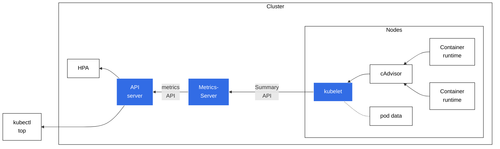
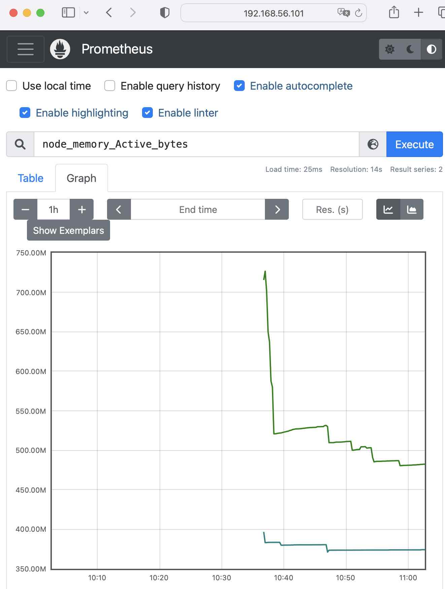
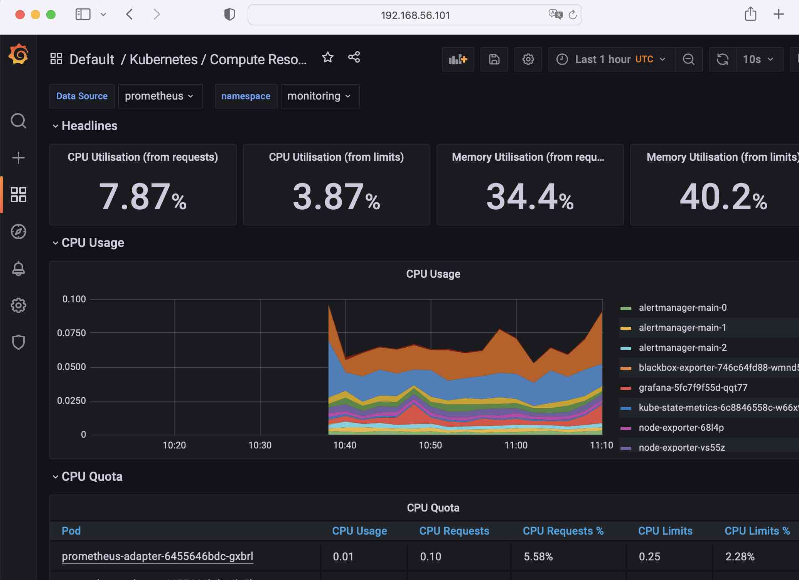

# 探索云原生

## 数据持久化

Kubernetes 管理存储资源的 API 对象 PersistentVolume 、 PersistentVolumeClaim 、 StorageClass 。

### Persistent Volume

Pod 里的容器是由镜像产生的，而镜像文件本身是只读的，进程要读写磁盘只能用一个临时的存储空间，一旦 Pod 销毁，临时存储也就会立即回收释放，数据也就丢失了。怎么办呢？

Kubernetes 的 Volume 是对数据存储的一个很好的抽象，它定义了有这么一个“存储卷”，而这个“存储卷”是什么类型、有多大容量、怎么存储，都可以自由发挥。Pod 不需要关心那些专业、复杂的细节，只要设置好 volumeMounts ，就可以把 Volume 加载进容器里使用。顺着 Volume 的概念， Kubernetes 延伸出了 PersistentVolume (PV) 对象，它专门用来表示持久存储设备，但隐藏了存储的底层实现。

作为存储的抽象， PV 实际上就是一些存储设备、文件系统，比如 Ceph、GlusterFS、NFS，甚至是本地磁盘，管理它们已经超出了 Kubernetes 的能力范围，一般会由系统管理员单独维护，然后再在 Kubernetes 里创建对应的 PV。

>PV 属于集群的系统资源，是和 Node 平级的一种对象，Pod 对它没有管理权，只有使用权。

### PersistentVolumeClaim/StorageClass

有了 PV，是否就可以直接在 Pod 里挂载使用了呢？还不行。因为不同存储设备的差异实在是太大了。

于是 Kubernetes 就又增加了两个新对象： PersistentVolumeClaim (PVC) 和 StorageClass，用的还是“中间层”的思想，把存储卷的分配管理过程再次细化。
（简化 Pod 挂载“虚拟盘”的过程， Pod 看不到，也不关心 PV 的实现细节。）

- PersistentVolumeClaim，简称 PVC，从名字上看比较好理解，就是用来向 Kubernetes 申请存储资源的。  
  PVC 是给 Pod 使用的对象，它相当于是 Pod 的代理，代表 Pod 向系统申请 PV。一旦资源申请成功，Kubernetes 就会把 PV 和 PVC 关联在一起，这个动作叫做“绑定”（bind）。

- StorageClass 在 PVC 和 PV 之间充当“协调人”的角色，帮助 PVC 找到合适的 PV。  
  系统里的存储资源非常多，如果要 PVC 去直接遍历查找合适的 PV 也很麻烦，所以就要用到 StorageClass。
  它的作用有点像 IngressClass，它抽象了特定类型的存储系统，归类分组 PV 对象，用来简化 PV 和 PVC 的绑定过程。

<br/>

### YAML 描述 PersistentVolume

Kubernetes 里有很多种类型的 PV，
- 最容易的本机存储 `HostPath`，它和 Docker 里挂载本地目录的 -v 参数非常类似，可以用它来初步认识一下 PV 的用法。

因为 Pod 会在集群的任意节点上运行，所以首先，我们要作为系统管理员在每个节点上创建一个目录，它将会作为本地存储卷挂载到 Pod 里。

```yml
apiVersion: v1
kind: PersistentVolume
metadata:
  name: host-10m-pv

spec:
  storageClassName: host-test
  accessModes:
  - ReadWriteOnce
  capacity:
    storage: 10Mi
  hostPath:
    path: /tmp/host-10m-pv/
```

解释：
- accessModes ：定义了存储设备的访问模式，简单来说就是虚拟盘的读写权限，和 Linux 的文件访问模式差不多，目前 Kubernetes 里有 3 种：
   - ReadWriteOnce：存储卷可读可写，但只能被一个节点上的 Pod 挂载。
   - ReadOnlyMany：存储卷只读不可写，可以被任意节点上的 Pod 多次挂载。
   - ReadWriteMany：存储卷可读可写，也可以被任意节点上的 Pod 多次挂载。

- capacity ：表示存储设备的容量，这里设置为 10MB。
  >Kubernetes 里定义存储容量使用的是国际标准， KB/MB/GB 的基数是 1024，要写成 Ki/Mi/Gi 。

- hostPath ：它指定了存储卷的本地路径，也就是在节点上的目录。

### YAML 描述 PersistentVolumeClaim

定义 PVC 对象，向 Kubernetes 申请存储。

```yml
apiVersion: v1
kind: PersistentVolumeClaim
metadata:
  name: host-5m-pvc

spec:
  storageClassName: host-test
  accessModes:
    - ReadWriteOnce
  resources:
    requests:
      storage: 5Mi
```

解释：

PVC 的内容与 PV 很像，但它不表示实际的存储，而是一个“申请”或者“声明”， spec 里的字段描述的是对存储的“期望状态”。

PVC 里的 storageClassName 、 accessModes 和 PV 是一样的，但不会有字段 capacity ，而是要用 resources.request 表示希望要有多大的容量。

### 使用 PersistentVolume

创建 PV

```shell
kubectl apply -f host-path-pv.yml
kubectl get pv
#
NAME          CAPACITY   ACCESS MODES   RECLAIM POLICY   STATUS      CLAIM   STORAGECLASS   REASON   AGE
host-10m-pv   10Mi       RWO            Retain           Available           host-test               5m22s
```

创建 PVC

```shell
kubectl apply -f host-path-pvc.yml
kubectl get pvc
#
NAME          STATUS   VOLUME        CAPACITY   ACCESS MODES   STORAGECLASS   AGE
host-5m-pvc   Bound    host-10m-pv   10Mi       RWO            host-test      4s
```

一旦 PVC 对象创建成功， Kubernetes 就会立即通过 StorageClass 、 resources 等条件在集群里查找符合要求的 PV ，如果找到合适的存储对象就会把它俩“绑定”在一起。  
此处 PVC 对象申请的是 5MB，现在系统里只有一个 10MB 的 PV，没有更合适的对象，所以 Kubernetes 也只能把这个 PV 分配出去，多出的容量就算是“福利”了。

如果把 PVC 的申请容量改大一些会怎么样呢？比如改成 100MB？  
会看到 PVC 会一直处于 Pending 状态，这意味着 Kubernetes 在系统里没有找到符合要求的存储，无法分配资源，只能等有满足要求的 PV 才能完成绑定。

### 为 Pod 挂载 PersistentVolume

PV 和 PVC 绑定好了，有了持久化存储，现在可以为 Pod 挂载存储卷。
先要在 `spec.volumes` 定义存储卷，然后在 `containers.volumeMounts` 挂载进容器。
因为用的是 PVC ，所以要在 volumes 里用字段 `persistentVolumeClaim` 指定 PVC 的名字。

```yml
apiVersion: v1
kind: Pod
metadata:
  name: host-pvc-pod

spec:
  volumes:
  - name: host-pvc-vol
    persistentVolumeClaim:
      claimName: host-5m-pvc

  containers:
    - name: ngx-pvc-pod
      image: nginx:alpine
      ports:
      - containerPort: 80
      volumeMounts:
      - name: host-pvc-vol
        mountPath: /tmp
```

<br/>
(Pod 、PVC 和 PV 的关系)

```shell
kubectl apply -f host-path-pod.yml
kubectl get pod -o wide
#
NAME           READY   STATUS    RESTARTS   AGE   IP            NODE   NOMINATED NODE   READINESS GATES
host-pvc-pod   1/1     Running   0          34s   10.244.1.34   vm2    <none>           <none>
```

可以看到 Pod 被分配到 vm2 节点上，那么 PV 是否确实挂载成功了呢？执行一些命令看看：

```bash
# check the path on bare host directory volume. run the command line on vm2
ll /tmp/
# 可以看到 volume /tmp/host-10m-pv 在 vm2 上自动生成了
drwxr-xr-x  2 root root 4096 Sep 15 14:50 host-10m-pv/

# go into pod
kubectl exec -it host-pvc-pod -- sh
/ # cd tmp
/tmp # echo hello world > a.txt
```

在 vm2 节点检查一下：

```bash
ll /tmp/host-10m-pv/
#
-rw-r--r--  1 root root   12 Sep 15 14:57 a.txt

cat /tmp/host-10m-pv/a.txt
#
hello world
```

可以看到确实在 vm2 节点的本地目录有一个 a.txt 的文件，再对一下时间，就可以确认是刚才在 Pod 里生成的文件。
因为 Pod 产生的数据已经通过 PV 存在了磁盘上，所以如果 Pod 删除后再重新创建，挂载存储卷时会依然使用这个目录，数据保持不变，也就实现了持久化存储。

不过因为这个 PV 是 HostPath 类型，只在本节点存储，如果 Pod 重建时被调度到了其他节点上，那么即使加载了本地目录，也不会是之前的存储位置，持久化功能也就失效了。

>**HostPath 类型的 PV 一般用来做测试。**

### 小结/补充

- Kubernets 有一种特殊形式的存储卷 `emptyDir`，它的生命周期与 Pod 相同，可以用于暂存或缓存。
- 如果存储系统符合 CSI (Container Storage Interface) 标准，那么 accessModes 可以设置成 ReadWriteOncePod ，只允许单个 Pod 读写。

## 使用网络共享卷

—— PersistentVolume + NFS (Network File System)

想让存储卷真正能被 Pod 任意挂载，需要变更存储的方式，不能限定在本地磁盘，而是要改成网络存储。这样 Pod 只要知道网络存储设备的 IP 地址或者域名，就可以通过网络通信访问。

网络存储是一个非常热门的应用领域，有很多知名的产品，比如 AWS、Azure、Ceph，Kubernetes 还专门定义了 CSI 规范，不过这些存储类型的安装、使用都比较复杂，在实验环境里部署难度比较高。此处以相对比较简单的 NFS 系统为例，来理解在 Kubernetes 里使用网络存储、静态存储卷和动态存储卷的概念。

### 安装 NFS 服务器

作为一个经典的网络存储系统，NFS 有着近 40 年的发展历史，基本上是各种 UNIX / Linux 系统的标准配置。

NFS 采用的是 Client/Server 架构，需要选定一台主机作为 Server，安装 NFS 服务端；其他要使用存储的主机作为 Client，安装 NFS 客户端工具。

此处以 Master 节点 vm1 作为 NFS 服务端。

```bash
sudo apt -y install nfs-kernel-server
```

安装好后，指定 NFS 的存储位置，这里使用了临时目录 /tmp/nfs

```bash
mkdir /tmp/nfs
```

接下来需要配置 NFS 访问共享目录，修改 `/etc/exports`，指定目录名、允许访问的网段，还有权限等参数。

```bash
vi /etc/exports
/tmp/nfs 192.168.56.1/24(rw,sync,no_subtree_check,no_root_squash,insecure)
```

让 NFS 配置生效：

```bash
sudo exportfs -ra
# 验证效果
sudo exportfs -v
#
/tmp/nfs      192.168.56.1/24(sync,wdelay,hide,no_subtree_check,sec=sys,rw,insecure,no_root_squash,no_all_squash)
```

启动 NFS 服务

```bash
sudo systemctl enable nfs-server
sudo systemctl start nfs-server
systemctl status nfs-server
```

使用命令 showmount 来检查 NFS 的网络挂载情况：

```bash
showmount -e 192.168.56.101
#
Export list for 192.168.56.101:
/tmp/nfs 192.168.56.1/24
```

### 安装 NFS 客户端

为了让 Kubernetes 集群能够访问 NFS 存储服务，需要在每个节点上都安装 NFS 客户端。

```bash
sudo apt -y install nfs-common
```

在节点上使用 showmount 检查 NFS 能否正常挂载：

```bash
showmount -e 192.168.56.101
```

尝试手动挂载 NFS 网络存储，将本地 /tmp/nfs-local 作为挂载点：

```bash
mkdir -p /tmp/nfs-local
sudo mount -t nfs 192.168.56.101:/tmp/nfs /tmp/nfs-local
# 1) 在 /tmp/test 里随便创建一个文件
cd /tmp/nfs-local/
echo hello-world > x.txt
# 2) 回到 NFS 服务器，检查共享目录 /tmp/nfs
ll /tmp/nfs/
#
-rw-rw-r--  1 dao  dao    12 Sep 15 15:50 x.txt

# to list all mounts
mount -l
df
```

### 使用 NFS 存储卷

#### 创建 PV

先手工分配一个存储卷，需要指定 storageClassName 是 nfs ；再设置 accessModes 为 ReadWriteMany ， NFS 支持多个节点同时访问一个共享目录。

```yml
apiVersion: v1
kind: PersistentVolume
metadata:
  name: nfs-100m-pv

spec:
  storageClassName: nfs-test
  accessModes:
  - ReadWriteMany
  capacity:
    storage: 100Mi

  nfs:
    server: 192.168.56.101
    path: /tmp/nfs/100m-pv
```

```bash
k apply -f pv/nfs-static-pv.yml
k get pv
#
NAME          CAPACITY   ACCESS MODES   RECLAIM POLICY   STATUS      CLAIM                 STORAGECLASS   REASON   AGE
nfs-100m-pv   100Mi      RWX            Retain           Available                         nfs-test                6s
```

>注意：
>spec.nfs 里的 IP 地址一定要正确，路径目录一定要事先创建好！

#### 创建 PVC

它的内容和 PV 差不多，但不涉及 NFS 存储的细节，只需要用指定申请多大的容量。

```yml
apiVersion: v1
kind: PersistentVolumeClaim
metadata:
  name: nfs-static-pvc

spec:
  storageClassName: nfs-test
  accessModes:
  - ReadWriteMany

  resources:
    requests:
      storage: 100Mi
```

```bash
k apply -f pv/nfs-static-pvc.yml
persistentvolumeclaim/nfs-static-pvc created
k get pvc
#
NAME             STATUS   VOLUME        CAPACITY   ACCESS MODES   STORAGECLASS   AGE
nfs-static-pvc   Bound    nfs-100m-pv   100Mi      RWX            nfs-test       6s
```

#### 创建 Pod

```yml
apiVersion: v1
kind: Pod
metadata:
  name: nfs-static-pod

spec:
  volumes:
  - name: nfs-static-vol
    persistentVolumeClaim:
      claimName: nfs-static-pvc

  containers:
    - name: ngx-nfs-static-pod
      image: nginx:alpine
      ports:
      - containerPort: 80
    
      volumeMounts:
      - name: nfs-static-vol
        mountPath: /tmp
```

```bash
k apply -f pv/nfs-static-pod.yml
k get pod -o wide
#
NAME             READY   STATUS    RESTARTS      AGE   IP            NODE   NOMINATED NODE   READINESS GATES
nfs-static-pod   1/1     Running   0             11s   10.244.1.37   vm2    <none>           <none>
```

<br/>
(Pod、PVC、PV 和 NFS 存储的关系)

#### 检验

Kubernetes 会自动执行 NFS 挂载动作，把 NFS 的共享目录 /tmp/nfs/100m-pv 挂载到 Pod 里的 /tmp 。

进入 Pod ，试着操作 NFS 共享目录：

```bash
# vm2
k exec -it nfs-static-pod -- sh
cd /tmp/
echo hello-world > a.txt

# vm1 (NFS Server)
ll /tmp/nfs/100m-pv/
-rw-r--r-- 1 root root   12 Sep 16 02:50 a.txt

cat /tmp/nfs/100m-pv/a.txt
hello-world
```

### 部署 NFS Provisoner

有了 NFS 网络存储系统，是否 Kubernetes 里的数据持久化问题就已经解决了？
“解决了，但没有完全解决。”

因为 PV 还是需要人工管理，必须要由系统管理员手动维护各种存储设备，再根据开发需求逐个创建 PV，而且 PV 的大小也很难精确控制，容易出现空间不足或者空间浪费的情况。

那么能不能让创建 PV 的工作也实现自动化呢？让计算机来代替人类来分配存储卷呢？这时“动态存储卷”的概念呼之欲出，它利用 StorageClass 绑定一个 Provisioner 对象，这个 Provisioner 就是一个能够自动管理存储、创建 PV 的应用，代替了原来系统管理员的手工劳动。

> Provisioner 就是 [NFS subdir external provisioner - GitHub](https://github.com/kubernetes-sigs/nfs-subdir-external-provisioner)

NFS Provisioner 也是以 Pod 的形式运行在 Kubernetes 里的，它所需的 YAML 文件，一共有三个：
- rbac.yaml
  
  需要修改它使用的是默认的 default 名字空间，改成其他的名字空间，避免与普通应用混在一起，可以用“查找替换”的方式把它统一改成 kube-system 。[参考](./src/pv/nfs-provisioner/rbac.yml)

- class.yaml

- deployment.yaml

  主要修改 名字空间 和 NFS 配置：
  首先，要把名字空间改成和 rbac.yaml 一样，比如 kube-system ；
  然后，要修改配置到集群里的 NFS 服务器，比如， volumes 和 env 里的 IP 地址和共享目录名。
  [参考](./src/pv/nfs-provisioner/deployment.yml)

```bash
k apply -f nfs-provisioner/rbac.yml
#
serviceaccount/nfs-client-provisioner created
clusterrole.rbac.authorization.k8s.io/nfs-client-provisioner-runner created
clusterrolebinding.rbac.authorization.k8s.io/run-nfs-client-provisioner created
role.rbac.authorization.k8s.io/leader-locking-nfs-client-provisioner created
rolebinding.rbac.authorization.k8s.io/leader-locking-nfs-client-provisioner created

k apply -f nfs-provisioner/class.yml
#
storageclass.storage.k8s.io/nfs-client created

k apply -f nfs-provisioner/deployment.yml
#
deployment.apps/nfs-client-provisioner created

k get deploy -A
#
NAMESPACE     NAME                     READY   UP-TO-DATE   AVAILABLE   AGE
kube-system   nfs-client-provisioner   1/1     1            1           20s
```

### 使用 NFS 动态存储卷

查看 NFS 默认的 StorageClass 定义，[参考](./src/pv/nfs-provisioner/class.yml)，

YAML 里的关键字段是 provisioner ：它指定了应该使用哪个 Provisioner。另一个字段 parameters 是调节 Provisioner 运行的参数，需要[参考文档](https://github.com/kubernetes-sigs/nfs-subdir-external-provisioner/tree/v4.0.2#build-and-publish-your-own-container-image)来确定具体值，在这里的 archiveOnDelete: "false" 就是自动回收存储空间。

NFS 动态卷我们可以根据自己的需求，任意定制具有不同存储特性的 StorageClass ，比如添加字段 onDelete: "retain" 暂时保留分配的存储，之后再手动删除。

>OnDelete: If it exists and has a delete value, delete the directory, if it exists and has a retain value, save the directory.

```yml
apiVersion: storage.k8s.io/v1
kind: StorageClass
metadata:
  name: nfs-client-retained

provisioner: k8s-sigs.io/nfs-subdir-external-provisioner
parameters:
  onDelete: "retain"
```

#### 实践

接下来定义一个 PVC ，向系统申请 10MB 的存储空间，使用的 StorageClass 是默认的 nfs-client ：

pvc

```yml
apiVersion: v1
kind: PersistentVolumeClaim
metadata:
  name: nfs-dyn-10m-pvc

spec:
  storageClassName: nfs-client
  accessModes:
  - ReadWriteMany

  resources:
    requests:
      storage: 10Mi
```

pod

```yml
apiVersion: v1
kind: Pod
metadata:
  name: nfs-dyn-pod

spec:
  volumes:
  - name: nfs-dyn-vol
    persistentVolumeClaim:
      claimName: nfs-dyn-10m-pvc

  containers:
    - name: ngx-nfs-dyn-pod
      image: nginx:alpine
      ports:
      - containerPort: 80
    
      volumeMounts:
      - name: nfs-dyn-vol
        mountPath: /tmp
```

检验

```bash
k apply -f nfs-dyn-pvc.yml
persistentvolumeclaim/nfs-dyn-10m-pvc created

ll /tmp/nfs/
#
drwxrwxrwx  2 root root 4096 Sep 16 04:49 default-nfs-dyn-10m-pvc-pvc-588e6c06-9d21-491d-baec-9a6d35635c2b/

k apply -f nfs-dyn-pod.yml
pod/nfs-dyn-pod created

k get pod
#
NAME             READY   STATUS    RESTARTS   AGE
nfs-dyn-pod      1/1     Running   0          5s

k get pv
#
NAME                                       CAPACITY   ACCESS MODES   RECLAIM POLICY   STATUS   CLAIM                     STORAGECLASS   REASON   AGE
pvc-588e6c06-9d21-491d-baec-9a6d35635c2b   10Mi       RWX            Delete           Bound    default/nfs-dyn-10m-pvc   nfs-client              2m

k get pvc
#
NAME              STATUS   VOLUME                                     CAPACITY   ACCESS MODES   STORAGECLASS   AGE
nfs-dyn-10m-pvc   Bound    pvc-588e6c06-9d21-491d-baec-9a6d35635c2b   10Mi       RWX            nfs-client     2m2s
```

>我们不需要定义 PV 对象，有 NFS Provisioner 自动创建一个 PV ，大小刚好是在 PVC 里申请的 10MB 。

<br/>
(Pod、PVC、StorageClass 和 Provisioner 的关系)

### 小结

- 在 Kubernetes 集群里，网络存储系统更适合数据持久化，NFS 是最容易使用的一种网络存储系统，要事先安装好服务端和客户端。
- 可以编写 PV 手工定义 NFS 静态存储卷，要指定 NFS 服务器的 IP 地址和共享目录名。
- 使用 NFS 动态存储卷必须要部署相应的 Provisioner ，在 YAML 里正确配置 NFS 服务器。
- 动态存储卷不需要手工定义 PV，而是要定义 StorageClass，由关联的 Provisioner 自动创建 PV 完成绑定。
- NFS 最初是由 Sun 公司在1984年发布的，当前由 IETF 负责维护，最新版本已是4.2了。

## StatefulSet

Deployment 和 DaemonSet 是在 Kubernetes 集群里部署应用的重要工具，不过它们只能管理“无状态应用”（Stateless Application），不能管理“有状态应用”（Stateful Application）。

### 什么是有状态的应用

先从 PersistentVolume 谈起，有了持久化存储，应用就可以把一些运行时的关键数据落盘，相当于有了一份“保险”，如果 Pod 发生意外崩溃，也只不过像是按下了暂停键，等重启后挂载 Volume 后，再加载原数据就能够满血复活，恢复之前的“状态”继续运行。

有一些应用的状态信息不是很重要，即使不恢复状态也能够正常运行，这就是“无状态应用”。典型的例子如 Nginx ，它只是处理 HTTP 请求，本身不生产数据（日志除外），不需要特意保存状态，无论以什么状态重启都能很好地对外提供服务。

还有一些应用，运行状态信息很重要，如果因为重启而丢失了状态是绝对无法接受的，这就是“有状态应用”。例子很多，比如 Redis 、 MySQL 这样的数据库，它们的“状态”就是在内存或者磁盘上产生的数据，是应用的核心价值所在。

那么，是不是 Deployment 加上 PersistentVolume 就可以轻松管理有状态的应用呢？
的确，用 Deployment 来保证高可用，用 PersistentVolume 来存储数据，确实可以**部分达到**管理“有状态应用”的目的。

但是 Kubernetes 的眼光则更加全面和长远，它认为“状态”不仅仅是数据持久化，在集群化、分布式的场景里，还有多实例的*依赖关系*、*启动顺序*和*网络标识*等问题需要解决，而这些问题恰恰是 Deployment 力所不及的。

比如，对*有状态应用* ，多个实例之间可能存在依赖关系，比如 master/slave、active/passive，需要依次启动才能保证应用正常运行，外界的客户端也可能要使用固定的网络标识来访问实例，并且这些信息还必须要保证在 Pod 重启后不变。

### 描述 StatefulSet

用命令查看 StatefulSet 的基本信息：

```bash
kubectl api-resources | grep statefulset
#
NAME                              SHORTNAMES   APIVERSION                             NAMESPACED   KIND
statefulsets                      sts          apps/v1                                true         StatefulSet

```

=>构造出 YAML 文件头信息如下：

```yml
apiVersion: apps/v1
kind: StatefulSet
metadata:
  name: xxx-sts # 它的简称是 sts
```

和 DaemonSet 类似， StatefulSet 也可以看做是 Deployment 的一个特例，它也不能直接用 kubectl create 创建样板文件，但可以简单修改 Deployment 得到。下面以 redis 为例：

```yaml
# k create deploy redis-sts --image=redis:alpine --port=6379 $out
apiVersion: apps/v1
kind: StatefulSet
metadata:
  name: redis-sts

spec:
  serviceName: redis-svc  # 新增字段
  replicas: 2
  selector:
    matchLabels:
      app: redis-sts

  template:
    metadata:
      labels:
        app: redis-sts
    spec:
      containers:
      - image: redis:alpine
        name: redis
        ports:
        - containerPort: 6379
```

观察 YAML 文件，除了 kind 不同于 Deployment 外，在 spec 里多出了一个字段`serviceName`。

### 使用 StatefulSet

使用 StatefulSet 来解决上面说的*有状态应用*的三个问题。

#### 第一问题：启动顺序

执行上面的 redis-sts 观察结果：

```bash
k apply -f statefulset/redis-sts.yml
k get sts
#
NAME        READY   AGE
redis-sts   0/2     6s

k get pod
#
NAME             READY   STATUS    RESTARTS   AGE
redis-sts-0      1/1     Running   0          51s
redis-sts-1      1/1     Running   0          29s
```

可以看到，StatefulSet 所管理的 Pod 不再是随机的名字了，而是有了顺序编号，从 0 开始分别被命名为 redis-sts-0、redis-sts-1，Kubernetes 也会按照这个顺序依次创建（0 号比 1 号的 AGE 要长一点）。——解决了启动顺序的问题。

#### 第二个问题：依赖关系

接下来看，应用怎么知道自己的身份，进而确定互相之间的依赖关系呢？ Kubernetes 给出的方法是使用 hostname ，也就是每个 Pod 里的主机名。去 Pod 里看看：

```bash
k exec -it redis-sts-0 -- hostname
#
redis-sts-0

k exec -it redis-sts-1 -- cat /etc/hostname
#
redis-sts-1
```

有了这个唯一的名字，应用就可以自行决定依赖关系了，比如在这个 Redis 例子里，可以让先启动的 0 号 Pod 是主实例，后启动的 1 号 Pod 是从实例。

#### 第三个问题：网络标识

这就需要用到 Service 对象。

>这里不能用命令 kubectl expose 直接为 StatefulSet 生成 Service，需要手动编写 YAML 。

```yml
# kubectl create service clusterip redis-svc --tcp=6379 $out
apiVersion: v1
kind: Service
metadata:
  name: redis-svc # 指定的 service name 必须与 StatefulSet serviceName 相同

spec:
  selector:
    app: redis-sts  # 指定 StatefulSet name

  type: ClusterIP
  ports:
  - port: 6379
    protocol: TCP
    targetPort: 6379
```

查看结果：

```bash
k apply -f statefulset/redis-svc.yml
k get svc
#
NAME         TYPE        CLUSTER-IP      EXTERNAL-IP   PORT(S)    AGE
redis-svc    ClusterIP   10.109.31.223   <none>        6379/TCP   4s

k describe svc redis-svc
#
Name:              redis-svc
Namespace:         default
Selector:          app=redis-sts
Type:              ClusterIP
IP Family Policy:  SingleStack
IP Families:       IPv4
IP:                10.109.31.223
IPs:               10.109.31.223
Port:              <unset>  6379/TCP
TargetPort:        6379/TCP
Endpoints:         10.244.1.40:6379,10.244.1.41:6379
...
```

我们知道 Service 有一个域名，格式是`对象名.名字空间`，每个 Pod 也有一个域名，形式是`IP 地址.名字空间`。但因为 IP 地址不稳定，所以 Pod 的域名并不实用。

但 Service 对象应用于 StatefulSet 的时候，情况就不一样了。Service 发现这些 Pod 不是一般的应用，而是有状态应用，需要有稳定的网络标识，所以就会为 Pod 再多创建出一个新的域名，格式是`Pod 名.服务名.名字空间.svc.cluster.local`。也可以简写成`Pod 名.服务名`。
进入 Pod 内部，用 ping 命令来验证一下：

```bash
k exec -it redis-sts-0 -- ping redis-sts-1.redis-svc
#
PING redis-sts-1.redis-svc (10.244.1.41): 56 data bytes
64 bytes from 10.244.1.41: seq=0 ttl=64 time=0.076 ms
...

k exec -it redis-sts-1 -- ping redis-sts-0.redis-svc
#
PING redis-sts-0.redis-svc (10.244.1.40): 56 data bytes
64 bytes from 10.244.1.40: seq=0 ttl=64 time=0.132 ms
...
```

通过 StatefulSet 和 Service 的联合使用，就有了稳定的网络标识。

<br/>
(StatefulSet 与 Service 对象的关系)

### 实现 StatefulSet 的数据持久化

为了强调持久化存储与 StatefulSet 的一对一绑定关系，Kubernetes 为 StatefulSet 专门定义了一个字段`volumeClaimTemplates`，直接把 PVC 定义嵌入 StatefulSet 的 YAML 文件里。这样能保证创建 StatefulSet 的同时，就会为每个 Pod 自动创建 PVC，让 StatefulSet 的可用性更高。

```yml
apiVersion: apps/v1
kind: StatefulSet
metadata:
  name: redis-pv-sts

spec:
  serviceName: redis-svc

  volumeClaimTemplates: 
  - metadata: 
      name: redis-100m-pvc
    spec: 
      storageClassName: nfs-client
      accessModes: 
      - ReadWriteMany

      resources: 
        requests: 
          storage: 100Mi

  replicas: 2
  selector:
    matchLabels:
      app: redis-sts

  template:
    metadata:
      labels:
        app: redis-sts
    spec:
      containers:
      - image: redis:alpine
        name: redis
        ports:
        - containerPort: 6379

        volumeMounts:
        - name: redis-100m-pvc
          mountPath: /data
```

解释：
- StatefulSet 对象的名字是 redis-pv-sts，表示它使用了 PV 存储。
- 然后 `volumeClaimTemplates`里定义了一个 PVC，名字是 redis-100m-pvc，申请了 100MB 的 NFS 存储。
- 在 Pod 模板里用 `volumeMounts` 引用了这个 PVC，把网盘挂载到 Redis 的数据目录 /data 。

完整的 StatefulSet 对象，如下：

<br/>

检验：

```bash
k apply -f statefulset/redis-pv-sts.yml
k get sts
#
NAME           READY   AGE
redis-pv-sts   2/2     5s

k get pod
#
NAME             READY   STATUS    RESTARTS   AGE
redis-pv-sts-0   1/1     Running   0          11s
redis-pv-sts-1   1/1     Running   0          8s

k get pv
# 为每个 redis 的 Pod 分配了 PV
NAME                                       CAPACITY   ACCESS MODES   RECLAIM POLICY   STATUS   CLAIM                                   STORAGECLASS   REASON   AGE
pvc-1115e2f4-93ac-464c-8070-7001b27abe21   100Mi      RWX            Delete           Bound    default/redis-100m-pvc-redis-pv-sts-0   nfs-client              90s
pvc-2c26d3d9-203c-4aad-b9c8-f164cb8d5b48   100Mi      RWX            Delete           Bound    default/redis-100m-pvc-redis-pv-sts-1   nfs-client              87s

# 添加 redis 键 message
kubectl exec -it redis-pv-sts-0 -- redis-cli
127.0.0.1:6379> set message 'hello world'
OK
127.0.0.1:6379> get message
"hello world"
127.0.0.1:6379> exit

# 模拟意外事故，删除 Redis 主实例
k delete pod redis-pv-sts-0
pod "redis-pv-sts-0" deleted

# 查看 pod
k get pod
NAME             READY   STATUS    RESTARTS   AGE
redis-pv-sts-0   1/1     Running   0          5s
redis-pv-sts-1   1/1     Running   0          6m51s

# 检查 message 键值
kubectl exec -it redis-pv-sts-0 -- redis-cli
127.0.0.1:6379> get message
"hello world"

# 设置 Redis 的 主/从 关系
kubectl exec -it redis-pv-sts-1 -- redis-cli replicaof redis-pv-sts-0.redis-svc 6379
kubectl exec -it redis-pv-sts-0 -- redis-cli info replication
# Replication
role:master
connected_slaves:1
slave0:ip=10.244.1.43,port=6379,state=online,offset=14,lag=0
master_failover_state:no-failover
# 添加一个键值 abc 1
kubectl exec -it redis-pv-sts-0 -- redis-cli set abc 1
OK
# 在从实例上查看新键值
kubectl exec -it redis-pv-sts-1 -- redis-cli get abc
"1"
```

我们得到了预期的结果，完美！

### 小结/补充

- 使用 `clusterIP: None`，没有集群 IP 的 service 对象，也被称为 “headless service”。
- 即使有了 StatefulSet ，管理有状态的应用的难度依然很高，之后又有了 Operator 概念。

## 滚动更新

—— kubectl rollout 实现用户无感知的应用升级和降级。

在 Kubernetes 里，版本更新使用的不是 API 对象，而是命令：kubectl apply 和 kubectl rollout，搭配部署应用所需要的 Deployment、DaemonSet 等 YAML 文件。

### 如何定义应用版本

简单地理解“版本”应该是应用程序的“版本号”，或者是容器镜像的“标签”？
但在 Kubernetes 里应用都是以 Pod 的形式运行的，而 Pod 通常又会被 Deployment 等对象来管理，所以应用的“版本更新”实际上更新的是整个 Pod 。
因为 Pod 是由 YAML 描述文件来确定的，更准确地说，是 Deployment 等对象里的字段 template 。

所以，在 Kubernetes 里应用的版本变化就会因为 template 里只变动了一个字段，而形成一个新的版本，也算作是版本变化。

```bash
k get pod 
```

Pod 名字里的那串随机数就是 Pod 模板的 Hash 值，也就是 Pod 的“版本号”。

### 如何实现应用更新

动手实践，以 Nginx Deployment 对象为例。

- ConfigMap

  [YAML 参考](./src/rollout/ngx-conf.yml)

- Pod

  使用 image nginx:1.21-alpine 。

  [YAML 参考](./src/rollout/ngx-v1.yml)

- Service (可选的)

  为了方便在 Pod 外查看，创建一个 svc 。[YAML 参考](./src/rollout/ngx-svc.yml)

- 查看结果

  ```bash
  k apply -f .
  # 如果 svc 使用 tpye=NodePort ，则需要下面的端口转发模式
  #kubectl port-forward svc/ngx-svc 8080:80 &
  #curl 127.1:8080
  k get svc
  #kubectl get all -l "app in (rollout-demo,ngx-dep)"
  #
  NAME         TYPE        CLUSTER-IP       EXTERNAL-IP   PORT(S)   AGE
  kubernetes   ClusterIP   10.96.0.1        <none>        443/TCP   39d
  ngx-svc      ClusterIP   10.103.245.125   <none>        80/TCP    5m55s

  curl 10.103.245.125
  #
  ver : 1.21.6  # <--
  srv : 10.244.1.52:80
  host: ngx-dep-6c785d8f5d-kd5z8
  ```

- 更新 Pod ，然后查看结果

  编写一个新版本对象 `ngx-v2.yml` ，把镜像升级到 `nginx:1.22-alpine`，其他的都不变。

  查看滚动更新状态：

  ```bash
  kubectl apply -f ngx-v2.yml
  kubectl rollout status deployment ngx-dep
  #
  Waiting for deployment "ngx-dep" rollout to finish: 3 out of 4 new replicas have been updated...
  Waiting for deployment "ngx-dep" rollout to finish: 3 out of 4 new replicas have been updated...
  Waiting for deployment "ngx-dep" rollout to finish: 3 out of 4 new replicas have been updated...
  Waiting for deployment "ngx-dep" rollout to finish: 3 out of 4 new replicas have been updated...
  Waiting for deployment "ngx-dep" rollout to finish: 1 old replicas are pending termination...
  Waiting for deployment "ngx-dep" rollout to finish: 1 old replicas are pending termination...
  Waiting for deployment "ngx-dep" rollout to finish: 1 old replicas are pending termination...
  Waiting for deployment "ngx-dep" rollout to finish: 3 of 4 updated replicas are available...
  deployment "ngx-dep" successfully rolled out

  k get pod
  #
  NAME                       READY   STATUS    RESTARTS   AGE
  ngx-dep-5f6fdd6f65-r97wk   1/1     Running   0          7m41s
  ...

  curl 10.103.245.125
  #
  ver : 1.22.0  # <--
  srv : 10.244.1.54:80
  host: ngx-dep-5f6fdd6f65-r97wk
  ```

  >如果 Kubernetes 的动作太快了，为了能够观察到应用更新的过程，可以添加一个字段 `minReadySeconds`。

仔细查看输出信息，可以发现， Kubernetes 不是把旧 Pod 全部销毁再一次性创建出新 Pod ，而是在逐个地创建新 Pod，同时也在销毁旧 Pod，保证系统里始终有足够数量的 Pod 在运行，不会有“空窗期”中断服务。

使用命令 `kubectl describe` 可以更清楚地看到 Pod 的变化情况：

```bash
k describe deploy ngx-dep
#
Type    Reason             Age   From                   Message
----    ------             ----  ----                   -------
Normal  ScalingReplicaSet  12m   deployment-controller  Scaled up replica set ngx-dep-5f6fdd6f65 to 1
Normal  ScalingReplicaSet  12m   deployment-controller  Scaled down replica set ngx-dep-6c785d8f5d to 3
Normal  ScalingReplicaSet  12m   deployment-controller  Scaled up replica set ngx-dep-5f6fdd6f65 to 2
Normal  ScalingReplicaSet  11m   deployment-controller  Scaled down replica set ngx-dep-6c785d8f5d to 2
Normal  ScalingReplicaSet  11m   deployment-controller  Scaled up replica set ngx-dep-5f6fdd6f65 to 3
Normal  ScalingReplicaSet  11m   deployment-controller  Scaled down replica set ngx-dep-6c785d8f5d to 1
Normal  ScalingReplicaSet  11m   deployment-controller  Scaled up replica set ngx-dep-5f6fdd6f65 to 4
Normal  ScalingReplicaSet  11m   deployment-controller  Scaled down replica set ngx-dep-6c785d8f5d to 0
```

到此为止，整个过程是比较明了的，“滚动更新”就是由 Deployment 控制的同步进行的应用“伸” 和 “缩”操作，老版本缩容到 0 ，同时新版本扩容到指定值。—— 此消彼长的过程

<br/>

### 如何管理应用更新

使用 Kubernetes 的“滚动更新”功能，不需要任何人工干预就能简单地把应用升级到新版本，也不会中断服务。
若更新过程中发生了错误或者更新后发现有 Bug ，该怎么办呢？要解决这两个问题，还是要用 kubectl rollout 命令。
在应用更新的过程中，可以随时使用 `kubectl rollout pause` 来暂停更新，检查、修改 Pod，或者测试验证，如果确认没问题，再用 `kubectl rollout resume` 来继续更新。

查看更新历史：

```bash
kubectl rollout history deploy ngx-dep
#
deployment.apps/ngx-dep
REVISION  CHANGE-CAUSE
1         <none>
2         <none>
```

在命令后加上参数 `--revision` 来查看每个版本的详细信息，包括标签、镜像名、环境变量、存储卷等等：

```bash
kubectl rollout history deploy ngx-dep --revision=2
```

若想要回退到上一个版本，就可以使用命令 `kubectl rollout undo`，也可以加上参数 `--to-revision` 回退到任意一个历史版本：

```bash
kubectl rollout undo deploy ngx-dep
#kubectl rollout undo deploy ngx-dep --to-revision=1

curl 10.103.245.125
#
ver : 1.21.6  # <--
srv : 10.244.1.61:80
host: ngx-dep-6c785d8f5d-nmwdf
```

undo 的操作过程依然是“滚动更新”，只不过使用的是旧版本 Pod 模板，把新版本 Pod 数量收缩到 0，同时把老版本 Pod 扩展到指定值。

<br/>

更新过程中的 pause / resume 演示：

```bash
kubectl set image deployment/ngx-dep nginx=nginx:1.23-alpine
#
kubectl rollout pause deployment/ngx-dep
#
kubectl rollout resume deployment/ngx-dep
#
kubectl edit deployment/ngx-dep
kubectl get deployment/ngx-dep -o yaml > /tmp/nginx.yaml
```

### 如何添加更新描述

`kubectl rollout history` 的版本列表只有一个版本更新序号，是否过于简单？能否让 `CHANGE-CAUSE` 显示像 Git 一样，每次更新加上说明信息呢？

可以的，做法也很简单，只需要在 Deployment 里添加上字段 `metadata.annotations`。
`annotations` 形式上和 `labels` 一样，都是 `Key-Value`，区别是：

- `annotations` 添加的信息一般是给 *Kubernetes 内部的各种对象*使用，像是“扩展属性”；
- `labels` 主要面对的是 *Kubernetes 外部的用户*，用来筛选、过滤对象的。

>打比喻来说呢， annotations 就是*包装盒里的产品说明书*，而 labels 是*包装盒外的标签贴纸*。

编写更新说明，需要使用特定的字段 `kubernetes.io/change-cause`：

```yaml
apiVersion: apps/v1
kind: Deployment
metadata:
  name: ngx-dep
  annotations:
    kubernetes.io/change-cause: v1, ngx=1.21
...
```

再用 kubectl rollout history 来看一下更新历史：

```bash
k rollout history deploy ngx-dep
#
deployment.apps/ngx-dep
REVISION  CHANGE-CAUSE
3         v1, ngx=1.21
4         v2, ngx=1.22
```

### 小结

- Kubernetes 采用滚动更新策略来更新应用，减少旧版本 Pod 的同时增加新版本 Pod ，保证在更新过程中服务始终可用。
- 在 Deployment 里还有其他一些字段可以对滚动更新的过程做更细致的控制，它们都在 `spec.strategy.rollingUpdate` 里，比如 `maxSurge`、`maxUnavailable` 等字段，分别控制*最多新增 Pod 数*和*最多不可用 Pod 数*。

  ```yaml
  spec:
    strategy:
      type: RollingUpdate
      rollingUpdate:
        maxSurge: 2
        maxUnavailable: 1
  ```

- Kubernetes 不会记录所有的更新历史，默认只会保留最近 10 次操作，可以用字段 `spec.revisionHistoryLimit` 调整。

- autoscale by CPU

  ```bash
  kubectl autoscale deployment/ngx-dep --min=10 --max=15 --cpu-percent=80
  ```

## 应用保障

Kubernetes 里配置 Pod 的两种方法：资源配额 Resources、检查探针 Probe，它们能够给 Pod 添加各种运行保障，让应用运行得更健康。

### 容器资源配额

创建容器有三大隔离技术：
- namespace 实现了独立的进程空间；
- chroot 实现了独立的文件系统；
- cgroup 管控 CPU、内存，保证容器不会无节制地占用基础资源，进而影响到系统里的其他应用。

这个资源配额管理，与 PersistentVolumeClaim 用法类似，就是容器需要先提出一个“书面申请”。
具体的申请方法很简单，在 Pod 容器的描述部分添加一个新字段 `resources` 就可以了。

```yaml
spec:
  containers:
    resources:
      requests:
        cpu: 10m
        memory: 100Mi
      limits:
        cpu: 20m
        memory: 200Mi
```

两个关键字段：
- requests

  容器要申请的资源，也就是要求 Kubernetes 在创建 Pod 的时候必须分配这里列出的资源，否则容器就无法运行。

- limits
 
  容器使用资源的上限，不能超过设定值，否则就有可能被强制停止运行。

资源表示方式：
- 内存的写法和磁盘容量一样，使用 Ki、Mi、Gi 来表示 KB、MB、GB，比如 512Ki、100Mi、0.5Gi 等。
- CPU 在计算机中数量有限， Kubernetes 允许容器精细分割 CPU，即可以 1 个、2 个地完整使用 CPU，也可以用小数 0.1、0.2 的方式来部分使用 CPU。
  >这是效仿了 UNIX `时间片`的用法，意思是进程最多可以占用多少 CPU 时间

  Kubernetes 里 CPU 的最小使用单位是 0.001，为了方便表示用了一个特别的单位 m，也就是 ‘milli’（毫），比如说 500m 就相当于 0.5。

上面 YAML 描述的解释：

它向系统申请的是 1% 的 CPU 时间和 100MB 的内存，运行时的资源上限是 2% 的 CPU 时间和 200MB 内存。

Kubernetes 会根据每个 Pod 声明的需求，像搭积木或者玩俄罗斯方块一样，把节点尽量“塞满”，充分利用每个节点的资源，让集群的效益最大化。

**问：如果 Pod 不写 resources 字段，Kubernetes 会如何处理呢？**（生产环境里的危险动作！）

答：此处 Pod 对运行的资源要求“既没有下限，也没有上限”， Kubernetes 不用管 CPU 和内存是否足够，可以把 Pod 调度到任意的节点上，而且后续 Pod 运行时也可以无限制地使用 CPU 和内存。

**问：如果预估错误，Pod 申请的资源太多，系统无法满足会怎么样呢？**

答：会调度失败！实验一下，强制分配超过总 CPU 数的 CPU 资源，Pod 状态将为 pending 。

```yaml
spec:
  containers:
    resources:
      requests:
        cpu: 10
        memory: 100Mi
```

```bash
k apply -f resource.yml
The Pod "ngx-pod-resources" is invalid: spec.containers[0].resources.requests: Invalid value: "10": must be less than or equal to cpu limit
```

### 容器状态探针

一个程序即使正常启动了，也有可能因为某些原因无法对外提供服务。因此需要更细致地监控 Pod 的状态，除了保证崩溃重启，还必须要能够探查到 Pod 的内部运行状态，定时给应用做“体检”，让应用时刻保持“健康”，能够满负荷稳定工作。

#### 用什么手段来检查应用的健康状态

Kubernetes 为检查应用状态定义了三种探针，分别对应容器不同的状态：（把应用变成一个灰盒子，而不是原来的黑盒子了）

- Startup

  启动探针，用来检查应用是否已经启动成功，适合那些有大量初始化工作要做，启动很慢的应用。

- Liveness
  
  存活探针，用来检查应用是否正常运行，是否存在死锁、死循环。

- Readiness

  就绪探针，用来检查应用是否可以接收流量，是否能够对外提供服务。

这三种探针是递进的关系：应用程序先启动，加载完配置文件等基本的初始化数据就进入了 Startup 状态，之后如果没有什么异常就是 Liveness 存活状态，但可能有一些准备工作没有完成，还不一定能对外提供服务，只有到最后的 Readiness 状态才是一个容器最健康可用的状态。

#### 如何使用状态和探针来管理容器

- 如果 Startup 探针失败， Kubernetes 会认为容器没有正常启动，就会尝试反复重启，当然其后面的 Liveness 探针和 Readiness 探针也不会启动。
- 如果 Liveness 探针失败， Kubernetes 就会认为容器发生了异常，也会重启容器。
- 如果 Readiness 探针失败， Kubernetes 会认为容器虽然在运行，但内部有错误，不能正常提供服务，就会把容器从 Service 对象的负载均衡集合中排除，不会给它分配流量。

Kubernetes 的处理动作及容器探针的工作流程，如下：

<br/>

### 使用容器状态探针

三种探针的配置方式都是一样的，关键字段：
- periodSeconds ：执行探测动作的时间间隔，默认是 10 秒探测一次。
- timeoutSeconds ：探测动作的超时时间，如果超时就认为探测失败，默认是 1 秒。
- successThreshold ：连续几次探测成功才认为是正常，对于 StartupProbe 和 LivenessProbe 来说它只能是 1。
- failureThreshold ：连续探测失败几次才认为是真正发生了异常，默认是 3 次。

Kubernetes 支持 3 种探测方式 Shell、TCP Socket、HTTP GET，也需要在探针里配置：
- exec ：执行一个 Linux 命令，比如 ps、cat 等等，和 container 的 command 字段很类似。
- tcpSocket ：使用 TCP 协议尝试连接容器的指定端口。
- httpGet ：连接端口并发送 HTTP GET 请求。

要使用这些探针，必须要在开发应用时预留出“检查口”，这样 Kubernetes 才能调用探针获取信息。下面以 Nginx 作为示例。

- 编写一个配置文件，[参考 YAML](./src/health/ngx-conf.yml)

```yaml
data:
  default.conf: |
    server {
      listen 80;
      location = /ready {
        return 200 'I am ready';
      }
    }
```

- Pod 里使用探针，[参考 YAML](./src/health/ngx-pod.yml)

```yaml
spec:
  containers:
    startupProbe:
      periodSeconds: 1
      exec:
        command: ["cat", "/var/run/nginx.pid"]

    livenessProbe:
      periodSeconds: 10
      tcpSocket:
        port: 80

    readinessProbe:
      periodSeconds: 5
      httpGet:
        path: /ready
        port: 80
```

配置解释：

- StartupProbe 使用了 Shell 方式，使用 cat 命令检查 Nginx 存在磁盘上的进程号文件（/var/run/nginx.pid），如果存在就认为是启动成功，它的执行频率是每秒探测一次。
- LivenessProbe 使用了 TCP Socket 方式，尝试连接 Nginx 的 80 端口，每 10 秒探测一次。
- ReadinessProbe 使用的是 HTTP GET 方式，访问容器的 /ready 路径，每 5 秒发一次请求。

- 运行及查看

```bash
k apply -f ngx-pod.yml
k get pod -o wide
#
NAME            READY   STATUS    RESTARTS   AGE   IP            NODE   NOMINATED NODE   READINESS GATES
ngx-pod-probe   1/1     Running   0          6s    10.244.1.90   vm2    <none>           <none>

# 从 Nginx 的访问日志里面，可以看到 HTTP GET 探针的执行情况
k logs ngx-pod-probe
#
10.244.1.1 - - [24/Sep/2022:14:48:03 +0000] "GET /ready HTTP/1.1" 200 10 "-" "kube-probe/1.23" "-"
10.244.1.1 - - [24/Sep/2022:14:48:06 +0000] "GET /ready HTTP/1.1" 200 10 "-" "kube-probe/1.23" "-"
10.244.1.1 - - [24/Sep/2022:14:48:11 +0000] "GET /ready HTTP/1.1" 200 10 "-" "kube-probe/1.23" "-"
```

修改探针，比如把命令改成检查错误的文件、错误的端口号：

```bash
# Pod 为 Running 状态，但永远不会 READY
k get pod
NAME            READY   STATUS    RESTARTS   AGE
ngx-pod-probe   0/1     Running   0          2s

k describe pod ngx-pod-probe
# StartupProbe 探测失败 Unhealthy Startup probe ，因为文件无法打开
Type     Reason     Age                   From               Message
----     ------     ----                  ----               -------
Warning  Unhealthy  3m4s (x9 over 3m14s)  kubelet            Startup probe failed: cat: cannot open '/var/nginx.pid': No such file or directory
Normal   Killing    3m3s (x3 over 3m11s)  kubelet            Container ngx failed startup probe, will be restarted
Warning  BackOff    2m55s (x4 over 3m3s)  kubelet            Back-off restarting failed container

# 观察到 RESTARTS 数量增加，在不断尝试重启 Pod
k get pod
NAME            READY   STATUS             RESTARTS      AGE
ngx-pod-probe   0/1     CrashLoopBackOff   4 (35s ago)   78s
```

```bash
k apply -f ngx-pod.yml
k get pod
#
NAME            READY   STATUS    RESTARTS   AGE
ngx-pod-probe   0/1     Running   0          3s

k describe ngx-pod-probe
# 注意到 Pod 是 Running ，describe 查看原因是 Unhealthy Readiness probe
Type     Reason     Age                From               Message
----     ------     ----               ----               -------
Warning  Unhealthy  1s (x12 over 44s)  kubelet            Readiness probe failed: Get "http://10.244.1.93:81/ready": dial tcp 10.244.1.93:81: connect: connection refused
# 观察发现 (x12 over 44s) 计数一直在增加，但是 Pod 不会重启
```

### 小结

- 两种为 Pod 配置运行保障的方式： Resources 和 Probe 。 Resources 就是为容器加上资源限制，而 Probe 就是主动健康检查，让 Kubernetes 实时地监控应用的运行状态。
- Kubernetes 资源配置的 CPU 指的是 逻辑 CPU ，也就是系统里可以看到的 CPU 。
- StartupProbe 和 LivenessProbe 探测失败后的动作由字段 `restartPolicy` 指定。（默认值是 `On-Failure`）
- 探针可以配置 `initialDelaySeconds` 字段，表示容器启动后多久才执行探针动作，适用于某些启动较慢的应用。（默认值是 0）
- 容器里还可以配置 `lifecycle` 字段，它用来在启动后和终止前安装两个钩子 `postStart` 和 `preStop` ，执行一些初始化和收尾工作。

## 用名字空间分隔系统资源

Kubernetes 的名字空间并不是一个实体对象，**只是一个逻辑上的概念**。

Kubernetes 的 Master/Node 架构已经能很好地管理集群，为什么还要引入名字空间呢？

Kubernetes 的名字空间是面对大规模集群、海量节点时的一种现实考虑。
比如，面对百万数量级别的 Pod，这就使得资源争抢和命名冲突的概率大大增加了。这时就需要使用名字空间把集群适当地“局部化”，为每一类用户创建出只属于它自己的“工作空间”。

### 使用名字空间

名字空间也是一种 API 对象，使用命令 kubectl api-resources 可以看到它的简称是“ns”。使用命令 kubectl create 可以很容易地创建一个名字空间：

```bash
kubectl create ns test-ns 
kubectl get ns
#
NAME              STATUS   AGE
default           Active   47d
kube-flannel      Active   47d
kube-node-lease   Active   47d
kube-public       Active   47d
kube-system       Active   47d
nginx-ingress     Active   46d
test-ns           Active   110s
```

Kubernetes 初始化集群的时候也会预设 4 个名字空间：`default`、`kube-system`、`kube-public`、`kube-node-lease`。前两个是常用的名字空间， default 是用户对象默认的名字空间， kube-system 是系统组件所在的名字空间。

想要把一个对象放入特定的名字空间，需要在它的 metadata 里添加一个 namespace 字段：

```yaml
metadata:
  name: ngx
  namespace: test-ns
```

使用了名字空间后，查看 Pod 需要加上参数 `-n`：

```bash
kubectl get pod -n test-ns
#
NAME   READY   STATUS    RESTARTS   AGE
ngx    1/1     Running   0          56s
```

**因为名字空间里的对象都从属于名字空间，所以在删除名字空间的时候一定要小心，一旦名字空间被删除，它里面的所有对象也都会消失。**

```bash
k delete ns test-ns
namespace "test-ns" deleted

k get ns
#
NAME              STATUS   AGE
default           Active   47d
kube-flannel      Active   47d
kube-node-lease   Active   47d
kube-public       Active   47d
kube-system       Active   47d
nginx-ingress     Active   46d

k get pod -n test-ns
No resources found in test-ns namespace.
```

### 资源配额

有了名字空间，就可以像管理容器一样，给名字空间设定配额，把整个集群的计算资源分割成不同的大小，按需分配给团队或项目使用。

名字空间的资源配额需要使用一个专门的 API 对象 `ResourceQuota`，简称是 `quota`。
可以使用命令 kubectl create 创建一个它的样板文件：

```bash
kubectl create quota dev-qt -n dev-ns $out
```

创建名字空间，并且关联它的资源配额：

```yaml
apiVersion: v1
kind: Namespace
metadata:
  name: dev-ns

---

apiVersion: v1
kind: ResourceQuota
metadata:
  name: dev-qt
  namespace: dev-ns

spec:
  hard: # 硬性全局限制
    ...
```

简单归类 ResourceQuota 里可以设置各类资源配额字段：
- CPU 和内存配额：使用 `requests.*` 、 `limits.*`，和容器资源限制是一样的。
- 存储容量配额：使 `requests.storage` 限制的是 PVC 的存储总量，也可以用 `persistentvolumeclaims` 限制 PVC 的个数。
- 核心对象配额，使用对象的名字（复数形式），比如 `pods`、`configmaps`、`secrets`、`services`。
- 其他 API 对象配额，使用 `count/name.group` 的形式，比如 `count/jobs.batch`、`count/deployments.apps`。

[参考 YAML](./src/namespace/dev-quota.yml)

```yaml
spec:
  hard:
    requests.cpu: 10
    requests.memory: 10Gi
    limits.cpu: 10
    limits.memory: 20Gi

    requests.storage: 100Gi
    persistentvolumeclaims: 100

    pods: 100
    configmaps: 100
    secrets: 100
    services: 10

    count/jobs.batch: 1
    count/cronjobs.batch: 1
    count/deployments.apps: 1
```

>可以拆成多个小的 YAML，分类限制资源数量

解释：

- 所有 Pod 的*需求总量*最多是 10 个 CPU 和 10GB 的内存，*上限总量*是 10 个 CPU 和 20GB 的内存。
- 只能创建 100 个 PVC 对象，使用 100GB 的持久化存储空间。
- 只能创建 100 个 Pod，100 个 ConfigMap，100 个 Secret，10 个 Service。
- 只能创建 1 个 Job，1 个 CronJob，1 个 Deployment。

### 使用资源配额

创建、查看资源配额对象

```bash
kubectl apply -f dev-quota.yml
kubectl get quota -n dev-ns
#
NAME     AGE   REQUEST                                                                                                                                                                                                                                                LIMIT
dev-qt   13s   configmaps: 1/100, count/cronjobs.batch: 0/1, count/deployments.apps: 0/1, count/jobs.batch: 0/1, persistentvolumeclaims: 0/100, pods: 0/100, requests.cpu: 0/10, requests.memory: 0/10Gi, requests.storage: 0/100Gi, secrets: 0/100, services: 0/10   limits.cpu: 0/10, limits.memory: 0/20Gi

# 上面输出的 ResourceQuota 信息，可读性不高，下面使用命令 kubectl describe 来查看对象
kubectl describe quota -n dev-ns
#
Name:                   dev-qt
Namespace:              dev-ns
Resource                Used  Hard
--------                ----  ----
configmaps              1     100
count/cronjobs.batch    0     1
count/deployments.apps  0     1
count/jobs.batch        0     1
limits.cpu              0     10
limits.memory           0     20Gi
persistentvolumeclaims  0     100
pods                    0     100
requests.cpu            0     10
requests.memory         0     10Gi
requests.storage        0     100Gi
secrets                 0     100
services                0     10
```

尝试在这个名字空间里运行两个 busybox Job :

```bash
kubectl create job echo1 -n dev-ns --image=busybox -- echo hello
kubectl create job echo2 -n dev-ns --image=busybox -- echo hello
# 因为 ResourceQuota 限制了名字空间里最多只能有一个 Job，所以创建第二个 Job 对象时会失败，提示超出了资源配额。
error: failed to create job: jobs.batch "echo2" is forbidden: exceeded quota: dev-qt, requested: count/jobs.batch=1, used: count/jobs.batch=1, limited: count/jobs.batch=1

# 使用 kubectl describe 来查看，也会发现 Job 资源已经到达了上限：
kubectl describe quota -n dev-ns
#
Name:                   dev-qt
Namespace:              dev-ns
Resource                Used  Hard
--------                ----  ----
configmaps              1     100
count/cronjobs.batch    0     1
count/deployments.apps  0     1
count/jobs.batch        1     1   <--
limits.cpu              0     10
limits.memory           0     20Gi
persistentvolumeclaims  0     100
pods                    0     100
requests.cpu            0     10
requests.memory         0     10Gi
requests.storage        0     100Gi
secrets                 1     100
services                0     10
```

### 默认资源配额

在名字空间加上了资源配额限制之后，它会有一个合理但比较“烦人”的约束：要求所有在里面运行的 Pod 都必须用字段 resources 声明资源需求，否则就无法创建。

```bash
kubectl run ngx --image=nginx:alpine -n dev-ns
#
Error from server (Forbidden): pods "ngx" is forbidden: failed quota: dev-qt: must specify limits.cpu,limits.memory,requests.cpu,requests.memory
```

Kubernetes 这样做的原因也很好理解，如果 Pod 里没有 resources 字段，就可以无限制地使用 CPU 和内存，这显然与名字空间的资源配额相冲突。为了保证名字空间的资源总量可管可控，Kubernetes 就只能拒绝创建这样的 Pod 了。

这个约束对于集群管理来说是好事，但对于普通用户来说却带来了一点麻烦，本来 YAML 文件就已经够大够复杂的了，现在还要再增加几个字段，再费心估算它的资源配额。这时默认资源配额就上场了，可以省去反复设置配额的烦心事。

辅助对象`LimitRange`，简称是 limits，它能为 API 对象添加默认的资源配额限制。

使用 `kubectl explain limits` 来查看它的 YAML 字段详细说明。
下面列出几个要点：
- `spec.limits` 是它的核心属性，描述了默认的资源限制。
- `type` 是要限制的对象类型，可以是 Container、Pod、PersistentVolumeClaim。
- `default` 是默认的*资源上限*，对应容器里的 resources.limits，只适用于 Container。
- `defaultRequest` 默认*申请的资源*，对应容器里的 resources.requests，同样也只适用于 Container。
- `max`、`min` 是对象能使用的资源的最大最小值。

示例：[参考 YAML](./src/namespace/dev-default.yml)

```yaml
spec:
  limits:
  - type: Container
    defaultRequest:
      cpu: 200m
      memory: 50Mi
    default:
      cpu: 500m
      memory: 100Mi
  - type: Pod
    max:
      cpu: 800m
      memory: 200Mi
```
解释：

上面设置了每个容器默认申请 0.2 的 CPU 和 50MB 内存，容器的资源上限是 0.5 的 CPU 和 100MB 内存，每个 Pod 的最大使用量是 0.8 的 CPU 和 200MB 内存。

```bash
k apply -f dev-default.yml
kubectl describe limitranges -n dev-ns
#
Name:       dev-limits
Namespace:  dev-ns
Type        Resource  Min  Max    Default Request  Default Limit  Max Limit/Request Ratio
----        --------  ---  ---    ---------------  -------------  -----------------------
Container   cpu       -    -      200m             500m           -
Container   memory    -    -      50Mi             100Mi          -
Pod         memory    -    200Mi  -                -              -
Pod         cpu       -    800m   -                -              -
```

有了这个默认的资源配额作为“保底”，再来创建一个 Pod ：

```bash
kubectl run ngx --image=nginx:alpine -n dev-ns
k describe pod ngx -n dev-ns
#
Containers:
  ngx:
    Limits:
      cpu:     500m
      memory:  100Mi
    Requests:
      cpu:        200m
      memory:     50Mi
```

### 小结

- 不是所有的 API 对象都可以划分到名字空间管理，比如 Node 和 PV 等，这样的全局资源就不属于任何名字空间。
- ResourceQuota 可以使用 `scopeSelector` 字段限制不同类型的对象，因此可以设置**多个不同策略的配额对象**，更精细地控制资源。
- LimitRange 里的 max 可以有效地防止创建申请超量资源的对象。

## 系统监控

—— 集群的可观测性。

Kubernetes 为集群提供的两种系统级别的监控项目： Metrics Server 和 Prometheus ，以及基于它们的水平自动伸缩对象 HorizontalPodAutoscaler(HPA) 。

### Metrics Server

Kubernetes 提供了类似于 Linux top 的命令，就是 `kubectl top`，默认情况下这个命令不会生效，必须要安装一个插件 Metrics Server 才可以。

Metrics Server 是一个专门用来收集 Kubernetes 核心资源指标(metrics)的插件组件，它定时从所有节点的 kubelet 里采集信息，但是对集群的整体性能影响极小，每个节点只大约会占用 1m 的 CPU 和 2MB 的内存，所以性价比非常高。

#### 资源指标管道的架构

Metrics Server 调用 kubelet 的 Summary API 拿到节点和 Pod 的指标，再把这些信息交给 apiserver ，这样 kubectl、HPA 就可以利用 apiserver 来读取指标。



>Metrics Server 的[项目网址](https://github.com/kubernetes-sigs/metrics-server)

Metrics Server 的所有依赖都放在了一个 [YAML 描述文件](https://github.com/kubernetes-sigs/metrics-server/releases/latest/download/components.yaml)
>参考 https://github.com/kubernetes-sigs/metrics-server/releases

#### 安装及使用

两个准备工作要：

1. 修改 YAML 文件

   在 Metrics Server 的 Deployment 对象里，加上一个额外的运行参数 --kubelet-insecure-tls 。因为 Metrics Server 默认使用 TLS 协 议，要验证证书才能与 kubelet 实现安全通信，在实验环境里加上这个参数可以让部署工作简单很多。

   ```yaml
   apiVersion: apps/v1
   kind: Deployment

   spec:
     template:
       spec:
         containers:
         - args:
           - --kubelet-insecure-tls
   ```

2. 预先下载 Metrics Server 的镜像

   这是可选的，为了解决镜像下载困难。

部署 Metrics Server

```bash
kubectl apply -f components.yaml

k get pod -n kube-system
#
NAME                                     READY   STATUS    RESTARTS       AGE
metrics-server-7cf8b65d65-zg9xh          1/1     Running   0              36s
```

使用 kubectl top 来查看 Kubernetes 集群当前的资源状态了。
- kubetctl top node 查看节点的资源使用率
- kubetctl top pod 查看 Pod 的资源使用率

```bash
k top node
NAME   CPU(cores)   CPU%   MEMORY(bytes)   MEMORY%
vm1    70m          3%     1350Mi          48%
vm2    16m          1%     705Mi           52%

k top pod -n kube-system
#
NAME                                     CPU(cores)   MEMORY(bytes)
coredns-5768477497-hmx2c                 1m           15Mi
coredns-5768477497-tpdm6                 2m           15Mi
etcd-vm1                                 13m          79Mi
kube-apiserver-vm1                       42m          288Mi
kube-controller-manager-vm1              13m          52Mi
kube-flannel-ds-7brm5                    3m           15Mi
kube-flannel-ds-fvkjh                    2m           14Mi
kube-proxy-ntnbc                         1m           19Mi
kube-proxy-q4lvj                         1m           15Mi
kube-scheduler-vm1                       3m           20Mi
metrics-server-7cf8b65d65-zg9xh          3m           14Mi
nfs-client-provisioner-96bc47474-vdgll   1m           10Mi

# get metrics by kubelet via kube proxy. version lower than 0.6.0
kubectl get --raw "/api/v1/nodes/vm1/proxy/stats/summary"
# new version
kubectl get --raw "/api/v1/nodes/vm1/proxy/metrics/resource"

# get metrics by metrics api
kubectl get --raw "/apis/metrics.k8s.io/v1beta1/nodes/vm1" | jq
kubectl get --raw "/apis/metrics.k8s.io/v1beta1/namespaces/kube-system/pods/metrics-server-7cf8b65d65-zg9xh" | jq
```

集群里两个节点 CPU 使用率都不高，分别是 3% 和 1%，但内存用的较多，master 节点用了差不多一半（48%），而 worker 节点使用了（52%）。
名字空间“kube-system”里有很多 Pod，其中 apiserver 最消耗资源，使用了 42m 的 CPU 和 288MB 的内存。

### HorizontalPodAutoscaler

Kubernetes 有一个命令 kubectl scale，可以任意增减 Deployment 部署的 Pod 数量，也就是水平方向的“扩容”和“缩容”。但是需要手动调整应用实例数量还是比较麻烦的，也很难准确把握时机及时应对生产环境中突发的大流量。

因此，最好这个“扩容”“缩容”是自动化的操作。

Kubernetes 为此就定义了一个新的 API 对象`HorizontalPodAutoscaler`，简称是`hpa`。它是专门用来自动伸缩 Pod 数量的对象，适用于 Deployment 和 StatefulSet 。

HorizontalPodAutoscaler 的能力完全基于 Metrics Server，它从 Metrics Server 获取当前应用的运行指标，主要是 CPU 使用率，再依据预定的策略增加或者减少 Pod 的数量。

#### 实践

- Nginx Deployment

  注意在它的 spec 里一定要用 resources 字段写清楚资源配额，否则 HorizontalPodAutoscaler 会无法获取 Pod 的指标，也就无法实现自动化扩缩容。

- Nginx Service
  
  [【参考 YAML】](./src/metrics/ngx-hpa-dep.yml)

- HPA

  用命令 `kubectl autoscale` 创建一个 HorizontalPodAutoscaler 的样板 YAML 文件，它有三个参数：
  - min，Pod 数量的最小值，也就是缩容的下限。
  - max，Pod 数量的最大值，也就是扩容的上限。
  - cpu-percent，CPU 使用率指标，当大于这个值时扩容，小于这个值时缩容。
  
  指定 Pod 数量最少 2 个，最多 10 个，为了方便观察扩容现象 CPU 使用率指标设置 5% ：
  
  ```bash
  kubectl autoscale deploy ngx-hpa-dep --min=2 --max=10 --cpu-percent=5 $out
  ```
  
  ```yaml
  apiVersion: autoscaling/v1
  kind: HorizontalPodAutoscaler
  metadata:
    name: ngx-hpa
  
  spec:
    maxReplicas: 10
    minReplicas: 2
    scaleTargetRef:
      apiVersion: apps/v1
      kind: Deployment
      name: ngx-hpa-dep
    targetCPUUtilizationPercentage: 5
  ```

- 观察执行

  ```bash
  k apply -f ngx-hpa-dep.yml

  k get pod
  #
  NAME                           READY   STATUS    RESTARTS   AGE
  ngx-hpa-dep-86f66c75f5-xk4lj   1/1     Running   0          8s

  k get deploy
  #
  NAME          READY   UP-TO-DATE   AVAILABLE   AGE
  ngx-hpa-dep   2/2     2            2           21s

  k get pod
  #
  NAME                           READY   STATUS    RESTARTS   AGE
  ngx-hpa-dep-86f66c75f5-mblvj   1/1     Running   0          11s
  ngx-hpa-dep-86f66c75f5-xk4lj   1/1     Running   0          26s

  k describe deploy ngx-hpa-dep
  # HorizontalPodAutoscaler 会根据 YAML 里的描述，找到要管理的 Deployment，把 Pod 数量调整成 2 个
  Events:
    Type    Reason             Age   From                   Message
    ----    ------             ----  ----                   -------
    Normal  ScalingReplicaSet  57s   deployment-controller  Scaled up replica set ngx-hpa-dep-86f66c75f5 to 1
    Normal  ScalingReplicaSet  42s   deployment-controller  Scaled up replica set ngx-hpa-dep-86f66c75f5 to 2
  
  k describe hpa ngx-hpa
  #
  Events:
    Type    Reason             Age    From                       Message
    ----    ------             ----   ----                       -------
    Normal  SuccessfulRescale  5m16s  horizontal-pod-autoscaler  New size: 2; reason: Current number of replicas below Spec.MinReplicas
  ```

- 加点流量，继续观察

  给 Nginx 加上压力流量，运行一个测试 Pod，使用的镜像是“httpd:alpine”，它里面有 HTTP 性能测试工具 ab（Apache Bench）：
  
  ```bash
  kubectl run test -it --image=httpd:alpine -- sh
  
  # 发起 1_000_000 请求
  ab -c 10 -t 60 -n 1000000 'http://ngx-hpa-svc/'
  #
  Concurrency Level:      10
  Time taken for tests:   60.000 seconds
  Complete requests:      265990
  Failed requests:        0
  Total transferred:      225562064 bytes
  HTML transferred:       163585695 bytes
  Requests per second:    4433.13 [#/sec] (mean)
  Time per request:       2.256 [ms] (mean)
  Time per request:       0.226 [ms] (mean, across all concurrent requests)
  Transfer rate:          3671.23 [Kbytes/sec] received
  ```

  Metrics Server 大约每 15 秒采集一次数据，所以 HorizontalPodAutoscaler 的自动化扩容和缩容也是按照这个时间点来逐步处理的。
  
  当它发现目标的 CPU 使用率超过了预定的 5% 后，就会以 2 的倍数开始扩容，一直到数量上限，然后持续监控一段时间，如果 CPU 使用率回落，就会再缩容到最小值。
  
  ```bash
  k get hpa
  #
  NAME      REFERENCE                TARGETS   MINPODS   MAXPODS   REPLICAS   AGE
  ngx-hpa   Deployment/ngx-hpa-dep   68%/5%    2         10        4          28m
  
  k top pod
  #
  NAME                           CPU(cores)   MEMORY(bytes)
  ngx-hpa-dep-86f66c75f5-2hlkp   86m          2Mi
  ngx-hpa-dep-86f66c75f5-8zbxt   83m          2Mi
  ngx-hpa-dep-86f66c75f5-mblvj   81m          1Mi
  ngx-hpa-dep-86f66c75f5-xk4lj   73m          1Mi
  
  k get hpa
  #
  NAME      REFERENCE                TARGETS   MINPODS   MAXPODS   REPLICAS   AGE
  ngx-hpa   Deployment/ngx-hpa-dep   154%/5%   2         10        8          28m
  
  k get hpa
  #
  NAME      REFERENCE                TARGETS   MINPODS   MAXPODS   REPLICAS   AGE
  ngx-hpa   Deployment/ngx-hpa-dep   106%/5%   2         10        10         28m
  
  k get hpa
  #
  NAME      REFERENCE                TARGETS   MINPODS   MAXPODS   REPLICAS   AGE
  ngx-hpa   Deployment/ngx-hpa-dep   0%/5%     2         10        2          36m
  ```

### Prometheus

Metrics Server 能够获取的指标还是太少了，只有 CPU 和内存，想要监控到更多更全面的应用运行状况，还得请出这方面的权威项目“Prometheus”。

Prometheus 的历史比 Kubernetes 还要早一些，它最初是由 Google 的离职员工在 2012 年创建的开源项目，灵感来源于 Borg 配套的 BorgMon 监控系统。在 2016 年，Prometheus 作为第二个项目加入了 CNCF，并在 2018 年继 Kubernetes 之后顺利毕业，成为了 CNCF 的不折不扣的“二当家”，也是云原生监控领域的“事实标准”。

#### Prometheus 官方的架构图

<br/>

Prometheus 系统的核心是 Prometheus Server，里面有一个时序数据库 TSDB，用来存储监控数据，另一个组件 Retrieval 使用拉取（Pull）的方式从各个目标收集数据，再通过 HTTP Server 把这些数据交给外界使用。

在 Prometheus Server 之外还有三个重要的组件：
- Push Gateway，用来适配一些特殊的监控目标，把默认的 Pull 模式转变为 Push 模式。
- Alert Manager，告警中心，预先设定规则，发现问题时就通过邮件等方式告警。
- Grafana 是图形化界面，可以定制大量直观的监控仪表盘。

#### 部署 

它包含的组件很多，部署起来有点麻烦，这里选用[kube-prometheus 项目](https://github.com/prometheus-operator/kube-prometheus/)。

- 先要下载 kube-prometheus 的源码包并且解压缩

```bash
wget https://github.com/prometheus-operator/kube-prometheus/archive/refs/tags/v0.11.0.tar.gz
tar -xf v0.11.0.tar.gz
```

- 修改 YAML

  - 修改 prometheus-service.yaml、grafana-service.yaml
    
  - 修改 kubeStateMetrics-deployment.yaml、prometheusAdapter-deployment.yaml 里镜像的地址（可选）

- 执行

  执行两个 kubectl create 命令来部署 Prometheus，先是 manifests/setup 目录，创建名字空间等基本对象，然后才是 manifests 目录：

  ```bash
  # Create the namespace and CRDs, and then wait for them to be available before creating the remaining resources
  kubectl apply --server-side -f manifests/setup
  until kubectl get servicemonitors --all-namespaces ; do date; sleep 1; echo ""; done
  kubectl apply -f manifests/

  # to teardown the stack:
  kubectl delete --ignore-not-found=true -f manifests/ -f manifests/setup

  k get pod -n monitoring
  # 查看 Pod 状态，发现 prometheus-operator 无法正常启动
  NAME                                  READY   STATUS    RESTARTS   AGE
  blackbox-exporter-746c64fd88-wmnd5    3/3     Running   0          68s
  grafana-5fc7f9f55d-qqt77              1/1     Running   0          68s
  kube-state-metrics-6c8846558c-w66x9   3/3     Running   0          67s
  node-exporter-68l4p                   2/2     Running   0          67s
  node-exporter-vs55z                   2/2     Running   0          67s
  prometheus-adapter-6455646bdc-4lz5l   1/1     Running   0          66s
  prometheus-adapter-6455646bdc-gxbrl   1/1     Running   0          66s
  prometheus-operator-f59c8b954-btxtw   0/2     Pending   0          66s

  k describe pod prometheus-operator-f59c8b954-btxtw -n monitoring
  # 调查 Pod prometheus-operator
  Events:
  Type     Reason            Age   From               Message
  ----     ------            ----  ----               -------
  Warning  FailedScheduling  82s   default-scheduler  0/2 nodes are available: 1 Insufficient memory, 1 node(s) had taint {node-role.kubernetes.io/master: }, that the pod didn't tolerate.
  Warning  FailedScheduling  20s   default-scheduler  0/2 nodes are available: 1 Insufficient memory, 1 node(s) had taint {node-role.kubernetes.io/master: }, that the pod didn't tolerate.

  # 去除 node 的污点 node-role.kubernetes.io/master
  kubectl taint nodes --all node-role.kubernetes.io/master-
  ```

#### 使用

获取 监控系统 对外的服务端口：

```bash
kubectl get svc -n monitoring
NAME                    TYPE        CLUSTER-IP       EXTERNAL-IP   PORT(S)                         AGE
alertmanager-main       ClusterIP   10.108.30.39     <none>        9093/TCP,8080/TCP               11m
alertmanager-operated   ClusterIP   None             <none>        9093/TCP,9094/TCP,9094/UDP      2m8s
blackbox-exporter       ClusterIP   10.101.51.207    <none>        9115/TCP,19115/TCP              11m
grafana                 NodePort    10.110.255.123   <none>        3000:31374/TCP                  11m
kube-state-metrics      ClusterIP   None             <none>        8443/TCP,9443/TCP               10m
node-exporter           ClusterIP   None             <none>        9100/TCP                        10m
prometheus-adapter      ClusterIP   10.109.26.118    <none>        443/TCP                         10m
prometheus-k8s          NodePort    10.96.138.56     <none>        9090:32711/TCP,8080:30143/TCP   10m
prometheus-operated     ClusterIP   None             <none>        9090/TCP                        2m7s
prometheus-operator     ClusterIP   None             <none>        8443/TCP                        10m
```

在浏览器里输入节点的 IP 地址再加上端口号 (http://192.168.56.101:32711)，就能看到 Prometheus 自带的 Web 界面。

在界面上可以使用 PromQL 来查询指标，生成可视化图表，比如选择 “node_memory_Active_bytes” 这个指标（当前正在使用的内存容量）。

<br/>

Prometheus 的 Web 界面比较简单，通常只用来调试、测试，不适合实际监控。
再来看 Grafana，访问 http://192.168.56.101:31374 ，Grafana 内部已经预置了很多强大易用的仪表盘，以在左侧菜单栏的“Dashboards - Browse”里任意挑选一个：
>默认的用户名和密码都是 “admin”

<br/>

### 小结

随时掌握 Kubernetes 集群的运行状态，做到“明察秋毫”。
Metrics Server 是一个 Kubernetes 插件，能够收集系统的核心资源指标，相关的命令是 kubectl top。Prometheus 是云原生监控领域的“事实标准”，用 PromQL 语言来查询数据，配合 Grafana 可以展示直观的图形界面，方便监控。HorizontalPodAutoscaler 实现了应用的自动水平伸缩功能，它从 Metrics Server 获取应用的运行指标，再实时调整 Pod 数量，可以很好地应对突发流量。

- Metric Server 早期的数据来源是 cAdvisor ， 它是一个独立的应用，后被精简集成到 kubelet 。
- HPA v2 已支持更多的可调节参数。
- 通常，运行 Grafana 要预先指定数据源，但 kube-prometheus 是开箱即用，已配置好了

## 参考

- [Deploymentss](https://kubernetes.io/docs/concepts/workloads/controllers/deployment/)
- [配置存活、就绪和启动探针](https://kubernetes.io/zh-cn/docs/tasks/configure-pod-container/configure-liveness-readiness-startup-probes/#define-readiness-probes)
- [容器探针](https://kubernetes.io/zh-cn/docs/concepts/workloads/pods/pod-lifecycle/#container-probes)
- [资源指标管道](https://kubernetes.io/zh-cn/docs/tasks/debug/debug-cluster/resource-metrics-pipeline/)
- [Prometheus](https://prometheus.io/docs/introduction/overview/)
- [更多 Grafana Dashboard](https://grafana.com/grafana/dashboards/)
